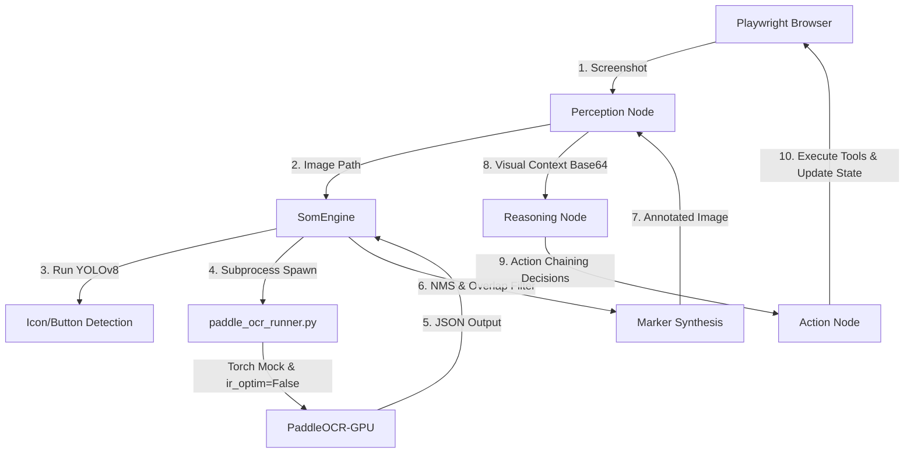

# 시스템 아키텍처

## 개요

이 문서는 두 시스템의 설계 의도와 구조를 설명합니다.

## Classic 시스템

Classic 시스템은 기존의 전통적인 DOM 파싱 기반 자동화 스크래핑 방식과 LLM의 정보 추출 능력을 결합한 하이브리드 파이프라인입니다.

### 1. 파이프라인 데이터 흐름
1. **URL 입력:** 사용자가 채용 공고 URL을 CLI로 입력합니다.
2. **URL Dispatcher (라우팅):** 도메인을 분석하여 5개 지원 사이트(원티드, 잡코리아, 사람인, 워크넷, 로켓펀치) 중 적절한 어댑터를 선택합니다.
3. **DOM 파싱 (Playwright):** 각 사이트별 특성에 맞게 최적화된 로직으로 화면을 조작하고 텍스트를 추출합니다. (예: "상세 정보 더 보기" 클릭, iframe 우회 등)
4. **LLM 정형화 (Ollama):** 수집된 텍스트를 Qwen 모델에 입력하여 사전 정의된 스키마에 맞는 구조화된 JSON 데이터로 추출합니다.
5. **타입 검증 및 정규화 (Pydantic):** 추출된 JSON 데이터의 타입을 검증하고 부족한 포맷(예: 단일 텍스트를 리스트로 자동 변환)을 정규화합니다.
6. **영속화 (SQLite):** 최종 정형화된 데이터를 로컬 데이터베이스에 저장합니다.

### 2. 핵심 설계 의도 및 모듈 구조
- **어댑터 패턴 (`classic/automation/sites/`)**: 플랫폼별 방어 로직(예: 사람인 jview 복사 방지, 잡코리아 다중 iframe 등)과 DOM 구조가 다르기 때문에 공통 인터페이스를 두고 사이트별 스크래핑 로직을 완전히 격리했습니다.
- **토큰 최적화 (`classic/extractor/`)**: 전체 HTML을 VLM에게 던지는 대신, Playwright가 1차적으로 본문 영역만 타겟팅해 추출한 텍스트를 컨텍스트로 전달하여 LLM 추론 비용과 응답 시간을 대폭 줄였습니다.
- **JSON 강제 출력**: Ollama의 JSON 모드를 활용하여 데이터 추출의 안정성을 높이고 할루시네이션을 최소화했습니다.

## Agent 시스템

Agent 시스템은 브라우저 DOM API를 일절 사용하지 않고, 오직 화면의 시각적 요소(Pure Vision 픽셀 정보)만으로 웹 브라우저를 자율 제어 및 탐색하며 채용 공고(JD) 정보를 누적 수집하는 비전 에이전트 파이프라인입니다.

### 1. 파이프라인 데이터 흐름

1. **`Perception Node`**: Playwright 브라우저의 현재 화면을 `mss`를 사용하여 인메모리에서 초고속으로 캡처하고, 브라우저의 물리적 윈도우 오프셋 및 DPI 스케일을 보정합니다.
2. **`SomEngine (Set-of-Marks)`**:
   - **YOLOv8**: 로컬 GPU(CUDA) 바인딩을 통해 화면 내의 미세 아이콘 및 버튼 요소를 검출합니다.
   - **PaddleOCR (Isolated Subprocess)**: 독립 서브프로세스 래퍼([paddle_ocr_runner.py](file:///c:/Users/psg/Desktop/L2C/agent/tools/paddle_ocr_runner.py))를 띄워 화면 텍스트 영역을 판독합니다. Windows 환경의 PyTorch와 PaddlePaddle 간 CUDA DLL 충돌(`WinError 127`)을 방지하기 위해 `torch` 모킹을 적용하고, IR Optimization 비활성화(`switch_ir_optim(False)`)로 기동 속도를 7.8초에서 0.35초로 95% 이상 단축했습니다.
   - **NMS & Overlap Filter**: 아이콘 영역과 텍스트 영역의 중복(IoU > 80%)을 제거하고, 네온 오렌지색 경계 상자와 흰색 숫자 마커 라벨 `[id]`을 캡처한 이미지에 합성합니다.
3. **`Reasoning Node`**:
   - `SKIP_VLM_CAPTION=true` 설정을 통해, 지연을 유발하는 VLM 캡셔닝 API 호출 단계를 우회하고 로컬 검출 데이터를 직접 합성하여 7.1초에서 1.3초로 레이턴시를 81.7% 급감시켰습니다.
   - 마킹 합성 이미지(1024px Bilinear 리사이징 및 JPEG 70 퀄리티 압축)와 텍스트 컨텍스트를 Gemini 3.5 Flash VLM에 전달하여 다음 자율 액션을 판단합니다.
   - 행동 이력을 분석해 동일 액션 3회 반복 시 경고, 4회 이상 시 강제 차단하는 루프 방지 로직(Loop Detection)을 탑재했습니다.
4. **`Action Node (Action Chaining)`**:
   - LLM이 판단한 다중 도구 호출(예: `update_extracted_info` -> `update_plan_progress` -> `click_marker`)을 순차적으로 실행하여 추론 횟수를 절감합니다.
   - 스크롤바 오클릭을 방지하기 위해 브라우저 우측 65픽셀 이내 마커는 Perception 레벨에서 필터링하고, 포커스를 잡고 `PageDown`을 누르는 정밀 하향식 스크롤 제어를 수행합니다.
5. **완료 및 종합**: 수집 완료 플래그(`is_finished`)가 활성화되거나 에러 카운트가 한도에 도달하면 워크플로우가 종료되고 수집된 JD 데이터를 SQLite DB에 최종 영속화합니다.

### 2. 핵심 설계 의도 및 모듈 구조
- **동적 계획 수립 (Dynamic Planning)**: 바탕화면 단계에서 억지로 완벽한 계획을 짜는 정적 `planning_node`를 제거하고, 화면을 직접 탐색하면서 상황(예: 검색 결과 개수)에 맞게 `update_plan_progress`를 통해 유연하게 소목표 계획을 세우고 실행하도록 유도합니다.
- **하향 전용 앵커 기반 스크롤 (Scroll Anchor-Down)**: 스크롤 탐색 시 위아래로 진동하는 현상을 방지하기 위해 오직 아래로만 스크롤하며, 이전 화면의 마지막 문장을 앵커로 삼아 정보를 누적 수집하는 프롬프트 가이드라인을 명시했습니다.
- **서브프로세스 및 리소스 최적화**: 윈도우 환경에서 PyTorch와 PaddlePaddle 간 DLL 충돌을 프로세스 격리로 완벽하게 회피하고, 그래프 컴파일 제거 패치를 통해 단일 OCR 처리 속도를 총 0.8초 이내로 종결했습니다.

## 두 시스템 비교

| 비교 항목 | Classic (원문 DOM 파싱) | Agent (비전 자율 판독) |
| :--- | :--- | :--- |
| **작동 원리** | Playwright를 이용해 DOM 노드에 직접 접근 및 XPath/CSS Selector로 텍스트 스크래핑 후 LLM 구조화 | 사람과 동일하게 화면 픽셀 정보를 인지(SoM)하고 마우스/키보드 이벤트를 시뮬레이션하여 자율 탐색 및 텍스트 수집 |
| **웹사이트 범용성** | 사이트마다 맞춤형 어댑터 구현 필요 (Wanted, Saramin 등) | 단일 LangGraph 비전 에이전트로 모든 웹 사이트 자율 수집 가능 (Zero-Shot) |
| **방어 기술 내성** | 캡차(CAPTCHA), 복사 방지 스크립트, 다중 iframe 구조에 취약하고 자주 깨짐 | 화면에 시각적으로 보이는 모든 텍스트와 요소를 인식하므로 복사 방지나 iframe 우회 불필요 |
| **속도 및 리소스** | 매우 빠름 (API 호출 1~2회, CPU 연산 최소화) | 비교적 무거움 (매 루프마다 OCR + YOLO + Gemini VLM 추론을 거침, 약 2~4초 소요) |
| **유지보수성** | UI/HTML 구조가 조금만 바뀌어도 파이프라인 크래시 발생으로 주기적 보수 필수 | DOM 구조 변화와 무관하여 마커 물리 인터랙션 유지로 유지보수 비용 극히 낮음 |
| **정보 수집 정합성** | 100% (원문 HTML/DOM 텍스트 수집) | 90% ~ 100% (OCR 판독의 미세 오차 및 스크롤 누적 누락에 따라 일부 텍스트 유실 가능) |

### 📊 정합성 벤치마크 결과 분석 (8개 원티드 JD 대상)
실제 8개 Wanted 공고 상세 페이지를 대상으로 Classic과 Agent 시스템을 동시에 구동하여 데이터를 수집하고 정합성을 검증한 결과([jd_all_comparison_report.md](file:///c:/Users/psg/Desktop/L2C/benchmark/jd_all_comparison_report.md)):
1. **높은 텍스트 복원력**: 대다수 공고(글로벌머니익스프레스, 왓챠, 네이버파이낸셜, 휴넷 등)의 자격요건, 우대사항, 주요업무 항목에서 **90% ~ 100% 수준의 자카드 유사도**를 보이며 DOM 기반 스크래핑 못지않은 정확도를 확보했습니다.
2. **미세 유실 케이스 식별**:
   - 스크롤 도중 VLM이 본문 하단의 긴 텍스트를 인계받는 시점에 앵커 텍스트 누락이 발생하거나, 마커 ID 매핑 단계에서 본문의 상세정보 더보기 영역을 올바르게 확장하지 못할 경우(예: 헤렌, 드림어스컴퍼니 등) 일부 본문 항목이 비어있음으로 기록되는 일부 텍스트 유실 현상이 식별되었습니다.
   - 이는 향후 페이즈 6에서 장기 스트레스 테스트와 스크롤 상태 전이 정밀화, VLM 프롬프트 튜닝을 통해 개선할 지점입니다.

