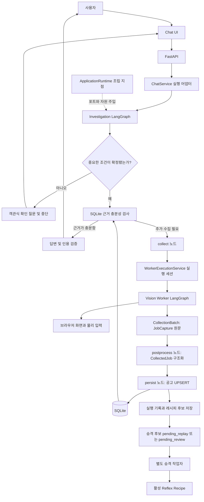
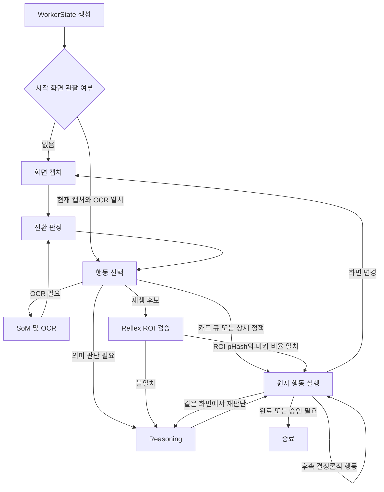

# 시스템 아키텍처

## 전체 흐름

L2C는 Windows 로컬 애플리케이션이며 사용자 질의, 필요 시 웹 수집, DB 저장, DB 근거 답변을 한 프로세스에서 처리합니다.

```mermaid
flowchart TD
    U[사용자] --> UI[Chat UI]
    UI --> API[FastAPI]
    API --> CS[ChatService 실행 어댑터]
    CS --> PLAN[Investigation LangGraph]
    RT[ApplicationRuntime 조립 지점] -. 포트와 자원 주입 .-> PLAN
    PLAN --> CLARIFY{중요한 조건이 확정됐는가?}
    CLARIFY -->|아니오| INPUT[객관식 확인 질문 및 중단]
    INPUT --> UI
    CLARIFY -->|예| DBQ[SQLite 근거 충분성 검사]
    DBQ -->|근거가 충분함| ANSWER[답변 및 인용 검증]
    DBQ -->|추가 수집 필요| COLLECTION[collect 노드]
    COLLECTION --> LOCK[WorkerExecutionService 실행 세션]
    LOCK --> WG[Vision Worker LangGraph]
    WG --> WEB[브라우저 화면과 물리 입력]
    WG --> BATCH[CollectionBatch: JobCapture 원문]
    BATCH --> POSTPROCESS[postprocess 노드: CollectedJob 구조화]
    POSTPROCESS --> STORE[persist 노드: 공고 UPSERT]
    STORE --> DB
    DB[(SQLite)] --> DBQ
    STORE --> EXPERIENCE[실행 기록과 레시피 후보 저장]
    EXPERIENCE --> CANDIDATE[승격 후보 pending_replay 또는 pending_review]
    CANDIDATE --> PROMOTION[별도 승격 작업자]
    PROMOTION --> RECIPE[활성 Reflex Recipe]
    ANSWER --> U
```

FastAPI `lifespan`이 `ApplicationRuntime`을 한 번 만들고 종료 시 닫습니다. `agent/bootstrap.py`는 조사 체크포인터, 포트 구현, 모델 묶음, 컴파일된 조사·작업자 그래프, 지연 생성 비전 자원과 자동승격 작업자를 조립합니다. `ChatService`는 실행 계측과 API 결과 변환만 담당합니다. 요청 이해, 확인 질문, DB 충분성 검사, 수집 계획, 비전 작업자 실행, DB 저장, 근거 재검사와 답변 순서는 Investigation LangGraph가 관리합니다.

## 백엔드 요청 생명주기

1. `POST /api/chat`이 요청마다 `run_id`를 만들고 최근 실행 레지스트리에 `queued` 상태를 기록합니다.
2. 동기식 LLM·Vision 실행은 `asyncio.to_thread()`로 이벤트 루프 밖에서 수행합니다.
3. `RunEvent`가 `received`, `planning`, `database`, `collection`, `validation`, `persistence`, `answering` 단계를 SSE로 전달합니다.
4. UI는 문자 단위 가짜 스트리밍 대신 진행 이벤트와 최종 응답을 구분해 표시합니다.
5. `GET /api/runs/{run_id}`로 최근 실행 상태와 최종 계측값을 다시 조회할 수 있습니다.

실행 레지스트리는 단일 사용자 로컬 앱을 위한 메모리 저장소입니다. Investigation LangGraph의 `understand` 노드는 최근 대화와 명시된 재개 실행을 읽고 현재 요청을 해석합니다. 실행 진행 이벤트는 프로세스 재시작 후 복구하지 않지만, 확인 질문과 확정 조건을 포함한 조사 상태는 업무 DB와 분리된 LangGraph SQLite 체크포인트에 저장합니다. `investigation_id`가 체크포인트의 `thread_id`이며 확인 답변은 같은 스레드를 재개합니다.

## Vision Worker

Realtime/Vision 경로는 DOM과 Playwright selector를 사용하지 않습니다. 화면 캡처, PaddleOCR, OmniParser, pHash, Gemini 판단, PyAutoGUI 물리 입력만 사용합니다.

```mermaid
flowchart TD
    S[WorkerState 생성] --> START{시작 화면 관찰 여부}
    START -->|없음| CAPTURE[화면 캡처]
    START -->|현재 캡처와 OCR 일치| SELECT[행동 선택]
    CAPTURE[화면 캡처] --> TRANSITION[전환 판정]
    TRANSITION --> SELECT
    OCR[SoM 및 OCR] --> TRANSITION
    SELECT -->|OCR 필요| OCR
    SELECT -->|카드 큐 또는 상세 정책| EXECUTION[원자 행동 실행]
    SELECT -->|재생 후보| REFLEX[Reflex ROI 검증]
    SELECT -->|의미 판단 필요| REASON[Reasoning]
    REFLEX -->|ROI pHash와 마커 비율 일치| EXECUTION
    REFLEX -->|불일치| REASON
    REASON --> EXECUTION
    EXECUTION -->|화면 변경| CAPTURE
    EXECUTION -->|같은 화면에서 재판단| REASON
    EXECUTION -->|후속 결정론적 행동| EXECUTION
    EXECUTION -->|완료 또는 승인 필요| END[종료]
```

- `Loading Wait`: 저해상도 OpenCV 프레임을 메모리에서 비교해 화면 변화 시작, 렌더링 안정화와 회색 저정보 화면 해소를 기다립니다. 준비된 최종 화면만 파일로 저장합니다.
- `OCR`: `OcrEngine`이 `PaddleOcr` 문자 검출과 `OmniParser` 아이콘 검출 결과를 합쳐 마커를 만듭니다. Paddle 작업자는 작업 동안 재사용합니다.
- `pHash`: 저장된 전체 화면·ROI 서명과 현재 화면을 비교해 카드 큐 복귀, Reflex 대상과 행동 직전 마커 동일성을 검증합니다.
- `Job Card Queue`: 검색 결과에서 LLM이 한 번 고른 공고 카드 좌표비율을 작업 큐로 보관합니다. 상세 수집 후 뒤로가면 목록 화면 pHash를 확인하고 다음 카드를 바로 클릭합니다.
- `Detail Runtime`: 상세 OCR 마커를 읽기용 줄로 합치고 여러 화면의 본문을 누적합니다. 작업자는 URL, OCR 원문과 화면 근거만 `JobCapture`로 반환합니다. 조사 그래프의 후처리 노드가 수집 종료 후 한 번 구조화하며 검색 목록의 카드 메타데이터는 사실 근거로 사용하지 않습니다.
- `Reflex Runtime`: `site + task_category`로 활성 레시피 후보를 조회하고 URL 범위, ROI pHash와 현재 마커 좌표비율이 맞는 경로만 재생합니다. `page_role`은 실행 기록과 도착 화면 설명에 사용합니다.
- `Reasoning`: 큐, 상세 정책, Reflex로 고정할 수 없는 현재 화면의 의미 판단만 수행합니다.
- `Execution`: `click_marker`, `type_in_marker`, `scroll`, `press_key`, `go_back`을 물리 입력으로 실행합니다.

## 계층과 책임

| 계층 | 주요 파일 | 책임 |
|---|---|---|
| 진입점 | `agent/web_server.py` | HTTP 입력과 SSE 응답 |
| 실행 계약 | `agent/observability/run_contracts.py`, `run_context.py`, `run_registry.py` | 실행 식별자, 진행 이벤트, 시간·토큰 계측 |
| 애플리케이션 | `agent/application/chat_service.py`, `evidence_service.py`, `conversation_context_service.py` | 실행 계측·응답 변환과 그래프가 호출하는 DB·대화 어댑터 |
| 수집 요청 | `agent/application/collection_request_builder.py` | 사이트 프로필 선택, 확정된 수집 의도로 작업자 목표 생성 |
| 수집 후처리 | `agent/application/collection_postprocessing.py` | `JobCapture`를 `CollectedJob`으로 구조화하고 필수 필드·날짜 조건 판정 |
| 공고 저장 | `agent/application/collection_storage.py` | 후처리된 공고 UPSERT와 검색 사전 연결 결과 기록 |
| 경험 기록 | `agent/application/collection_experience.py` | 작업자 제출물 저장과 레시피 후보 등록 |
| 구성·수명주기 | `agent/bootstrap.py` | 체크포인터·서비스·그래프·비전 런타임·승격 작업자의 생성과 종료 |
| 비전 런타임 | `agent/runtime/vision_worker_runtime.py` | OCR·Perception·ActionTools·판단 모델·작업자 그래프의 지연 생성과 실행 잠금 |
| 작업자 실행 | `agent/application/worker_execution_service.py` | 수집 의도 정규화, 작업자 상태·제출물 생성, 화면 잠금, 그래프 실행과 브라우저 정리 |
| 비동기 승격 | `agent/application/recipe_promotion_worker.py`, `recipe_candidate_review_service.py` | 후보 DB 등록, Critic 검토·승격 작업자 수명주기 |
| 지휘자 그래프 | `agent/graph/investigation_workflow.py`, `investigation_context.py` | 주입된 노드 연결, 조사 상태 계약, 체크포인트 중단·재개 |
| 지휘자 업무 노드 | `agent/graph/investigation_*_nodes.py`, `investigation_evidence_policy.py` | 문맥을 반영한 요청 해석, 근거 판정, 수집·저장, 재검사와 답변 |
| 직무 확인 | `agent/application/occupation_clarification_service.py` | 직무 사전 후보 질문 생성과 사용자 승인 별칭 기록 |
| 작업자 그래프 | `agent/graph/workflow.py`, `agent/runtime/worker_contracts.py` | Vision LangGraph 연결, 런타임 문맥과 WorkerState 계약 |
| 작업자 노드 | `agent/graph/worker_*.py` | 관찰, 전환, 선택, 추론과 원자 실행 |
| 행동 실행 세부 | `agent/graph/worker_action_guard.py`, `worker_execution_dispatch.py`, `worker_action_effects.py` | 실행 전 안전 검증, 물리·상태 도구 전달, 실행 후 상태 반영 |
| 추론 문맥 | `agent/graph/worker_reasoning_prompt.py` | 화면·수집·전환 정보를 모델 메시지로 압축 |
| 런타임 정책 | `agent/runtime/` | 전환 검증, 상세 버퍼, 카드 큐, Reflex 재생 |
| 로딩 대기 | `agent/vision/loading_wait.py` | CV 프레임 변화·안정화·저정보 화면 판정 |
| OCR | `agent/tools/ocr_engine.py`, `paddle_ocr.py`, `omni_parser.py` | 문자·아이콘 검출과 마커 합성 |
| pHash | `agent/vision/screen_signature.py` | 저장 화면·ROI 서명 생성과 유사도 비교 |
| 화면·입력 | `agent/tools/perception.py`, `actions.py` | 화면 캡처 진입점과 물리 입력 |
| 경험 메모리 | `agent/recipe/` | 행동 기록, 결정론적 승격 정책, 경로 생성, 활성 레시피 저장·매칭·재생 |

## 상태와 행동 계약

- 모든 작업자 진입점은 `create_worker_state()`로 독립된 초기 상태를 만듭니다.
- `WorkerState`는 `request`, `observation`, `decision`, `transition`, `replay`, `collection`, `lifecycle` 구역으로 구성됩니다. 각 구역의 reducer는 노드가 반환한 부분 갱신을 기존 구역에 병합합니다.
- 상태 구역은 책임 경계입니다. 요청 계약은 실행 중 바뀌지 않고, 화면 관찰은 관찰 노드, 행동 선택은 선택·Reflex·추론 노드, 행동 결과와 전환 요청은 실행 노드가 갱신합니다.
- LLM 응답은 추론 노드 경계에서 한 번만 `ActionRequest`로 변환됩니다. Reflex, 공고 카드 큐와 결정론적 화면 정책도 같은 계약을 직접 만듭니다.
- 실행 전 명령은 `decision.pending_action: ActionRequest`, 실행 결과는 `transition.action_events`에 순서대로 기록합니다.
- `execution_node`는 행동 출처와 무관하게 검증된 `ToolCallRequest`만 실행합니다. 도구 이름과 인자는 실제 Pydantic 도구 스키마로 물리 입력 전에 검증됩니다.
- `WorkerExecutionContext`는 검증된 행동, 런타임 의존성, 작업 상태 사본과 후속 행동을 직접 보관합니다. 실행 후 각 책임 구역을 `WorkerStateUpdate` 타입으로 반환합니다.
- 실행기는 안전 검증, 도구 전달, 상태 효과를 순서대로 조립하며 행동 종류는 `agent/runtime/worker_actions.py`에서 한 번만 정의합니다.
- 큐 식별자와 전환 출처 같은 실행 추적값은 도구 인자에 섞지 않고 `ToolCallRequest.metadata`에 둡니다.
- `type_in_marker`는 선택 마커가 OCR 텍스트, 텍스트를 포함한 컨테이너, 가로로 긴 입력형 영역 중 하나인지 검사합니다. 작은 아이콘이면 물리 입력을 실행하지 않고 같은 화면 reasoning으로 돌려보냅니다.
- 행동이 요구한 전환은 `transition.transition_request`, 현재 검증 결과는 `transition.transition_result`로 구분합니다. 전환 요청에는 행동, 입력 문자열, 대상 마커 ID와 저장된 도착 화면을 각각 보관하며 중복 `step` 딕셔너리를 만들지 않습니다. 전환이 없으면 `transition_request=None`입니다.
- 작업자 상태와 이를 직접 소비하는 그래프 모듈은 CI의 `mypy` 검사 대상입니다. Pydantic 런타임 검증은 API·LLM 도구·저장 스키마 경계에서만 수행합니다.
- 결정론적 정책이 검증에 실패하면 행동을 강행하지 않고 reasoning으로 폴백합니다.

## 그래프 의존성 주입

- `ApplicationRuntime`이 구체 서비스와 장기 실행 자원을 생성합니다.
- `build_investigation_workflow()`는 준비된 수집 함수, 모델 묶음, 검색 사전 서비스와 체크포인터 `saver`를 조사 노드에 주입합니다. DB 경로가 필요한 근거 조회와 문서 로드는 이 구성 루트에서 결합합니다.
- 조사 노드는 구성 루트에서 주입한 함수와 서비스만 호출합니다. `agent/graph`는 `agent/application`을 import하지 않으며 DB 경로, 서비스 생성과 저장 구현을 알지 못합니다.
- 상세 추출은 `JobPosting`을 한 번 생성하고 화면 근거는 `JobCollectionEvidence`에 분리합니다. 작업 상태와 저장 서비스는 `CollectedJob`을 그대로 전달하며, SQLite의 목록 JSON 직렬화와 역직렬화는 `shared/db/database.py`만 담당합니다.
- `VisionWorkerRuntime`은 컴파일된 작업자 그래프를 캐시합니다. `WorkerExecutionService`가 실행할 때 LangGraph `context`에 `WorkerDependencies(vision=...)`를 전달합니다.
- 캡처, OCR, 추론과 실행 노드는 `Runtime[WorkerDependencies]`에서 비전 의존성을 받습니다. 전역 변수나 `ContextVar`로 현재 작업자를 조회하지 않습니다.
- 그래프 클래스는 노드 순서, 조건부 분기, 상태 병합과 중단·재개를 담당합니다. 서비스 생성, 프로세스 종료, DB 연결 종료와 백그라운드 작업자 수명주기는 애플리케이션 계층이 담당합니다.

## 로컬 작업자 생명주기

- `ApplicationRuntime`은 FastAPI 시작 때 한 번 생성되고 E2E 실행기에서는 명시적인 컨텍스트로 관리됩니다.
- Perception·ActionTools·OCR·컴파일된 작업자 그래프·판단 모델은 애플리케이션 수명 동안 재사용합니다.
- `WorkerExecutionService.run()`이 `VisionWorkerRuntime.execution_session()` 안에서 브라우저 준비와 작업자 그래프를 실행하고 브라우저를 정리합니다. 제출물 검증과 SQLite 저장은 화면 잠금을 해제한 뒤 진행합니다.
- 브라우저 창은 수집 요청마다 열고 기본적으로 요청 종료 때 닫습니다. 이때 OCR worker는 유지됩니다.
- PaddleOCR은 별도 subprocess를 요청 간 재사용합니다.
- OCR subprocess는 요청 횟수로 재시작하지 않으며 실제 timeout이나 프로세스 실패 때만 한 번 복구합니다.
- 무거운 화면 모델과 GUI 도구는 수집이 실제로 호출될 때 지연 초기화합니다.
- DB 근거만으로 답할 수 있는 요청은 비전 런타임을 초기화하지 않습니다.
- 자동승격은 `recipe_candidates` SQLite 상태를 영속 대기열로 사용합니다. API 요청은 `pending_review` 등록 후 답변을 계속하고, FastAPI 수명주기의 단일 작업자가 `reviewing`으로 선점해 Critic을 실행합니다.
- 백엔드가 중단되면 처리 중이던 후보는 다음 시작에서 `pending_review`로 복구됩니다. Critic 전송 오류는 재시도하며 의미상 `revise`와 시스템 오류 `review_failed`를 구분합니다.

## Classic 경로

Classic은 Playwright DOM 기반 베이스라인입니다. 사이트별 selector를 사용하므로 빠르지만 사이트 구조 변경 시 어댑터 유지보수가 필요합니다. DOM/selector 사용은 Classic에만 한정합니다.

## 계측과 테스트

- 처리 시간은 시스템 시각 변경의 영향을 받지 않는 `time.perf_counter()`로 측정합니다.
- `RunContext`가 한 요청의 단계별 실행시간, LLM 호출시간, 모델별 입력·출력 토큰을 `run_id`로 묶습니다.
- 비용은 코드에 단가를 하드코딩하지 않습니다. `LLM_PRICING_FILE`로 정확한 모델 ID별 가격표를 제공했을 때만 추정하고, 가격이 없으면 `null`과 미등록 모델명을 남깁니다.
- 브라우저 E2E는 로그와 `.summary.json`을 새 파일로 함께 만들며 기존 결과를 덮어쓰지 않습니다. 요약에는 코드 버전, 환경 설정, 실행시간, 토큰, 품질 판정이 포함됩니다. 성능 수치는 텍스트 로그에서 다시 계산하지 않고 구조화 요약만 집계 원본으로 사용합니다.
- 기본 `pytest`는 외부 API와 물리 브라우저 테스트를 제외합니다. `external`, `e2e` 표식을 명시해야 실제 외부 자원을 사용합니다.
- 품질 평가는 자카드 유사도를 성공 기준으로 쓰지 않습니다. 목표 수집 개수, DB 적재 개수, 필수 필드, URL 고유성, 기준 데이터와의 URL·식별 필드 정확 일치를 따로 측정합니다.
