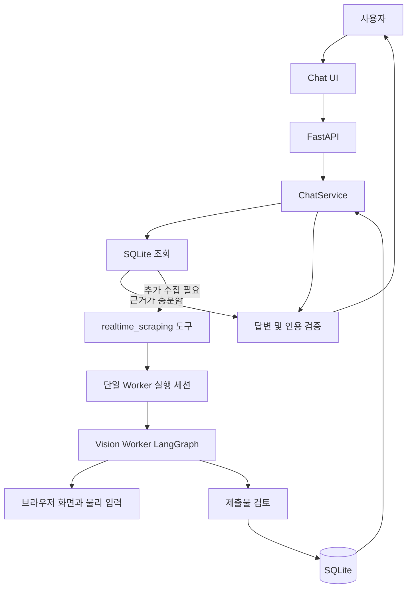
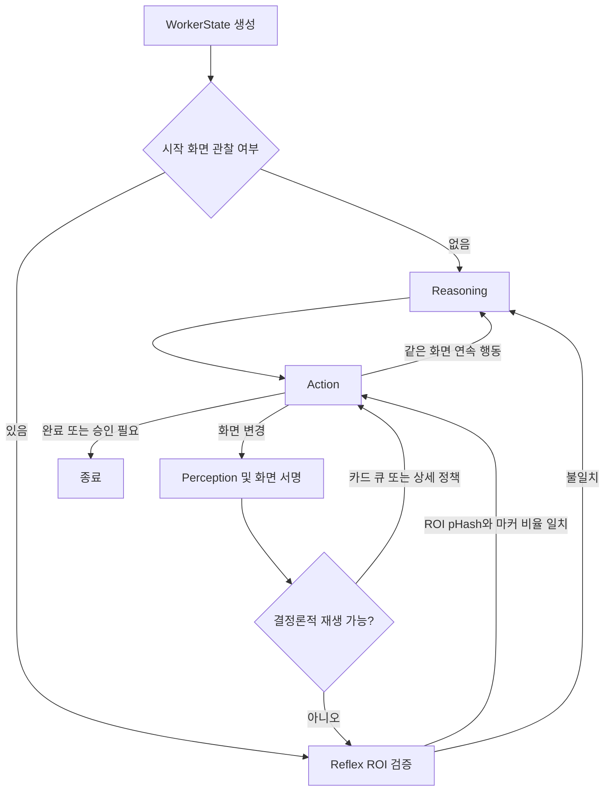

# 시스템 아키텍처

## 전체 흐름

L2C는 Windows 로컬 애플리케이션이며 사용자 질의, 필요 시 웹 수집, DB 저장, DB 근거 답변을 한 프로세스에서 처리합니다.

```mermaid
flowchart TD
    U[사용자] --> UI[Chat UI]
    UI --> API[FastAPI]
    API --> CS[ChatService]
    CS --> DBQ[SQLite 조회]
    DBQ -->|근거가 충분함| ANSWER[답변 및 인용 검증]
    DBQ -->|추가 수집 필요| TOOL[realtime_scraping 도구]
    TOOL --> LOCK[단일 Worker 실행 세션]
    LOCK --> WG[Vision Worker LangGraph]
    WG --> WEB[브라우저 화면과 물리 입력]
    WG --> REVIEW[제출물 검토]
    REVIEW --> DB[(SQLite)]
    DB --> CS
    CS --> ANSWER
    ANSWER --> U
```

`ChatService`가 사용자 진입점의 유일한 지휘자입니다. DB를 먼저 조회하고, 현재 데이터로 답할 수 없을 때만 사이트 프로필을 선택해 수집 도구를 호출합니다. CLI는 같은 서비스를 직접 호출하는 개발·복구용 어댑터일 뿐 별도 운영 경로가 아닙니다. `agent.graph.commander_workflow`는 명시적으로 실행하는 다중 사이트 배치 실험이며 사용자 요청을 환경변수로 우회시키는 기본 경로가 아닙니다.

## 백엔드 요청 생명주기

1. `POST /api/chat`이 요청마다 `run_id`를 만들고 최근 실행 레지스트리에 `queued` 상태를 기록합니다.
2. 동기식 LLM·Vision 실행은 `asyncio.to_thread()`로 이벤트 루프 밖에서 수행합니다.
3. `RunEvent`가 `received`, `planning`, `database`, `collection`, `review`, `persistence`, `answering` 단계를 SSE로 전달합니다.
4. UI는 문자 단위 가짜 스트리밍 대신 진행 이벤트와 최종 응답을 구분해 표시합니다.
5. `GET /api/runs/{run_id}`로 최근 실행 상태와 최종 계측값을 다시 조회할 수 있습니다.

실행 레지스트리는 단일 사용자 로컬 앱을 위한 메모리 저장소입니다. 프로세스 재시작 후 복구가 필요한 장기 작업 큐가 아니며, 영속 데이터는 SQLite 공고·제출물·레시피 테이블만 담당합니다.

## Vision Worker

Realtime/Vision 경로는 DOM과 Playwright selector를 사용하지 않습니다. 화면 캡처, PaddleOCR, OmniParser, pHash, Gemini 판단, PyAutoGUI 물리 입력만 사용합니다.

```mermaid
flowchart TD
    S[WorkerState 생성] --> START{시작 화면 관찰 여부}
    START -->|없음| REASON[Reasoning]
    START -->|있음| REFLEX[Reflex ROI 검증]
    PERCEPTION[Perception 및 화면 서명] --> POLICY{결정론적 재생 가능?}
    POLICY -->|카드 큐 또는 상세 정책| ACTION[Action]
    POLICY -->|아니오| REFLEX
    REFLEX -->|ROI pHash와 마커 비율 일치| ACTION
    REFLEX -->|불일치| REASON
    REASON --> ACTION
    ACTION -->|화면 변경| PERCEPTION
    ACTION -->|같은 화면 연속 행동| REASON
    ACTION -->|완료 또는 승인 필요| END[종료]
```

- `Perception`: 브라우저 화면을 캡처하고 PaddleOCR·OmniParser 마커와 화면 서명을 만듭니다.
- `Result Card Queue`: 검색 결과에서 LLM이 한 번 고른 카드 좌표비율을 작업 큐로 보관합니다. 상세 수집 후 뒤로가면 목록 화면 pHash를 확인하고 다음 카드를 바로 클릭합니다.
- `Detail Runtime`: 상세 OCR 마커를 읽기용 줄로 합치고 여러 화면의 본문을 누적합니다. 반복 스크롤·펼치기는 결정론적으로 처리하고 마지막에 한 번만 구조화합니다. 최종 정제 모델에는 상세 OCR과 URL만 전달하고, 검색 목록의 카드 메타데이터는 모델이 필드를 비운 경우의 폴백으로만 사용합니다.
- `Reflex Runtime`: `site + task_category + page_role`로 활성 레시피를 조회하고 ROI pHash와 현재 마커 좌표비율이 맞을 때만 재생합니다.
- `Reasoning`: 큐, 상세 정책, Reflex로 고정할 수 없는 현재 화면의 의미 판단만 수행합니다.
- `Action`: `click_marker`, `type_in_marker`, `scroll`, `press_key`, `go_back`을 물리 입력으로 실행합니다.

## 계층과 책임

| 계층 | 주요 파일 | 책임 |
|---|---|---|
| 진입점 | `agent/main.py`, `agent/web_server.py` | CLI·HTTP 입력과 응답 |
| 실행 계약 | `agent/application/run_contracts.py`, `run_context.py`, `run_registry.py` | 실행 식별자, 진행 이벤트, 시간·토큰 계측 |
| 애플리케이션 | `agent/application/chat_service.py` | DB 우선 도구 호출과 최종 답변 |
| 수집 조율 | `agent/application/collection_service.py` | 작업자 실행, 검토 재시도, 승인 데이터 저장 순서 |
| 작업자 실행 | `agent/application/worker_execution_service.py` | 단일 작업자 직렬화, 그래프 실행, 브라우저 정리 |
| 저장·정제 | `agent/application/job_persistence_service.py`, `detail_extraction_service.py` | 공고 정규화·UPSERT, 상세 OCR 최종 구조화 |
| 그래프 | `agent/graph/workflow.py`, `state.py`, `state_factory.py` | LangGraph 연결과 WorkerState 계약 |
| 노드 | `agent/graph/nodes.py` | perception, reasoning, action 실행 |
| 런타임 정책 | `agent/runtime/` | 전환 검증, 상세 버퍼, 카드 큐, Reflex 재생 |
| 화면·입력 | `agent/tools/perception.py`, `som_engine.py`, `actions.py` | 화면/OCR/마커 생성과 물리 입력 |
| 학습 메모리 | `agent/recipe/` | 행동 기록, 후보 검토, 활성 레시피 저장·매칭 |

## 상태와 행동 계약

- 모든 작업자 진입점은 `create_worker_state()`로 독립된 초기 상태를 만듭니다.
- LLM과 결정론적 정책은 `ActionRequest` 형태의 도구 호출 묶음을 공유합니다.
- 기존 `action_node`가 LangChain `AIMessage`를 받으므로 현재는 `ActionRequest.to_ai_message()` 어댑터를 사용합니다.
- `type_in_marker`는 선택 마커가 OCR 텍스트, 텍스트를 포함한 컨테이너, 가로로 긴 입력형 영역 중 하나인지 검사합니다. 작은 아이콘이면 물리 입력을 실행하지 않고 같은 화면 reasoning으로 돌려보냅니다.
- 행동 전후 검증은 `pending_transition`과 `transition_observations`로 연결합니다.
- 결정론적 정책이 검증에 실패하면 행동을 강행하지 않고 reasoning으로 폴백합니다.

## 로컬 작업자 생명주기

- 브라우저·Perception·OCR은 한 프로세스 안에서 재사용합니다.
- `worker_execution_session()`이 전체 수집, 검토 재시도, 브라우저 정리를 직렬화해 동시 요청이 같은 화면을 조작하지 못하게 합니다.
- PaddleOCR은 별도 subprocess를 요청 간 재사용합니다.
- 장기 재사용 tail latency를 막기 위해 기본 7회 요청 후 subprocess만 재시작합니다. Perception과 상위 작업자는 유지됩니다.
- 무거운 화면 모델과 GUI 도구는 수집이 실제로 호출될 때 지연 초기화합니다.

## Classic 경로

Classic은 Playwright DOM 기반 베이스라인입니다. 사이트별 selector를 사용하므로 빠르지만 사이트 구조 변경 시 어댑터 유지보수가 필요합니다. DOM/selector 사용은 Classic에만 한정합니다.

## 계측과 테스트

- 처리 시간은 시스템 시각 변경의 영향을 받지 않는 `time.perf_counter()`로 측정합니다.
- `RunContext`가 한 요청의 단계별 실행시간, LLM 호출시간, 모델별 입력·출력 토큰을 `run_id`로 묶습니다.
- 비용은 코드에 단가를 하드코딩하지 않습니다. `LLM_PRICING_FILE`로 정확한 모델 ID별 가격표를 제공했을 때만 추정하고, 가격이 없으면 `null`과 미등록 모델명을 남깁니다.
- 브라우저 E2E는 로그와 `.summary.json`을 새 파일로 함께 만들며 기존 결과를 덮어쓰지 않습니다. 요약에는 코드 버전, 환경 설정, 실행시간, 토큰, 품질 판정이 포함됩니다.
- 기본 `pytest`는 외부 API와 물리 브라우저 테스트를 제외합니다. `external`, `e2e` 표식을 명시해야 실제 외부 자원을 사용합니다.
- 품질 평가는 자카드 유사도를 성공 기준으로 쓰지 않습니다. 목표 수집 개수, DB 적재 개수, 필수 필드, URL 고유성, 기준 데이터와의 URL·식별 필드 정확 일치를 따로 측정합니다.
