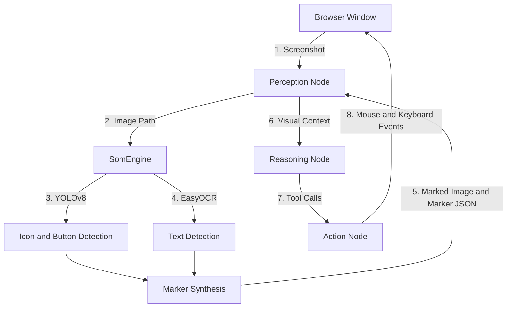

# 시스템 아키텍처

## Classic 시스템

Classic 시스템은 Playwright로 DOM을 직접 탐색하는 수집 경로입니다. 사이트별 DOM 구조와 셀렉터를 사용하므로 빠르고 정확하지만, 사이트 구조가 바뀌면 유지보수가 필요합니다.

## Agent 시스템

Agent 시스템은 DOM을 직접 읽지 않고 화면 캡처, 로컬 비전 모델, OCR, LLM 추론, 물리 입력 도구를 조합해 브라우저를 제어합니다.

```mermaid
graph TD
    A[Browser Window] -->|1. Screenshot| B[Perception Node]
    B -->|2. Image Path| C[SomEngine]
    C -->|3. YOLOv8| D[Icon and Button Detection]
    C -->|4. EasyOCR| E[Text Detection]
    D --> F[Marker Synthesis]
    E --> F
    F -->|5. Marked Image and Marker JSON| B
    B -->|6. Visual Context| G[Reasoning Node]
    G -->|7. Tool Calls| H[Action Node]
    H -->|8. Mouse and Keyboard Events| A
```

## 주요 모듈

- `agent/tools/perception.py`: 브라우저 영역을 캡처하고 SoM 분석 결과를 LangGraph 상태에 넣습니다.
- `agent/tools/som_engine.py`: YOLOv8로 아이콘/버튼 후보를 찾고 EasyOCR로 텍스트 후보를 찾은 뒤, 숫자 마커와 좌표 매핑을 만듭니다.
- `agent/graph/nodes.py`: perception, reasoning, action, QA 노드를 구성하고 반복 실행을 제어합니다.
- `agent/tools/actions.py`: 마커 클릭, 입력, 스크롤, 뒤로가기, 브라우저 종료 같은 물리 액션을 실행합니다.

## 실행 흐름

1. `Perception Node`가 현재 브라우저 화면을 캡처합니다.
2. `SomEngine`이 캡처 이미지를 추론용 크기로 줄여 OCR과 YOLOv8을 실행합니다.
3. 감지된 텍스트/아이콘 후보를 겹침 제거 후 마커 ID로 정렬합니다.
4. `Reasoning Node`는 마커 이미지와 마커 JSON을 보고 다음 도구 호출을 결정합니다.
5. `Action Node`는 도구 호출을 실제 마우스/키보드 입력으로 실행합니다.
6. 화면 변화 후 다시 perception으로 돌아가 다음 스텝을 반복합니다.

## 설계 원칙

- 비전 Agent 경로는 DOM 셀렉터나 Playwright DOM API에 의존하지 않습니다.
- 마커 ID와 OCR 텍스트를 기준으로 LLM이 행동을 선택하고, 물리 좌표 변환은 로컬 도구가 담당합니다.
- 무거운 모델과 GUI 제어 객체는 필요한 시점에 초기화해 QA 서버 import 경로와 분리합니다.
