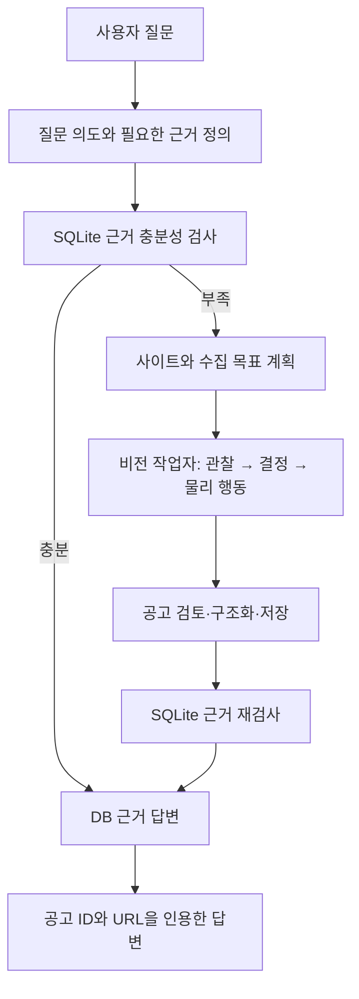

# L2C - LLM to Computer

[](https://github.com/Dreamtreeme/L2C/actions/workflows/ci.yml)
[](./LICENSE)

> 채용공고 수집을 대상으로, 성공한 GUI 실행 경로를 조건부로 재사용하는 Windows 로컬 Computer-Use 애플리케이션

- 자연어 질문을 조사 계획으로 바꾸고, SQLite 근거가 부족하면 실제 채용 사이트의 상세 화면을 읽습니다.
- 자율탐색의 `화면 → 행동 → 결과`를 기록하고, 검토된 행동 경로를 같은 화면 조건에서 다시 실행합니다.
- 5개 사이트 15개 요청을 두 번 실행해 자동 수집 `26/30(86.7%)`을 기록했고, 현재 실행에서는 전체 시도 `12/15(80.0%)`가 사람의 핵심 필드 검증까지 통과했습니다.


## 해결하려는 문제

채용공고는 게시, 마감과 재등록으로 상태가 계속 바뀝니다. 검색 결과의 제목과 요약만으로는
실제 업무, 필수 조건과 우대 조건을 판단하기 어렵고, 사용자는 여러 상세 페이지를 직접
열어 같은 형식으로 다시 정리해야 합니다.

L2C는 사용자의 질문에 답할 근거가 SQLite에 충분한지 먼저 확인합니다. 근거가 부족하면
실제 사이트의 상세 화면을 OCR로 읽고 회사명, 공고명, URL, 주요 업무와 자격요건을
구조화해 저장합니다. 이후 답변은 저장된 공고 ID와 원본 URL을 근거로 만듭니다.

같은 검색 경로를 다시 이용할 때마다 화면 판단 모델을 호출하는 비용도 다룹니다. 첫
자율탐색에서 성공한 행동을 기록하고, 다음 실행에서는 현재 화면 조건이 맞는 구간만
저장된 행동으로 처리합니다.

## 데모

합성 공고 3건이 들어 있는 샘플 DB로 UI부터 근거 답변까지 재현할 수 있습니다.

```text
사용자: 샘플 DB에 있는 AI 엔지니어 공고를 비교해줘

L2C: SQLite 근거 확인 → 관련 공고 비교 → 공고 ID와 원본 URL을 인용한 답변
```

이 시나리오는 웹 수집을 실행하지 않고 Chat UI, FastAPI, 조사 그래프와 SQLite 답변
경로를 확인합니다. 실제 사이트 수집에서는 진행 단계, 수집한 공고와 출처, 실행시간,
토큰 사용량을 같은 화면에 표시합니다. 실행 화면과 확인 항목은
[제품 데모 및 검증](./docs/product_demo.md)에 정리했습니다.

## 핵심 설계와 변경 과정

초기에는 비전 기반 조작이 사이트별 DOM 자동화의 추가 개발 공수를 줄일 것으로
예상했습니다. 인크루트와 랠릿에 Playwright 기반 Classic과 Vision 수집기를 각각
구현해 비교한 결과, Vision의 사이트 전용 코드는 적었지만 준비와 실행을 포함한 전체
시간은 Classic보다 길었습니다.

이 결과를 바탕으로 최적화 대상을 신규 사이트 구현 공수에서 반복되는 화면 판단으로
변경했습니다. 현재 구조는 처음 보는 화면을 LLM이 탐색하고, 성공한 경로에서 화면과
행동의 인과관계를 기록한 뒤, 조건이 맞는 고정 구간만 코드로 재생합니다. 공고 카드와
상세 본문처럼 실행마다 달라지는 선택은 LLM에 남깁니다.

비교 조건과 원본 결과는 [기술 및 설계 결정](./docs/design_decisions.md)과
[신규 사이트 적용 증거](./docs/evidence/site_onboarding/comparison_report.json)에
보존했습니다.

## 실제 동작 흐름



FastAPI는 요청과 SSE 진행 이벤트를 전달합니다. Investigation LangGraph가 질문 보완,
DB 검사, 수집, 저장과 답변 순서를 관리합니다. Vision Worker LangGraph는 화면 관찰,
행동 결정, 물리 입력과 공고 검토를 반복합니다.

## 경험 기반 탐색

| 단계 | 처리 내용 | 남기는 결과 |
|---|---|---|
| 1. 자율탐색 | LLM이 화면을 보고 물리 도구를 선택 | 화면, 선택 이유, 행동과 도착 화면 |
| 2. 실행 그래프 구성 | 한 번의 성공 기록을 목적별 연속 구간으로 묶음 | 실행·분기·복구 간선이 있는 경로 |
| 3. Critic 검토 | 전체 경로에서 불필요한 탐색 구간을 제거 | 재사용할 의미 노드 |
| 4. 조건부 재생 | URL 범위와 ROI pHash가 맞으면 저장 행동 실행 | 재생 결과 또는 자율탐색 폴백 |

저장된 경로는 검색어 입력과 Enter처럼 함께 수행해야 화면 전환을 만드는 행동을 한
노드로 실행합니다. 각 전이 후에는 CV로 화면 변화를 기다리고, 도착 화면 조건이 다르면
남은 경로를 중단합니다. ROI pHash는 저장 당시의 화면 영역과 현재 영역을 비교하며,
공고 카드 내용과 상세 본문 판단을 대신하지 않습니다.

## 측정 결과

2026-08-22에 원티드, 사람인, 잡코리아, 고용24와 로켓펀치에서 사이트별 3개씩,
총 15개 요청을 빈 공고 DB로 실행했습니다. 같은 행렬을 두 번 실행했고 수집 행동
로직은 두 실행 사이에 바꾸지 않았습니다.

| 측정 항목 | 결과 |
|---|---:|
| 두 번의 자동 수집 | **26/30 (86.7%)** |
| 1차 자동 수집 | 12/15 (80.0%) |
| 2차 자동 수집 | 14/15 (93.3%) |
| 2차 실행 전체 시간 | 934.30초 |
| 2차 실행당 평균 | 62.29초 |
| 2차 실행 전체 토큰·추정 비용 | 1,285,207 · $0.706876 |
| 자동 수집 성공 1건당 평균 | 54.21초 · 73,772토큰 · $0.037805 |

두 번의 결과 차이는 화면과 모델 판단에 따른 실행 변동을 보여줍니다. 2차 실패는
고용24 `생산 관리`에서 필수 자격요건을 확보하지 못한 공고를 거절한 뒤 같은 후보에
재진입하면서 발생했습니다. 해당 실행은 175.37초, 화면 판단 32회, OCR 21회 후
판단 한도에 도달했습니다.

### 저장된 행동 재사용

원티드 5개와 사람인 5개 검색어에서 `자율탐색 → 행동 검토·저장 → 경험 기반 탐색`을
실행했습니다.

| 측정 항목 | 결과 |
|---|---:|
| 자율탐색 수집 성공 | 10/10 |
| 행동 검토·저장 성공 | 9/10 |
| 저장된 행동 사용과 경로 완료 | 9/9 |
| LLM 판단 없이 실행한 물리 행동 | 18회 |
| 저장 행동이 대체한 화면 판단 | 9회 |
| 경험 기반 탐색의 전체 수집 성공 | 8/9 |

두 방식 모두 수집에 성공한 8쌍에서는 평균 화면 판단 `16.4%`, OCR `22.4%`, 토큰
`13.2%`가 줄었습니다. 실행시간은 `5.5%` 줄었고, 모델 전환 비용의 영향으로 추정
비용은 `2.7%` 늘었습니다. 행동 경로 8개의 일회성 검토·저장에는 별도로 199.63초,
156,146토큰과 `$0.428061`이 들었습니다.

### 사람의 정리 시간과 비교

회사명, 공고명, URL, 주요 업무와 자격요건을 직접 검색해 정리하는 시간을 사용자의
경험에 따라 공고 1건당 5분으로 잡았습니다. 핵심 필드 검증을 통과한 12건을 확보하는
데 L2C는 실패와 품질 탈락 실행을 포함해 15.57분을 사용했습니다. 같은 수량을 직접
정리하는 추정 시간 60분보다 `3.85배` 빠르고, 시간은 `74.0%` 적습니다. 이 비교의
사람 쪽 기준은 한 사용자의 경험 추정이며 통제 사용자 실험 결과가 아닙니다.

## 검증 결과

2차 실행에서 자동 수집한 14건은 상세 화면 스크린샷, 누적 OCR과 SQLite 저장값을
사람이 전부 대조했습니다. 자동 검사는 목표 수, 저장 수, URL과 필드 존재 여부를
확인하고, 사람 검증은 실제 문자열과 내용이 화면 근거에 맞는지 확인했습니다.

| 검증 항목 | 통과 |
|---|---:|
| 검색 의도와 공고 관련성 | 14/14 (100.0%) |
| 상세 URL | 14/14 (100.0%) |
| 회사명 | 13/14 (92.9%) |
| 공고명 | 14/14 (100.0%) |
| 주요 업무 | 14/14 (100.0%) |
| 자격요건 | 13/14 (92.9%) |
| 핵심 필드 모두 통과 | **12/14 (85.7%)** |
| 전체 15회 시도 중 핵심 필드 모두 통과 | **12/15 (80.0%)** |

원티드 Android 공고는 화면의 `포디(FODI)`를 `포디(FOD)`로 저장했고, 고용24
사회복지사 공고는 `경력 최소 1년 필수`를 누락했습니다. 필드 존재 여부만 검사하는
자동 판정에서는 두 오류가 드러나지 않았습니다.

DB 답변 경로는 공고 152건이 있는 DB와 빈 DB에서 같은 질문으로 확인했습니다. 공고가
있는 경우 웹 수집 없이 관련 공고 16건과 실제 DB 공고 ID 16개를 인용했고, 빈 DB에서는
공고와 인용을 만들지 않았습니다. 개별 실행, 비용과 사람 판정 원본은
[현재 버전 검증 기록](./docs/evidence/l2c_metrics_20260822.md)과
[14건 필드 판정 JSON](./docs/evidence/manual_field_audit_20260822.json)에 있습니다.

## 빠른 시작과 재현

실행 환경은 64비트 Windows 10/11, Node.js 22 이상, NVIDIA 드라이버 580 이상,
VRAM 8GB 이상과 여유 디스크 12GB 이상입니다. 설치 과정에서 Python 3.13.14를
확인하고 없으면 공식 설치 파일로 구성합니다.

```powershell
git clone https://github.com/Dreamtreeme/L2C.git
cd L2C
.\setup.cmd
notepad .env
```

`.env`의 `GEMINI_API_KEY`에 [Google AI Studio API 키](https://aistudio.google.com/app/apikey)를
입력합니다. 합성 공고 3건으로 DB 근거 답변을 재현하려면 다음 명령을 실행합니다.

```powershell
.\demo.cmd
```

실제 사이트 수집은 다음 명령으로 실행합니다.

```powershell
.\run.cmd
```

백엔드 계약과 프런트 테스트는 다음 명령으로 확인합니다.

```powershell
.\scripts\test.cmd

Push-Location frontend
npm.cmd test
npm.cmd run build
Pop-Location
```

설치 항목과 검증된 버전은 [런타임 호환 기준](./docs/runtime_compatibility.md), 실제
브라우저 E2E와 지표 집계 방법은 [E2E 관측 환경](./docs/e2e_observability.md)을
따릅니다.

## 아키텍처와 책임

```text
Chat UI → FastAPI → Investigation LangGraph
  → SQLite 근거 검사
  → WorkerExecutionService → Vision Worker LangGraph → 실제 웹 화면
  → 공고 검토 → 후처리·SQLite 저장 → DB 근거 답변

RecipePromotionWorker
  → 성공 후보 → 실행 그래프 구성 → Critic 검토 → 활성 경험 경로
```

| 주체 | 책임 |
|---|---|
| Chat UI | 질문 입력, 진행 상태, 출처와 실행 지표 표시 |
| FastAPI | HTTP 요청과 SSE 이벤트 전달, 취소 연결 |
| Investigation LangGraph | 질문 보완, DB 근거 검사, 수집 계획, 저장과 답변 순서 관리 |
| Vision Worker LangGraph | 화면 관찰, 행동 결정, 물리 입력과 공고 검토 |
| 코드 정책 | 도구 계약, CV 로딩 대기, pHash 비교, 물리 입력, 저장과 폴백 |
| LLM | 사용자 의도, 화면 의미, 목표 선택, 공고 구조화와 경험 경로 검토 |
| 사람 | 검색 의도, 저장 필드와 최종 답변 품질 평가 |

| 영역 | 기술 |
|---|---|
| 로컬 앱 | React 19, FastAPI, SSE |
| 워크플로 | LangGraph 1.2 |
| 비전 | OpenCV, OmniParser, PaddleOCR 3.7 |
| 물리 입력 | PyAutoGUI, pyperclip |
| 모델 | Gemini 3.6 Flash, Gemini 3.5 Flash Lite |
| 저장·검색 | SQLite, 검색 의미 사전 |
| 관측 | structlog, LangSmith, 실행 summary |
| 비교 기준 | Playwright DOM/selector |

상태 소유권, 그래프 경계, 비전 자원 수명과 주요 모듈은
[ARCHITECTURE.md](./ARCHITECTURE.md)에서 설명합니다.

## 확인된 한계와 상세 문서

- 검증 환경은 Windows와 RTX 3080 10GB 한 대이며 다른 GPU와 운영체제는 확인하지 않았습니다.
- 로그인과 CAPTCHA가 필요한 사이트는 검증 범위에서 제외했습니다.
- 같은 15개 요청의 자동 수집 결과가 12건과 14건으로 달라 실행 재현성이 충분하지 않습니다.
- 저장된 행동은 화면 판단을 줄였지만 검토 비용을 포함한 총비용 절감은 확인하지 못했습니다.
- 필드 존재 여부 자동 검사만으로 회사명 철자와 필수 경력 누락을 잡지 못했습니다.
- 사람 대비 시간은 한 사용자의 5분 추정에 기반하며 다수 사용자의 통제 실험이 필요합니다.
- 실제 사이트 사용 전 이용약관과 계정 권한을 확인해야 합니다.
- 저장소의 샘플 공고는 제품 흐름 재현을 위한 합성 데이터입니다.

| 문서 | 내용 |
|---|---|
| [현재 아키텍처](./ARCHITECTURE.md) | 계층, 상태 소유권, 그래프와 런타임 경계 |
| [기술 및 설계 결정](./docs/design_decisions.md) | 채택한 방식, 비교 결과와 트레이드오프 |
| [제품 데모 및 검증](./docs/product_demo.md) | 실제 실행 시나리오와 E2E 수치 |
| [E2E 관측 환경](./docs/e2e_observability.md) | 실행시간, 토큰, 비용과 실패 단계 집계 |
| [런타임 호환 기준](./docs/runtime_compatibility.md) | Python, CUDA와 OCR 설치 조합 |
| [실패 원인과 해결 기록](./troubleshooting.md) | 실험 실패, 원인과 수정 결과 |
| [개발 단계 기록](./docs/development_history.md) | 구현 범위가 바뀐 과정 |
| [전체 문서 인덱스](./docs/index.md) | 나머지 설계, 검색과 운영 문서 |
