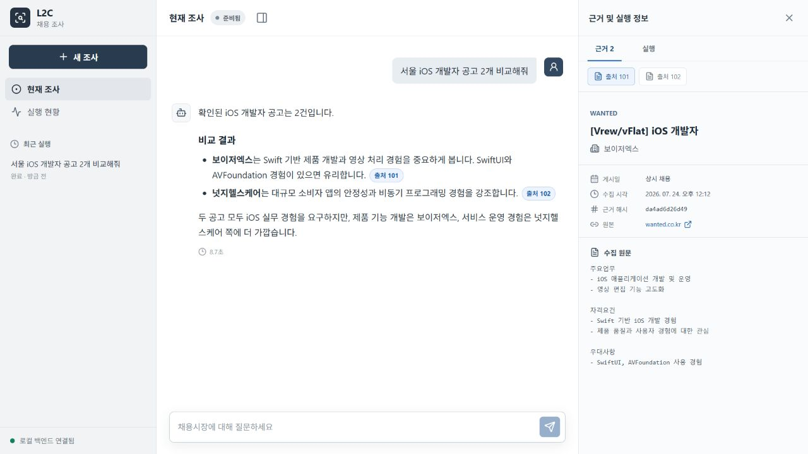
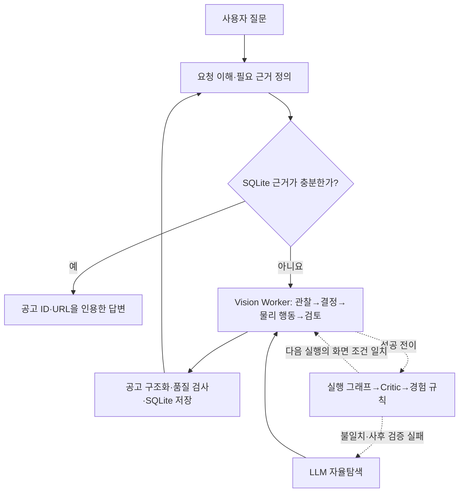

# L2C — LLM to Computer

[](https://github.com/Dreamtreeme/L2C/actions/workflows/ci.yml)
[](./LICENSE)

> 채용 사이트의 실제 화면을 읽어 공고를 수집하고, 검증된 반복 GUI 구간만 화면 조건에 따라 재사용하는 Windows 로컬 Computer-Use Agent



검색 결과의 제목·요약만으로는 실제 업무와 필수 조건을 비교하기 어려워 사용자가 상세
페이지를 하나씩 열고 정리해야 합니다. L2C는 자연어 요청에 답할 DB 근거가 부족하면
채용 사이트의 상세 화면을 OCR로 읽어 공고를 구조화하고 ID·원본 URL을 인용해 답합니다.
매 화면을 LLM이 다시 해석하는 방식과 달리, 성공한 물리 행동을 화면 조건과 함께 저장해
반복 가능한 구간만 재생하고 가변적인 카드 선택과 본문 해석은 LLM에 남깁니다.

## 핵심 결과

| 검증 항목 | 결과 |
|---|---:|
| 5개 사이트 × 검색어 3개 × 2회 자동 수집 | **26/30 (86.7%)** |
| 두 번째 15회 중 사람의 핵심 필드 검증까지 통과 | **12/15 (80.0%)** |
| 양쪽 방식이 자동 수집 계약을 통과한 8쌍의 저장 행동 재사용 | 화면 판단 **-16.4%** · OCR **-22.4%** · 토큰 **-13.2%** |
| 같은 8쌍의 시간·추정 비용 | 시간 **-5.5%** · 비용 **+2.7%** |

분모, 실행 조건과 실패 기록은 [현재 버전 검증 기록](./docs/evidence/l2c_metrics_20260822.md),
사람 판정은 [14건 전수 감사](./docs/evidence/manual_field_audit_20260822.json)에서 확인할 수 있습니다.

## 핵심 아이디어

1. 처음 보는 화면에서는 LLM이 OCR·화면 상태를 해석해 다음 물리 행동을 고릅니다.
2. 수집에 성공하면 행동 전 화면, 클릭·입력, 행동 후 화면을 하나의 전이로 기록합니다.
3. 실행 그래프가 연속 행동을 의미 단위로 묶고 Critic이 재사용할 노드만 남깁니다.
4. 다음 실행에서 URL 범위·화면 역할·ROI pHash가 맞을 때만 저장 행동을 재생합니다.
5. 조건이나 실행 후 기대 효과가 다르면 남은 경로를 막고 LLM 자율탐색으로 돌아갑니다.

따라서 L2C는 Agent 전체를 스크립트로 바꾸지 않습니다. 검색어 입력처럼 고정된 구간의
판단만 줄이고, 공고 카드와 상세 내용처럼 실행마다 달라지는 판단은 계속 화면 근거로 수행합니다.

## 가설에서 구현·측정까지

초기 가설은 “Vision 조작이 사이트별 DOM 자동화 구현 비용을 줄인다”였습니다. 이를
확인하려고 인크루트와 랠릿에서 Playwright 기반 Classic과 화면 기반 Vision을 비교했습니다.
같은 기준 커밋과 프롬프트, 90분 제한, 격리된 작업 환경을 사용하고 개발에 쓰지 않은 검색어
3종으로 공고를 2건씩 저장한 뒤 방식 이름을 가리고 품질을 판정했습니다.

| 사이트 | Classic: 사이트/공통 변경 LOC · 적용시간 | Vision: 사이트/공통 변경 LOC · 적용시간 |
|---|---:|---:|
| 인크루트 | 158/16 · 22분 31초 | 30/153 · 52분 16초 |
| 랠릿 | 114/16 · 23분 03초 | 81/134 · 58분 06초 |

네 세션 모두 최종 품질 계약을 통과했습니다. 다만 인크루트 Vision은 최초 미사용 검색어
두 개가 목표 수를 채우지 못해 사전에 정한 예비 검색어로 대체했으므로, 같은 검색어의
정확도 비교로 해석하지 않습니다. Vision은 사이트 전용 코드를 줄였지만 적용시간은
Classic의 2.32배와 2.52배였고, 공통 런타임 수정도 더 많았습니다. 이에
최적화 대상을 “신규 사이트 구현”에서 “반복 실행의 LLM 화면 판단”으로 바꾸고
화면-행동-결과 기록과 조건부 재생을 설계했습니다.

이 결론을 코드에 반영해 성공한 행동 전이를 저장하고, Critic이 재사용할 단계만 남기며,
URL·화면 역할·ROI가 맞을 때만 재생하도록 구현했습니다. 조건이 다르거나 실행 후 검증에
실패하면 즉시 LLM 자율탐색으로 돌아갑니다. 이후 같은 상세 URL의 자동 수집 계약을 양쪽
방식이 모두 통과한 8쌍에서 화면 판단 16.4%, OCR 22.4%, 토큰 13.2%가 줄었지만 추정
비용은 2.7% 늘었습니다. 따라서 성과를 전체 비용 절감이 아니라 **검증 가능한 반복 구간의
화면 판단 감소**로 한정했습니다.

## 핵심 구현

| 확인할 내용 | 코드 진입점 |
|---|---|
| 전체 조사 Agent 흐름 | [InvestigationWorkflow._build_graph](./agent/graph/investigation_workflow.py#L49-L121) |
| Vision Worker의 관찰→결정→실행→검토 | [build_graph](./agent/graph/workflow.py#L90-L135) |
| 화면·행동·결과 기록 | [record_action_result](./agent/graph/worker_action_recording.py#L56-L120) |
| 실행 그래프 생성과 Critic 승격 | [review_and_apply_candidate](./agent/application/recipe_candidate_review_service.py#L283-L382) |
| 저장 행동 우선·실패 시 LLM 폴백 | [decision_node](./agent/graph/worker_cycle.py#L188-L214) |
| URL·화면 역할·ROI 조건 검사 | [select_reflex_replay](./agent/recipe/replay.py#L534-L550) |

## 동작 구조



FastAPI는 요청과 SSE 진행 이벤트를 전달하고 두 LangGraph가 조사와 화면 작업의 상태를
나눠 소유합니다. 계층, 런타임 수명과 저장 경계는 [아키텍처](./ARCHITECTURE.md)에 있습니다.

## 측정과 검증

### 다중 사이트 수집

2026-08-22에 원티드·사람인·잡코리아·고용24·로켓펀치에서 검색어를 3개씩, 매번
빈 DB로 시작했습니다. 같은 15개 요청을 수집 행동 로직 변경 없이 두 번 실행한 결과는
12/15와 14/15였습니다. 이 차이 자체가 현재 화면·모델 실행의 변동성을 보여줍니다.

두 번째 실행의 자동 성공 14건을 상세 화면·누적 OCR·DB 값과 대조하자 핵심 필드가
모두 맞은 결과는 12/14, 전체 시도 기준 12/15였습니다. 포디(FODI)의 한 글자 누락과
고용24 공고의 필수 경력 누락은 필드 존재 여부만 보는 자동 검사에서 잡지 못했습니다.
또 다른 고용24 실행은 후보 재진입을 반복해 175.37초 동안 화면 판단 32회·OCR 21회
후 한도에 도달했습니다.

### 저장 행동 재사용

원티드·사람인 검색어를 5개씩 자율탐색→검토·저장→경험 기반 탐색 순서로 실행했습니다.
자율탐색은 10/10, 검토·저장은 9/10이 성공했고 저장한 9개 경로는 모두 끝까지
재생됐습니다. 다만 이후 가변 구간까지 포함한 전체 수집 성공은 8/9였습니다.

| 지표 | 자율탐색 평균 | 경험 기반 평균 | 변화 |
|---|---:|---:|---:|
| 실행시간 | 52.15초 | 49.28초 | -5.5% |
| LLM 화면 판단 | 8.38회 | 7.00회 | -16.4% |
| OCR | 7.25회 | 5.63회 | -22.4% |
| 토큰 | 62,946 | 54,606 | -13.2% |
| 추정 비용 | $0.034200 | $0.035108 | +2.7% |

표는 두 방식 모두 같은 상세 URL의 자동 수집 계약을 통과한 8쌍만 비교하며 별도 사람
필드 감사 표본은 아닙니다. 이 8개 경로를 한 번 검토·저장하는
데 별도로 199.63초, 156,146토큰, $0.428061이 들었습니다. 사람인 Java 실패처럼
저장된 검색 행동은 성공해도 이후 자율탐색이 잘못된 화면으로 갈 수 있어, 재생 성공을
전체 작업 성공으로 간주하지 않습니다.

DB 근거 경로도 152건 DB에서는 웹 수집 없이 관련 공고 ID 16개를 인용하고, 빈 DB에서는
인용을 만들지 않는지 확인했습니다. 전자는 기능 계약은 통과했지만 임시 토큰 상한을
641토큰 초과했습니다.

### 비교 실험에서 Codex를 사용한 방법

사이트 적용시간 비교에서는 구현자의 숙련도와 수작업 순서 차이를 줄이고 같은 절차를
반복하기 위해 Codex를 통제된 실행 도구로 사용했습니다. 동일 기준 커밋에서 분리한 네
작업 환경에 같은 프롬프트와 90분 제한을 적용했고, Codex는 정해진 범위 안에서 구현,
브라우저 실행, 테스트와 오류 수정을 반복했습니다.

제가 직접 결정한 부분은 실험 가설, Classic·Vision별 허용·금지 조건, 개발에 사용하지
않을 평가 검색어, 품질 게이트, 개입 규칙과 결과 해석입니다. Vision 실패 과정에서는
LLM 호출 한도만 늘리는 안을 폐기하고 완료·상세 검토 시점을 상태 전이로 판정하도록
설계를 바꿨습니다. 기술 개입도 Classic 0회, Vision 인크루트 1회·랠릿 9회로 기록해
AI 실행과 개발자 판단의 경계를 남겼습니다. 세션별 조건과 원본 결과는
[실험 설계](./docs/site_onboarding_benchmark_plan.md#codex-실행-조건)와
[비교 결과](./docs/evidence/site_onboarding/comparison_report.json)에 보존했습니다.

## 확인된 한계

- Windows 11·RTX 3080 10GB 장비 한 대에서 측정했으며 다른 환경은 검증하지 않았습니다.
- 로그인·CAPTCHA가 필요한 사이트는 범위에서 제외했습니다.
- 같은 15개 요청의 성공이 12건과 14건으로 달라 실행 재현성이 충분하지 않습니다.
- 화면 판단은 줄었지만 일회성 검토 비용을 포함한 전체 비용 절감은 확인하지 못했습니다.
- 자동 필드 존재 검사만으로는 오탈자와 필수 조건 누락을 잡지 못했습니다.
- 지표 실행은 dirty worktree에서 이뤄졌고 원시 로그·화면·OCR도 Git에 없어, 저장소만으로
  당시 코드 상태를 복원하거나 수치를 재계산할 수 없습니다.
- 실제 사이트를 사용하기 전 이용약관과 계정 권한을 확인해야 합니다.

## 실행과 재현

검증된 기준은 64비트 Windows 10/11, Node.js 22+, NVIDIA 드라이버 580+,
VRAM 8GB+, 여유 디스크 12GB입니다. 설치기는 Python 3.13.14를 확인합니다.

```powershell
git clone https://github.com/Dreamtreeme/L2C.git
cd L2C
.\setup.cmd
notepad .env
```

`.env`에 [Google AI Studio API 키](https://aistudio.google.com/app/apikey)를
`GEMINI_API_KEY`로 입력한 뒤, 합성 공고 3건 데모는 `.\demo.cmd`, 실제 사이트
수집은 `.\run.cmd`로 실행합니다.

```powershell
.\scripts\test.cmd

Push-Location frontend
npm.cmd test
npm.cmd run build
Pop-Location
```

설치 조합은 [런타임 호환 기준](./docs/runtime_compatibility.md), 실제 실행과 지표 생성은
[E2E 관측 환경](./docs/e2e_observability.md), 데모 확인 순서는
[제품 데모](./docs/product_demo.md)를 따릅니다.

## 상세 문서

| 문서 | 확인할 내용 |
|---|---|
| [ARCHITECTURE.md](./ARCHITECTURE.md) | 계층, 그래프 경계, 상태와 자원 수명 |
| [기술 및 설계 결정](./docs/design_decisions.md) | 채택·폐기한 방식과 트레이드오프 |
| [사이트 적용 비교](./docs/site_onboarding_benchmark_plan.md) | Codex 실행 계약, 블라인드 판정과 원본 경로 |
| [현재 버전 검증 기록](./docs/evidence/l2c_metrics_20260822.md) | 수집·재생·DB 근거 지표와 실패 |
| [테스트 구조](./agent/tests/README.md) | core·regression·evaluation 범위 |
| [실패 원인과 해결 기록](./troubleshooting.md) | 실험 실패, 원인과 재검증 |
| [전체 문서 인덱스](./docs/index.md) | 실행·검색·운영 상세 문서 |
