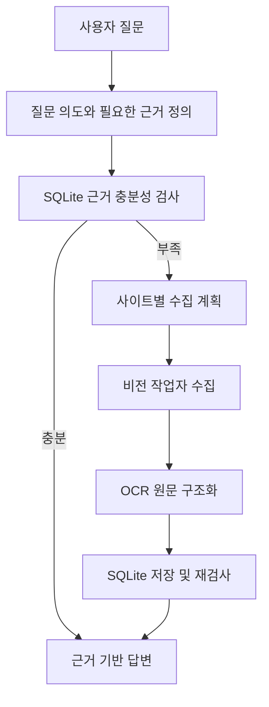
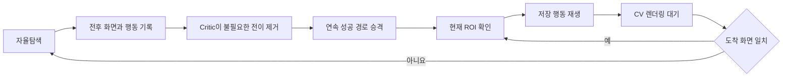

# L2C - LLM to Computer

[](https://github.com/Dreamtreeme/L2C/actions/workflows/ci.yml)
[](./LICENSE)

- 자연어 질문을 조사 계획으로 바꾸고 SQLite에 답변 근거가 충분한지 먼저 확인합니다.
- 근거가 부족하면 실제 웹 화면을 OCR로 읽고 물리 입력으로 채용공고 상세 본문을 수집합니다.
- 자율탐색에서 성공한 화면 전이는 검토 후 재생해 반복 실행의 LLM 추론과 비용을 줄입니다.


## 빠른 시작

실행 환경은 64비트 Windows 10/11, Node.js 22 이상, NVIDIA 드라이버 580 이상,
VRAM 8GB 이상, 여유 디스크 12GB 이상입니다. Python 3.13.14는 설치 과정에서
확인하고 없으면 공식 설치 파일로 구성합니다.

```powershell
git clone https://github.com/Dreamtreeme/L2C.git
cd L2C
.\setup.cmd
notepad .env
```

`.env`의 `GEMINI_API_KEY`에 [Google AI Studio API 키](https://aistudio.google.com/app/apikey)를
입력한 뒤, 합성 공고 3건이 들어 있는 재현 데모를 실행합니다.

```powershell
.\demo.cmd
```

브라우저에서 `샘플 DB에 있는 AI 엔지니어 공고를 비교해줘`라고 질문하면 DB 근거와
`job_id`를 인용한 답변을 확인할 수 있습니다. 데모 데이터는
[`data/samples/demo_jobs.json`](./data/samples/demo_jobs.json)에 고정되어 있으며 실행할
때마다 `data/demo_jobs.db`를 같은 내용으로 다시 만듭니다.

실제 사이트 수집에는 기본 DB로 앱을 실행합니다.

```powershell
.\run.cmd
```

`setup.cmd`는 `.venv-app`, `.venv-ocr`, Chromium, OmniParser·PaddleOCR 모델,
프런트 패키지와 빌드를 한 번에 준비합니다. Node.js와 NVIDIA 드라이버는 설치 전에
검사하며 자동 설치하지 않습니다.

## 문제와 접근

채용공고는 게시, 마감, 재등록으로 상태가 바뀌고 검색 결과의 제목만으로는 실제 업무,
필수 조건과 우대 조건을 판단하기 어렵습니다. API가 없거나 제공 정보가 제한된
사이트까지 직접 확인하려면 사이트별 DOM 자동화 코드를 계속 관리하거나 매 화면마다
비전 모델이 판단해야 합니다.

L2C의 비전 작업자는 스크린샷, PaddleOCR, OmniParser 마커와 공통 물리 도구를
사용합니다. 처음 보는 화면에서는 LLM이 행동을 선택합니다. 성공한 실행의
`이전 화면 → 행동 묶음 → 도착 화면`은 검토 가능한 경험으로 저장하고, 다음 실행에서
같은 화면이 확인되면 추론 없이 재생합니다. 카드 의미 선택과 상세 본문 판단처럼
화면마다 달라지는 결정은 LLM이 계속 담당합니다.

## 사용자 흐름



FastAPI는 UI 요청과 SSE 응답을 전달합니다. Investigation LangGraph가 대화 문맥,
확인 질문, DB 조회, 수집 계획, 작업자 호출, 저장 시점과 답변 순서를 관리합니다.
Vision Worker LangGraph는 화면 캡처부터 OCR, 경험 재생, LLM 판단과 물리 도구 실행을
반복합니다.

## 경험 기반 탐색



Critic은 실행 기록에서 전이를 유지하거나 제거합니다. 행동 이름, 대상, 파라미터,
순서와 화면 조건을 새로 만들지 않습니다. 재생 시 현재 ROI에서 대상을 다시 찾고,
행동 뒤에는 OpenCV 연속 프레임 비교로 렌더링 완료를 기다립니다. 저장된 URL 또는
ROI pHash와 도착 화면이 다르면 해당 경로를 중단하고 자율탐색으로 복귀합니다.

## 검증 결과

2026-08-14 사람인 제논 공고 `rec_idx=54532265`를 고정 대상으로
`자율탐색 → Critic 승격 → 경험 기반 탐색` 순서로 실행했습니다. 두 실행 모두 같은
공고를 1회 저장했고 품질, 고정 URL과 실행 모드 계약을 통과했습니다.

| 검증 항목 | 결과 |
|---|---:|
| 자율탐색 고정 공고 일치 | 1/1 |
| 경험 기반 탐색 고정 공고 일치 | 1/1 |
| 완료된 경험 경로 | 1개 |
| 재생한 성공 전이 | 2개 |
| 재생 폴백 | 0회 |
| OCR timeout | 0회 |

당시 관찰값은 자율탐색 `60.63초·화면 추론 5회`, 경험 기반 탐색
`29.31초·화면 추론 2회`였습니다. 자율탐색 당시의 화면과 모델 판단을 다시 만들 수
없으므로 이 차이를 실행시간 또는 추론 3회 절감으로 판정하지 않습니다. 현재
관측 계약은 경험 규칙이 대체한 원본 판단 수에서 재생 중 사용한 의미 해석기 호출을
뺀 값을 `reflex_reasoning_call_reduction`으로 기록합니다. 실행 조건과 원본 집계값은
[`docs/evidence/saramin_target_contract_pair_20260814.json`](./docs/evidence/saramin_target_contract_pair_20260814.json)에
보존했습니다.

실행시간, 토큰과 API 비용은 실행별 진단값입니다. 경험 기반 탐색의 성과는 최종 수집
품질을 통과한 실행에서 줄어든 추론 호출 수, 경험 경로 완료율과 폴백 횟수로 평가합니다.

## 비교 범위

| 항목 | Classic Playwright | 일반 비전 에이전트 | L2C |
|---|---|---|---|
| 첫 사이트 준비 | selector와 실행 순서 구현 | 목표와 접속 정보 제공 | 선언형 프로필과 자율탐색 |
| 화면 판단 | DOM 조건 | 매 단계 모델 판단 | 저장 경험이 없을 때 모델 판단 |
| 반복 행동 | 작성한 코드 실행 | 다시 모델 판단 | 관찰된 성공 전이 재생 |
| UI 변경 대응 | selector 수정 | 현재 화면 재추론 | ROI 불일치 시 자율탐색 복귀 |

Classic 기준선은 원티드, 잡코리아와 로켓펀치의 DOM 어댑터를 갖고 있습니다.
Realtime/Vision 경로는 사이트별 selector 없이 클릭, 입력, 스크롤, 키 입력과 브라우저
이동 도구를 공유합니다.

## 아키텍처

```text
Chat UI → FastAPI
  → Investigation LangGraph
      → SQLite 근거 검사
      → WorkerExecutionService
          → Vision Worker LangGraph
              → 캡처 → OCR/경험 재생/추론 → 물리 행동
      → OCR 후처리 → 공고 저장 → DB 재검사
      → job_id 근거 답변

RecipePromotionWorker
  → 성공 후보 → Critic 가지치기 → 활성 경험 경로
```

- `agent/bootstrap.py`: DB, 모델, 체크포인터와 비전 런타임 조립
- `agent/graph/`: 조사 그래프와 비전 작업자 그래프의 순서·분기
- `agent/application/`: 수집 실행, 상세 정제, DB 조회·저장 서비스
- `agent/runtime/`: 작업자 상태, 화면 전환, 카드 큐와 상세 OCR 정책
- `agent/recipe/`: 성공 경로 기록, Critic 검토, ROI 매칭과 재생
- `agent/vision/`: 캡처, CV 로딩 판정, PaddleOCR와 OmniParser
- `shared/schema/`: 수집부터 답변까지 공유하는 Pydantic 계약
- `shared/db/`: SQLite 스키마와 공고 UPSERT

전체 책임 경계는 [`ARCHITECTURE.md`](./ARCHITECTURE.md)에 정리했습니다.

## 기술 스택

| 영역 | 기술 |
|---|---|
| 로컬 앱 | React 19, FastAPI, SSE |
| 워크플로 | LangGraph 1.2 |
| 비전 | OpenCV, OmniParser, PaddleOCR 3.7 |
| 물리 입력 | PyAutoGUI, pyperclip |
| 모델 | Gemini 3.6 Flash, Gemini 3.5 Flash Lite |
| 저장·검색 | SQLite, 검색 의미 사전 |
| 관측 | structlog, LangSmith, 실행 summary |
| 기준선 | Playwright DOM/selector |

## 검증

백엔드 계약과 프런트 테스트를 실행합니다. 테스트 개수는 문서에 고정하지 않고 CI의
실제 결과를 기준으로 삼습니다.

```powershell
.\scripts\test.cmd

Push-Location frontend
npm.cmd test
npm.cmd run build
Pop-Location
```

벤치마크 명령은 설치된 앱 Python만 사용합니다.

```powershell
.\.venv-app\Scripts\python.exe -m benchmark.profile_reflex_trace logs\e2e.summary.json
.\.venv-app\Scripts\python.exe -m benchmark.run_regression_matrix --matrix benchmark\portfolio_reflex_matrix.json --dry-run
```

일반 수집 성공은 요청 개수, 상세 URL, 필수 공고 필드, DB 저장과 답변의 `job_id`
인용을 검사합니다. 고정 대상 E2E는 기대 URL과 저장 URL을 일대일로 비교합니다.
검색 의도와 실제 업무의 의미 일치, 회사명·직무명·본문 정확도는 고정 판정표로 사람이
확인합니다.

## 제약

- 현재 검증 환경은 Windows와 RTX 3080 10GB 한 대입니다.
- Realtime/Vision은 로그인·CAPTCHA 우회 기능을 제공하지 않습니다.
- 사이트 UI, 모델 응답과 네트워크 상태에 따라 자율탐색 성공률과 실행시간이 달라집니다.
- 실제 사이트 사용 전 이용약관과 계정 권한을 확인해야 합니다.
- 저장소의 샘플 공고는 제품 흐름 재현을 위한 합성 데이터입니다.

## 문서

- [현재 아키텍처](./ARCHITECTURE.md)
- [개발 단계 기록](./docs/development_history.md)
- [제품 데모와 검증](./docs/product_demo.md)
- [E2E 관측 기준](./docs/e2e_observability.md)
- [런타임 호환 기준](./docs/runtime_compatibility.md)
- [실패 원인과 해결 기록](./troubleshooting.md)
- [전체 문서 인덱스](./docs/index.md)
