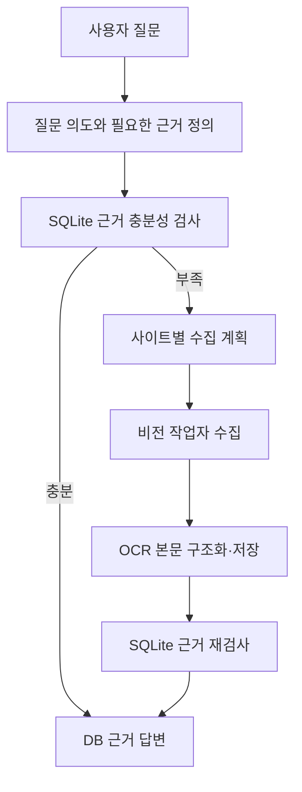
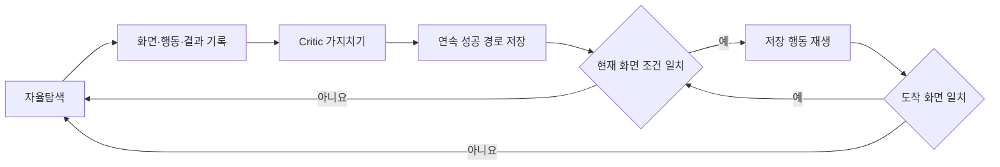

# L2C - LLM to Computer

[](https://github.com/Dreamtreeme/L2C/actions/workflows/ci.yml)
[](./LICENSE)

> 채용공고 수집을 대상으로, 성공한 GUI 실행을 조건부 경로로 재사용하는 Windows 로컬 Computer-Use 애플리케이션

- 자연어 질문을 조사 계획으로 바꾸고, DB 근거가 부족하면 실제 웹 화면에서 상세 본문을 수집합니다.
- 자율탐색의 `화면 → 행동 → 결과`를 기록하고, 검토된 연속 경로를 같은 화면 조건에서 재생합니다.
- 고정 공고 검증에서 연속 전이 2개를 LLM 판단 없이 재생했습니다. 전체 개발 공수와 실행 비용 절감은 확인하지 못했습니다.


## 빠른 시작

실행 환경은 64비트 Windows 10/11, Node.js 22 이상, NVIDIA 드라이버 580 이상,
VRAM 8GB 이상, 여유 디스크 12GB 이상입니다. Python 3.13.14는 설치 과정에서
확인하고 없으면 공식 설치 파일로 구성합니다.

```powershell
git clone https://github.com/Dreamtreeme/L2C.git
cd L2C
.\setup.cmd
notepad .env
```

`.env`의 `GEMINI_API_KEY`에 [Google AI Studio API 키](https://aistudio.google.com/app/apikey)를
입력한 뒤 합성 공고 3건이 들어 있는 데모를 실행합니다.

```powershell
.\demo.cmd
```

브라우저에서 `샘플 DB에 있는 AI 엔지니어 공고를 비교해줘`라고 질문하면 DB 근거와
`job_id`를 인용한 답변을 확인할 수 있습니다. 이 데모는 Chat UI, FastAPI, 조사 그래프와
SQLite 답변 경로를 재현합니다. 실제 사이트의 비전 수집은 다음 명령으로 실행합니다.

```powershell
.\run.cmd
```

설치 항목과 검증된 버전 조합은
[런타임 호환 기준](./docs/runtime_compatibility.md)에 정리했습니다.

## 해결하는 문제

채용공고는 게시, 마감과 재등록으로 상태가 바뀌고, 검색 결과의 제목만으로는 실제 업무,
필수 조건과 우대 조건을 판단하기 어렵습니다. L2C는 먼저 SQLite의 기존 근거를 확인하고,
부족한 정보만 실제 사이트 상세 화면에서 수집해 구조화한 뒤 답변에 사용합니다.

일반 비전 에이전트는 같은 업무를 반복해도 화면을 다시 읽고 다음 행동을 다시 판단합니다.
L2C는 성공한 실행에서 재사용할 수 있는 연속 구간을 추출하고, 현재 화면이 저장된 조건과
일치할 때 해당 행동을 직접 실행합니다.

## 설계 변경

초기에는 비전 기반 조작이 사이트별 DOM 자동화 개발 공수를 줄일 것으로 예상했습니다.
인크루트와 랠릿에 Classic과 Vision을 각각 구현해 비교한 결과, Vision의 사이트 전용
코드는 줄었지만 전체 적용시간과 실행시간은 더 길었습니다.

이후 최적화 대상을 사이트 구현 공수에서 반복되는 모델 판단으로 변경했습니다.
비교 조건과 수치는 [기술 및 설계 결정](./docs/design_decisions.md)과
[신규 사이트 적용 증거](./docs/evidence/site_onboarding/comparison_report.json)에 보존했습니다.

## 사용자 흐름



FastAPI는 요청과 SSE 진행 이벤트를 전달합니다. Investigation LangGraph가 질문 보완,
DB 검사, 수집, 저장과 답변 순서를 관리하고, Vision Worker LangGraph가 화면 관찰,
행동 선택, 물리 입력과 공고 검토를 반복합니다.

## 경험 경로 재사용



Critic은 실행 기록에서 실패했거나 결과에 필요하지 않았던 전이만 제거합니다. 행동과
화면 조건을 새로 만들지 않습니다. 재생은 URL 범위, ROI pHash와 저장 좌표를 검사하고,
조건이나 도착 화면이 다르면 경로를 중단한 뒤 자율탐색으로 복귀합니다.

## 판단 책임

| 주체 | 담당하는 판단과 실행 |
|---|---|
| 코드 | 그래프 전이, 도구 계약 검증, CV 로딩 대기, pHash 비교, 물리 입력, DB 저장과 폴백 |
| LLM | 사용자 의도, 화면 의미, 목표 선택, 공고 구조화와 Critic 가지치기 |
| 사람 | 검색 의도 일치, 공고 내용 정확성과 최종 답변 품질 평가 |

## 확인한 범위

| 확인 항목 | 결과 |
|---|---|
| 고정 공고 자율탐색과 경험 기반 탐색 | 두 실행 모두 같은 공고 1건 저장 |
| 화면 조건 일치 시 추론 없는 재생 | 연속 전이 2개 완료, 폴백 0회 |
| Classic·Vision 신규 사이트 적용 | 두 방식 모두 품질 통과, Vision의 전체 적용시간은 더 김 |
| 경험 기반 탐색의 전체 실행시간 절감 | 확인하지 못함 |
| Critic 비용을 포함한 총비용 절감 | 손익분기점을 확인하지 못함 |

고정 공고 실행 조건과 원본 집계값은
[고정 대상 증거](./docs/evidence/saramin_target_contract_pair_20260814.json), 전체 E2E 기록과
수치 해석은 [제품 데모 및 검증](./docs/product_demo.md)에 정리했습니다.

## 아키텍처

```text
Chat UI → FastAPI → Investigation LangGraph
  → SQLite 근거 검사
  → WorkerExecutionService → Vision Worker LangGraph → 실제 웹 화면
  → 공고 검토 → SQLite 저장 → DB 근거 답변

RecipePromotionWorker
  → 성공 후보 → Critic 가지치기 → 활성 경험 경로
```

상태 소유권, 그래프 경계, 비전 자원 수명과 주요 모듈은
[ARCHITECTURE.md](./ARCHITECTURE.md)에서 설명합니다.

## 기술 스택

| 영역 | 기술 |
|---|---|
| 로컬 앱 | React 19, FastAPI, SSE |
| 워크플로 | LangGraph 1.2 |
| 비전 | OpenCV, OmniParser, PaddleOCR 3.7 |
| 물리 입력 | PyAutoGUI, pyperclip |
| 모델 | Gemini 3.6 Flash, Gemini 3.5 Flash Lite |
| 저장·검색 | SQLite, 검색 의미 사전 |
| 관측 | structlog, LangSmith, 실행 summary |
| 기준선 | Playwright DOM/selector |

## 검증 명령

백엔드 계약과 프런트 테스트를 실행합니다.

```powershell
.\scripts\test.cmd

Push-Location frontend
npm.cmd test
npm.cmd run build
Pop-Location
```

실제 브라우저 E2E와 성능 집계 방법은
[E2E 관측 환경](./docs/e2e_observability.md)을 따릅니다.

## 제약

- 현재 검증 환경은 Windows와 RTX 3080 10GB 한 대입니다.
- Realtime/Vision은 로그인·CAPTCHA 우회 기능을 제공하지 않습니다.
- 사이트 UI, 모델 응답과 네트워크 상태에 따라 자율탐색 성공률과 실행시간이 달라집니다.
- 실제 사이트 사용 전 이용약관과 계정 권한을 확인해야 합니다.
- 저장소의 샘플 공고는 제품 흐름 재현을 위한 합성 데이터입니다.

## 상세 문서

| 문서 | 내용 |
|---|---|
| [현재 아키텍처](./ARCHITECTURE.md) | 계층, 상태 소유권, 그래프와 런타임 경계 |
| [기술 및 설계 결정](./docs/design_decisions.md) | 채택한 방식, 비교 결과와 트레이드오프 |
| [제품 데모 및 검증](./docs/product_demo.md) | 실제 실행 시나리오와 E2E 수치 |
| [E2E 관측 환경](./docs/e2e_observability.md) | 실행시간, 토큰, 비용과 실패 단계 집계 |
| [런타임 호환 기준](./docs/runtime_compatibility.md) | Python, CUDA, OCR 설치 조합 |
| [실패 원인과 해결 기록](./troubleshooting.md) | 실험 실패, 원인과 수정 결과 |
| [개발 단계 기록](./docs/development_history.md) | 구현 범위가 바뀐 과정 |
| [전체 문서 인덱스](./docs/index.md) | 나머지 설계·검색·운영 문서 |
