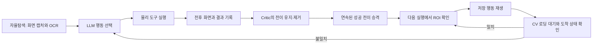

# L2C - LLM to Computer

> 자연어 질문에 필요한 최신 근거를 실제 웹 화면에서 수집하고, 한 번 성공한
> 화면 행동 경로를 다음 실행에 재사용하는 로컬 채용시장 조사 에이전트입니다.

## 문제와 접근

채용공고는 게시·마감·재등록으로 상태가 계속 바뀝니다. 검색 결과의 제목과 요약만
보면 실제 업무, 필수 조건, 우대 조건의 뉘앙스를 놓칠 수 있어 상세 화면을 직접
읽어야 합니다. 사람이 여러 사이트에서 검색하고 상세 본문을 비교하는 과정에는
반복 조작과 읽기 시간이 함께 들어갑니다.

Classic 기준선은 Playwright selector와 사이트별 실행 순서를 사용합니다. 실행은
빠르지만 사이트를 추가하거나 UI가 바뀔 때 어댑터를 수정해야 합니다. 비전 작업자는
스크린샷, PaddleOCR, OmniParser 마커와 공통 물리 도구를 사용하므로 첫 탐색을
사이트별 selector 없이 시작할 수 있습니다. 이 경로는 매 화면에서 LLM 판단 비용이
발생합니다.

L2C는 첫 실행의 성공 기록을 다음 실행의 제약된 행동 기억으로 사용합니다. 검색창
입력과 검색 버튼 클릭처럼 실제로 관찰된 연속 행동은 화면 상태를 확인하면서
재생하고, 현재 공고의 의미 선택과 상세 본문 판단은 LLM에 남깁니다. 사용자의 질문은
조사 계획으로 바뀌며, SQLite 근거가 충분하면 브라우저를 열지 않습니다. 새 근거가
필요한 경우에만 채용사이트를 방문하고 구조화된 공고와 `job_id`를 저장해 답변합니다.

## 경험 기반 탐색

현재 학습 단위는 자율탐색에서 실제로 성공한 `이전 화면 → 행동 묶음 → 도착 화면`
전이입니다.



Critic은 기록된 전이를 유지하거나 제거합니다. 행동 이름, 대상, 파라미터, 순서와
화면 조건은 새로 만들거나 수정하지 않습니다. 남은 전이가 실제 실행 순서로 이어질
때만 하나의 경로로 저장됩니다. 재생 시 첫 대상은 현재 ROI에서 다시 찾고, 행동 뒤에는
OpenCV 연속 프레임 비교로 렌더링을 기다린 다음 저장된 URL 또는 ROI pHash로 도착
상태를 확인합니다.

현재 자동 승격 범위는 성공 로그에 존재한 연속 행동입니다. 반복문, 새 분기, 새 도구
조합과 새 함수를 합성하는 기능은 구현 범위에 포함하지 않습니다. 검색 결과의 가변
카드, 상세 페이지의 내용 판단과 예외 화면은 자율탐색이 처리합니다.

## 현재 실증 결과

### 통과한 단일 짝 실험

2026-08-13 사람인 `AI 엔지니어` 고정 공고 2건을 같은 설정으로
`자율탐색 → Critic 승격 → 경험 기반 탐색` 순서로 실행했습니다. 당시 변경분은 이후
`260fcfd`로 커밋됐습니다. 새 고정 URL 판정기로 원본 summary를 다시 검사한 결과,
두 실행 모두 넥슨코리아 `rec_idx=54532032`와 하이브랩 `rec_idx=54517809`를 각각
한 번씩 저장했습니다.

| 지표 | 자율탐색 | 경험 기반 탐색 | 차이 |
|---|---:|---:|---:|
| 고정 공고 일치 | 2/2 | 2/2 | 동일 |
| 실행시간 | 73.97초 | 64.48초 | 9.49초 감소 |
| 화면 추론 | 9회 | 7회 | 2회 감소 |
| OCR | 12회 | 10회 | 2회 감소 |
| 총 토큰 | 72,054 | 60,430 | 11,624 감소 |
| 추정 API 비용 | `$0.0307242` | `$0.0283634` | `$0.0023608` 감소 |
| 완료된 경험 경로 | 0개 | 1개 | 2개 전이 재생 |

재생된 전이는 `검색어 입력 → 검색 버튼 클릭`입니다. 카드 선택과 두 상세 페이지
판독은 자율탐색이 수행했습니다. Critic 검토 비용은 `$0.0159255`였으며, 이 한 표본의
비용 절감만 적용하면 약 6.75회 반복 뒤 검토 비용을 회수합니다. 이 결과는 단일 짝
표본이고 실행 당시 작업 트리가 커밋 전 상태였으므로 개발 단계 측정값으로 분류합니다.
실행 ID, 고정 URL과 집계값은
[`docs/evidence/saramin_reflex_pair_20260813.json`](./docs/evidence/saramin_reflex_pair_20260813.json)에
축약해 보존했습니다.

### 2026-08-14 고정 대상 계약 재검증

깨끗한 커밋 `260fcfd`에서 같은 검색 경로는 다시 적중했습니다. 경험 기반 실행은
2개 전이를 재생했고 경로 1개를 완료했으며, 입력 뒤 ROI와 검색 뒤 URL을 확인하는
동안 전체 OCR을 생략했습니다.

전체 수집 품질은 통과하지 못했습니다. 기존 평가기는 `expected_source_urls`를
summary에 기록만 하고 실제 저장 URL과 비교하지 않아, 다른 공고나 동일 공고의 URL
변형을 저장해도 성공으로 처리했습니다. 평가기에 고정 URL의 호스트·경로·쿼리
식별자를 일대일로 대조하는 최종 계약을 추가한 뒤 다음 결과를 확인했습니다.

| 시나리오 | 자율탐색 | 경험 기반 탐색 | 성능 비교 |
|---|---:|---:|---|
| 기존 고정 URL 2건 재실행 | 0/2 | 0/2 | 제외 |
| 현재 제논 공고 1건 | 1/1 | 0/1 | 제외 |

두 번째 시나리오에서 경험 기반 실행은 검색 경로를 정상 재생했지만 이후 LLM이 다른
AI 엔지니어 카드를 선택했습니다. 이 실패를 계기로 고정 대상 판정을 자식 E2E의 최종
품질 계약에 포함하고, 누락·중복·추가 URL을 모두 실패로 처리했습니다.

수정 후 같은 제논 공고 `rec_idx=54532265`를 대상으로 다시 실행한 결과는 다음과
같습니다.

| 지표 | 자율탐색 | 경험 기반 탐색 | 차이 |
|---|---:|---:|---:|
| 고정 공고 일치 | 1/1 | 1/1 | 동일 |
| 실행시간 | 60.63초 | 29.31초 | 31.32초 감소 |
| 화면 추론 | 5회 | 2회 | 3회 감소 |
| OCR | 5회 | 4회 | 1회 감소 |
| 총 토큰 | 36,069 | 14,871 | 21,198 감소 |
| 추정 API 비용 | `$0.0159379` | `$0.0069957` | `$0.0089422` 감소 |
| 완료된 경험 경로 | 0개 | 1개 | 2개 전이 재생 |

두 실행 모두 종료 코드 0, 품질 계약, 고정 대상 계약과 실행 모드 계약을 통과했습니다.
OCR timeout과 재생 폴백은 없었습니다. Critic 검토 비용은 `$0.0133770`이며 이 표본의
비용 절감 기준 손익분기점은 약 1.50회입니다. LangSmith trace ID가 없는 로컬
환경이라 원격 피드백 발행은 생략됐고, summary의 `observability.e2e_success`는 두
실행 모두 `1`로 기록됐습니다. 실행 근거는
[`docs/evidence/saramin_target_contract_pair_20260814.json`](./docs/evidence/saramin_target_contract_pair_20260814.json)에
보존했습니다.

현재 증거가 지지하는 범위는 **관찰된 검색 부모 경로의 추론 생략과 결정론적
재생**입니다. 동일 공고 선택을 포함한 전체 수집의 안정적인 시간·비용 절감은 반복
표본으로 추가 검증해야 합니다.

## 비교 범위

| 항목 | Classic Playwright | 범용 웹 에이전트 | L2C |
|---|---|---|---|
| 첫 사이트 준비 | selector와 실행 순서 구현 | 목표와 접속 정보 제공 | 선언형 프로필과 첫 자율탐색 |
| 화면 판단 | DOM 조건 | 매 단계 모델 판단 | 미승격 단계만 모델 판단 |
| 반복 행동 | 작성한 코드 실행 | 다시 모델 판단 | 관찰된 성공 전이만 재생 |
| UI 변경 | selector 수정 | 현재 화면 재추론 | ROI 불일치 시 자율탐색 복귀 |
| 현재 강점 | 안정된 대량 처리 | 넓은 초기 탐색 범위 | 비전 탐색 기록을 검증 가능한 경로로 재사용 |

2026-07-28 L2C 실행의 토큰 수를
[Browser Use 공식 Pay As You Go 가격표](https://browser-use.com/pricing)에 단순
대입한 값은 BU Mini `$0.0812`, BU Max `$0.3373`이었습니다. Browser Use를 같은
과제로 실행한 측정값이 아니므로 성능 우위 근거에는 사용하지 않습니다.

Classic 기준선은 원티드·잡코리아·로켓펀치의 DOM 어댑터로 구성됩니다. 비전 경로는
등록 사이트에서 클릭, 입력, 스크롤, 키 입력과 브라우저 이동 도구를 공유합니다.
신규 사이트 적용 공수와 수집 성공률의 정식 비교는 아직 완료되지 않았습니다.

## Agent 아키텍처

```
사용자 자연어 질의
    ↓
[Chat UI → FastAPI]
    ↓
[ChatService — 실행 계측과 API 응답 변환]
    ↓
[Investigation LangGraph — 요청별 최상위 실행 관리자]
  대화 문맥 적재 → 요청 이해 → 중요한 모호성 확인
  → 답변 근거 정의 → SQLite 충분성 검사
  → 부족한 근거의 수집 행동계획
  → collect 노드에서 비전 작업자 실행
  → postprocess 노드에서 OCR 원문을 공고 스키마로 구조화
  → persist 노드에서 공고 UPSERT
  → 작업자 제출물과 레시피 후보를 별도 기록
  → SQLite 근거 재검사 → 최종 답변 및 job_id 인용 검증
    ↓
[WorkerExecutionService — 수집 요청과 작업자 그래프 연결]
    ↓
[VisionWorkerRuntime.execution_session — 화면 잠금·브라우저 정리]
  OCR·판단 모델·컴파일된 그래프는 요청 간 재사용
    ↓
[Vision Worker LangGraph]
  시작 상태 확인 → capture → transition → selection
  ├─ OCR 필요: ocr → transition → selection
  ├─ 결정론적 정책: execution
  ├─ Reflex 후보: reflex → execution 또는 reasoning
  └─ 의미 판단 필요: reasoning → execution
  execution → capture·reasoning·종료
    ↓
[SQLite 저장 → Investigation LangGraph 근거 재검사 → 최종 답변]

[비동기 RecipePromotionWorker]
  레시피 후보 → Critic 가지치기 → 활성 Reflex Recipe 승격
```

지휘자는 `agent/graph/investigation_workflow.py`의 LangGraph로 실행됩니다. 확인 질문이 남아 있으면 DB와 브라우저 도구를 호출하지 않고 `waiting_input`으로 중단하며, 사용자의 선택은 SQLite 조사 상태에 반영되어 다음 질문 또는 근거 검사 단계부터 재개됩니다. 사이트·날짜·개수·분석 목적은 실행 전에 확정된 행동계획에서만 수집 worker로 전달됩니다.

`agent/bootstrap.py`는 체크포인터, DB·대화·수집 포트, 모델 묶음과 비전 런타임을 생성해 그래프에 주입하는 조립 지점입니다. Investigation LangGraph가 대화 문맥, 노드 순서, DB 조회·저장 시점, 분기, 중단·재개와 상태 갱신을 담당합니다. 실제 SQL, 브라우저와 OCR 자원 수명은 주입된 어댑터가 담당합니다. Vision 노드는 전역 런타임 조회 없이 LangGraph `Runtime` 문맥으로 전달된 `VisionWorkerRuntime`을 사용합니다.

작업자 상태는 `request`, `observation`, `decision`, `transition`, `replay`, `collection`, `lifecycle`의 7개 책임 구역으로 나뉩니다. 노드는 자신이 변경한 구역만 `WorkerStateUpdate`로 반환하고 LangGraph reducer가 해당 구역을 병합합니다. 행동 실행은 불변 입력과 가변 결과를 분리하고, 결과 상태에서 최초 입력과 달라진 구역만 반환합니다.

Realtime/Vision 경로는 DOM이나 Playwright selector를 사용하지 않습니다. 전환 검증, 상세 OCR 누적, 카드 큐, Reflex 재생은 `agent/runtime/`에 분리되어 화면 서명·OCR 마커·좌표비율만 사용합니다. 최초 검색 결과에서는 경량 모델이 수집할 카드를 한 번 고르고, 상세에서 돌아온 뒤에는 목록 pHash와 저장 좌표로 큐의 다음 카드를 실행합니다. 큐를 모두 처리한 뒤 추가 탐색이 필요할 때만 일반 화면 추론이 새 큐를 만듭니다. Investigation LangGraph가 요청과 저장 흐름을 지휘하고, `agent/application/`은 상세 정제·DB 작업·비전 실행 어댑터를 제공하며 `agent/bootstrap.py`는 자원 수명주기만 조립합니다.

운영 경로는 지연 초기화(lazy initialization)를 적용합니다. DB 질의와 웹 Q&A 서버는 비전 엔진, YOLO 모델, 물리 GUI 제어 도구를 import 시점에 초기화하지 않고, 실시간 수집이 실제로 필요할 때만 비전 파이프라인을 준비합니다. PaddleOCR subprocess는 작업 동안 계속 재사용하고, 요청 timeout이나 worker 오류가 발생할 때만 재시작합니다. OCR 입력 최대 변은 1152로 제한합니다.

## 진행 상황

- [x] 프로젝트 셋업
- [x] Phase 1: Classic 시스템 베이스라인
  - [x] 원티드 URL 입력 기반 추출
  - [x] 본문 셀렉터 기반 영역 추출 및 상세 정보 더 보기 클릭
  - [x] Gemini 구조화 출력 기반 LLM 정형화 및 SQLite 저장
  - [x] LLM 출력 JSON 모드 및 타입 정규화 (string ↔ list 자동 변환)
  - [x] 사이트별 어댑터 패턴 및 URL 디스패처 (`classic/automation/sites/`)
  - [x] Classic 기준선 3개 사이트 구현 (원티드, 잡코리아, 로켓펀치)

- [x] Phase 2: 비전 및 물리 제어 엔진 기반 에이전트 도구 구축
  - [x] 1. 지표 및 에러 추적 세팅
    - [x] structlog: 소요 시간 등 성능 벤치마크용 JSON 포맷 로깅
  - [x] 2. 백그라운드 엔진 스크립트 (LLM이 직접 호출하지 않는 내부 엔진 계층)
    - [x] Perception: mss 브라우저 캡처, CV 로딩 대기, OCR, pHash를 분리한 화면 인식 파이프라인
    - [x] Loading Wait: 메모리 프레임의 변화·안정성과 회색 저정보 화면을 함께 확인한 뒤 최종 화면만 저장
    - [x] Security: .env 기반 자격증명 관리 시스템
  - [x] 3. 순수 파이썬 좌표 검증 테스트
    - [x] LLM 연동 전 캡처 화면의 마커 좌표와 실제 마우스 클릭 좌표가 어긋나지 않는지 하드코딩으로 1차 확인
  - [x] 4. 에이전트 상태 관리
    - [x] 스크롤이나 클릭 동작의 성공 여부를 비교할 수 있도록 최근 2장의 전후 마커 이미지 보관
    - [x] 파싱된 UI 요소 텍스트 및 Action History 정의
  - [x] 5. LLM이 호출하는 물리 행동 도구 (에이전트의 외부 인터페이스)
    - [x] click_marker: 마커 ID의 절대 좌표 계산 후 PyAutoGUI 물리적 클릭
    - [x] type_in_marker: 한글 씹힘 현상 방지를 위해 pyperclip 모듈을 활용한 클립보드 복사 후 붙여넣기 물리 타이핑
    - [x] scroll: OS 마우스 휠 스크롤
    - [x] press_key: Enter, ESC 등 특수키 입력
    - [x] finish_task: 수집 완료 시 데이터를 반환하며 루프 강제 종료
    - [x] Action Wrapper: 도구 실행 시 성능 로깅 및 안정화 대기 로직 자동 주입

- [x] Phase 3: LangGraph 지휘자 워크플로우 구성 (비전 통합은 Phase 3.5에서 본격 구현)
  - [x] 1. 노드 설계 및 관찰 → 계획 → 행동 루프
    - [x] Perception Node: 시스템이 화면을 캡처하고 로컬 SoM(OmniParser + PaddleOCR)으로 UI 요소와 텍스트를 추출 후 상태 갱신
    - [x] Reasoning Node: 마킹 이미지와 압축된 UI 텍스트 컨텍스트를 Gemini 3.5 Flash에 전달해 다음 행동 도구 선택
    - [x] Action Node: 도구 실행 및 시스템 안정화 후 다시 Perception Node로 회귀
  - [x] 2. 모듈화 기반 서브 그래프 구축
    - [x] 향후 Phase 6의 라우터 확장을 고려하여 구조를 유연하게 분리
  - [x] 3. LangSmith 통합 트래킹
    - [x] 노드 간 궤적, 소요 토큰 수, 프롬프트 입출력 모니터링 적용 (Phase 8 학습 데이터의 원천)
  - [x] 4. 단일 시나리오 E2E 통합 테스트
    - [x] 바탕화면에서 브라우저 조작 및 검색 화면 이동 검증 ("원티드에서 데이터 분석가 신입 공고 검색해줘" 명령)

- [x] Phase 3.5: OmniParser(Set-of-Marks) 로컬 파이프라인 실제 구현 및 순수 비전 본문 JSON 추출
  - [x] 1. 종속성 패키지 설치 (`ultralytics`, `paddleocr`) 및 로컬 OCR 연동 확인
  - [x] 2. OmniParser 공식 YOLOv8 모델 가중치 자동 다운로드 유틸 개발
  - [x] 3. OCR 경계 분리 (`paddle_ocr.py` 문자 검출, `omni_parser.py` 아이콘 검출, `ocr_engine.py` 마커 합성)
  - [x] 4. `perception.py` 리팩토링 및 SoM 연동 (마킹 이미지 주입 및 마커 ID 좌표 매핑 디코딩)
  - [x] 5. VLM 프롬프트 최적화 (멀티모달 SoM 마크 이미지 주입 및 의사결정 프롬프트 팝업/모달 차단 조치 추가)
  - [x] 6. E2E 본문 추출 통합 테스트 검증 및 벤치마크
    - [x] 원티드 데이터 분석가 검색 이동 성공 및 듀얼 모니터 좌표 매핑 속도 검증
    - [x] **[핵심 목적]** 개별 채용공고 카드 클릭 상세 진입 ➡️ "상세 정보 더 보기" 클릭 본문 확장 ➡️ 스크롤을 통한 화면 전체 텍스트 판독 ➡️ 주요업무, 자격요건, 우대사항, 혜택 항목별 구조화된 JSON 본문 데이터 최종 추출 완료 및 파일 저장 검증

- [x] Phase 4: 등록 사이트 간 화면 기반 런타임 재사용 및 본문 비교 검증
  - [x] 1. 로그인 불필요 환경에 대응하는 워크넷 접속 및 검색 추출
  - [x] 2. 잡코리아 등 화면 구조가 다른 사이트에 같은 비전 도구 계약 적용
  - [x] 3. Realtime 경로는 사이트별 DOM 파싱 코드 대신 등록 프로필과 공통 화면 작업자를 사용
  - [x] 4. **[추가]** 검색 결과 채용 공고 카드를 클릭하여 상세 페이지(본문)로 이동한 후, 화면 내 본문 텍스트를 판독·추출하여 파일로 저장
  - [x] 5. **[추가]** 저장된 본문 파일과 실제 사이트의 원문(Ground Truth) 텍스트를 텍스트 유사도 및 차이(Diff) 분석을 통해 정밀 검증하는 프로세스 구축

- [x] Phase 5: Classic 대 Agent 벤치마크 실험 및 본문 정합성 비교 데모
  - [x] 1. 성공률 및 완료 소요 시간에 대한 Structlog 데이터 기반 정량 비교
  - [x] 2. **[추가]** Classic 시스템이 수집한 공고 원문 파일과 Agent가 저장한 본문 텍스트 파일 간의 텍스트 매칭 정확도 및 누락률 정량 비교
  - [x] 3. LangSmith 데이터 기반 에이전트 오류 자가 복구율 분석 및 LangGraph `recursion_limit` 60으로 완화 조정
  - [x] 4. 토큰 사용량 기반 비용 산출 및 로컬 모델 메모리 부족(OOM)으로 발생하던 500 에러를 대비하기 위한 Gemini API 텍스트 추론 경로 추가 (하이브리드 추론 구조로 전환)

- [x] Phase 6: 수집 데이터 전처리 및 DB 적재 신뢰성 강화
  - [x] 1. 고정밀 텍스트 전처리 엔진 구현 (`preprocessor.py`)
    - [x] OCR 텍스트 내 불필요 개행, 특수 기호, 마커 잔영(`[id]`) 제거 및 목록 필드 정규화
    - [x] LLM이 리스트 필드를 단일 문자열 또는 JSON 문자열로 반환해도 안전하게 리스트로 정규화
    - [x] `3년 이상 ~ 7년 이하` 같은 경력 범위 표현 파싱 보강
  - [x] 2. 수집 필드 확장 스키마 설계 및 마이그레이션 (`jd_schema.py`, `database.py`)
    - [x] `source_platform`, `raw_ocr_text`, `content_hash`, `experience_min/max/text` 필드 및 인덱스 동적 추가
  - [x] 3. SQLite DB 이중 중복 방지 적재
    - [x] 동일 URL 또는 동일 content_hash 감지 시 자동 `UPDATE` 처리하는 UPSERT 파이프라인 구축
  - [x] 4. E2E 데이터 파이프라인 정합성 최종 검증 (`test_db_persistence.py`)
    - [x] 실제 수집 데이터 기반 전처리·DB 연동 후 적재 검증 패키지 자동 테스트 통과

- [x] Phase 7: 조사 계획 기반 DB 근거 조회와 지휘자 통합
  - [x] 1. 사용자 질문을 조사 계약으로 변환
    - [x] 직무 범위, 기술 조건, 사이트 검색어, 필요한 근거를 서로 다른 필드로 분리
    - [x] LLM이 임의 SQL이나 동의어 목록을 만들지 않고 검색 의미 사전의 개념 키를 사용
  - [x] 2. 구조화된 SQLite 근거 검사
    - [x] 직무 계층과 필수·우대·언급 기술 조건을 결정론적으로 조회
    - [x] 사전에서 확정할 수 없는 의미 조건만 LLM 검증으로 전달
    - [x] DB 근거가 부족할 때만 비전 수집 단계를 계획
  - [x] 3. 답변 생성 및 출처 검증
    - [x] 검증된 공고만 구조화 문서로 답변 모델에 제공
    - [x] 답변의 `[job_id:N]`이 실제 근거 문서에 포함되는지 검사
  - [x] 4. 정적 검색 의미 사전
      - [x] 버전 관리되는 한국어 업무 영역·직무·기술 별칭 적재
      - [x] 업무 영역부터 직무군까지 DB 공고 수와 사전 직무 수를 구분한 단계형 질문
      - [x] 미등록 직무는 선택 영역의 하위 개념만 LLM에 제공하고 현재 요청에서 확인

- [ ] **Phase 8: 피드백 루프 기반 Reflex Recipe 승격 (현재 단계)**

  > 자율탐색이 실제 실행한 전후 화면과 행동을 기록하고, Critic이 유지한 연속 성공
  > 전이만 다음 실행에서 재생한다.

  - [x] 1. 성공 전이 기록
    - [x] 행동, 대상, 파라미터 슬롯, 실행 결과와 전후 화면을 같은 순번으로 저장
    - [x] 검색어처럼 바뀌는 값은 `slot_refs`로 분리
  - [x] 2. Critic 가지치기
    - [x] 후보 전체의 `accept / reject`와 전이별 `keep`만 반환
    - [x] 행동·대상·파라미터·순서·화면 조건 수정 권한 제거
    - [x] 가지치기 뒤 실제 화면 상태가 이어지는 전이만 경로로 승격
  - [x] 3. 경험 경로 재생
    - [x] 현재 ROI에서 대상을 다시 찾고 저장된 행동 묶음 실행
    - [x] OpenCV로 렌더링 완료를 기다린 뒤 URL 또는 ROI pHash로 도착 상태 확인
    - [x] 불일치나 시간 초과 시 해당 경로를 중단하고 자율탐색으로 복귀
  - [x] 4. 고정 대상 평가 계약
    - [x] 기대 URL의 호스트·경로·쿼리 식별자를 저장 결과와 일대일 비교
    - [x] 고정 대상이 다르면 성공 건수와 무관하게 성능 비교에서 제외
  - [ ] 5. 반복 실증
    - [ ] 같은 고정 공고를 자율탐색과 경험 기반 탐색에서 안정적으로 선택
    - [ ] 깨끗한 커밋에서 사이트별 3회 이상 짝 반복
    - [ ] 성공률, 잘못된 카드 선택률, 실행시간, 토큰과 Critic 비용 함께 보고

## 디렉토리 구조

```
L2C/
├── ARCHITECTURE.md     시스템 아키텍처 문서
├── README.md           프로젝트 메인 리드미
├── troubleshooting.md  트러블슈팅 가이드
├── requirements.txt    종속성 패키지 정의
├── .env.example        환경변수 예시 파일
│
├── classic/            전통 자동화 (베이스라인)
│   ├── automation/       Playwright DOM 파싱 및 사이트별 어댑터
│   └── extractor/        Gemini 구조화 출력 기반 텍스트 정형화
│
├── agent/              비전 LLM 에이전트
│   ├── application/      사용자 지휘·작업자 실행·상세 정제·DB 저장 서비스
│   ├── graph/            LangGraph 순서·분기와 조사·작업자 노드
│   ├── runtime/          상태 계약·비전 의존성·전환·상세 OCR·카드 큐 정책
│   ├── prompts/          조사·상세 정제·신뢰 경계 프롬프트
│   ├── tools/            화면 인식(Perception)·물리 제어·실시간 수집 도구
│   ├── sites/            지휘자용 사이트 프로필과 매뉴얼 JSON
│   ├── recipe/           Reflex Recipe 기록·매칭·재생 보조 모듈
│   ├── utils/            로깅 및 전처리 유틸리티
│   └── tests/            자동화 유닛/통합 테스트 (DB 영속성, 조사 계획 등)
│
├── shared/             공통 모듈
│   ├── db/               SQLite 데이터베이스 관리
│   └── schema/           Pydantic 스키마 정의
│
├── benchmark/          비교 벤치마크 스크립트 및 정합성 리포트
│
├── data/               수집 데이터 및 정합성 검증 비교 리포트
│   ├── screenshots/      에이전트 구동 중 캡처 화면
│   ├── jobs.db           수집 결과 SQLite DB 파일
│   └── *.md/*.json       정합성 비교 리포트 및 추출 결과 캐시
│
└── docs/               추가 설계 관련 문서
    ├── index.md             문서 탐색 진입점
    └── design_decisions.md  기술적 설계 결정
```

## 기술 스택

| 카테고리 | 기술 |
|---------|------|
| 언어·런타임 | Python 3.13.14 |
| Classic 브라우저 자동화 | Playwright DOM/selector |
| Realtime 브라우저 자동화 | 화면/OCR + PyAutoGUI 물리 입력 |
| UI 요소 검출 | OmniParser (Microsoft) |
| OCR | PaddlePaddle 3.3.1 + PaddleOCR 3.7 GPU subprocess 재사용 |
| 에이전트 워크플로우 | LangGraph 1.2 |
| 지휘자 모델 | Gemini 3.6 Flash |
| 비전 판단 모델 | Gemini 3.6 Flash |
| 경량 구조화 모델 | Gemini 3.5 Flash Lite |
| 실행자 텍스트 모델 | Gemini 경량 모델 |
| 검색 방식 | 검색 의미 사전 + 구조화 SQLite 근거 검사 |
| 궤적 트래킹 | LangSmith |
| 자격증명 보안 | .env (python-dotenv) |
| 저장소 | SQLite |

## 보안·법적 고려사항

- **자격증명**: 소스 코드에 직접 노출하지 않고 `.env` 파일에 보관하여 `.gitignore`로 관리합니다.
- **사용 범위**: 본인 계정에 한정하며, 학습 목적으로만 사용합니다.
- **사이트 약관**: 각 사이트의 이용약관을 확인하고 진행합니다.

## 빠른 시작

```powershell
git clone https://github.com/Dreamtreeme/L2C.git
cd L2C

# Windows 원클릭 설치
.\setup.cmd

# 테스트·벤치마크 도구까지 설치
.\setup.cmd -Development

# setup.cmd가 만든 .env에 GEMINI_API_KEY를 설정

# 분할된 비전 작업자 그래프는 VISION_AGENT_RECURSION_LIMIT=180 기본값으로 실행

# 로컬 Chat UI와 백엔드 실행
.\run.cmd

# Classic 방식 — URL 직접 입력
python -m classic.main extract https://www.wanted.co.kr/wd/350432

# 핵심 제품 계약 117개
.\scripts\test.cmd

# 과거 장애와 세부 기능 회귀
.\scripts\test.cmd agent\tests\regression -q

# 벤치마크와 품질 계산 검증
.\scripts\test.cmd agent\tests\evaluation -q

# 전체 232개
.\scripts\test.cmd agent\tests -q

# Realtime E2E: 로그, 구조화 요약, 선택적 LangSmith trace를 함께 생성
python -m benchmark.run_realtime_e2e --site wanted --search-keyword "iOS 개발자" --original-query "ios 개발자 공고 2개" --target-count 2 --count-mode explicit --scenario-id wanted-ios-2 --execution-mode experience_guided --log logs/e2e_wanted_ios2.log

# 구조화 summary의 p50/p95/max, Reflex, OCR 지표 확인
python -m benchmark.profile_reflex_trace logs/e2e_wanted_ios2.summary.json

# 포트폴리오 수집 성공률 30회 실행 계약 확인
python -m benchmark.run_regression_matrix --matrix benchmark/portfolio_collection_matrix.json --dry-run

# 자율 탐색·경험 기반 탐색 18회 짝 비교 계약 확인
python -m benchmark.run_regression_matrix --matrix benchmark/portfolio_reflex_matrix.json --dry-run

# E2E summary와 사람 판정표를 결합한 엄격 성공률 계산
python -m benchmark.manual_evaluation logs/portfolio/manual_evaluation.json

# 설치 용량과 현재 RAM·VRAM 기준값 측정
powershell -File scripts/measure_runtime_resources.ps1
```

`setup.cmd`는 디스크, NVIDIA 드라이버 580 이상과 VRAM 8GB 이상을 다운로드 전에 검사합니다. Python 3.13.14가 없으면 공식 python.org 설치 파일을 받아 SHA-256을 검증한 뒤 설치합니다. 이후 `.venv-app`과 `.venv-ocr`을 만들고 Chromium과 OmniParser·PaddleOCR 모델을 내려받은 뒤 실제 GPU 연산까지 검사합니다. 기본 설치에는 제품 런타임만 포함되며 `-Development`를 지정하면 테스트·벤치마크 의존성도 설치합니다. NVIDIA 드라이버는 하드웨어와 재부팅이 관련되므로 자동 설치하지 않습니다.

OmniParser/PyTorch와 PaddleOCR/PaddlePaddle의 CUDA 런타임은 서로 다른 환경에 둡니다. 따라서 한 프로세스 안에서 DLL과 import 순서를 맞추는 우회 코드가 필요하지 않습니다. 설치 항목을 선택적으로 생략해야 하는 개발 환경에서는 `scripts/setup_runtime.ps1`을 직접 사용할 수 있습니다.

고정 버전의 선택 근거와 GPU 실측 결과는 [`docs/runtime_compatibility.md`](./docs/runtime_compatibility.md)에 정리했습니다.

백엔드와 UI는 `127.0.0.1`에서만 실행됩니다. 설정에 외부 Host나 CORS 출처를 넣거나 원격 클라이언트가 직접 요청하면 시작 또는 요청 단계에서 거부합니다.

웹 화면 오른쪽 위의 활동 아이콘에서 최근 실행 상태를 확인할 수 있습니다.

E2E 요약은 `run_id`, 실행시간, 실패 단계, 단계별 시간, 모델별 토큰, 비용 추정, 수집 품질을 한 파일에 기록합니다. LangSmith를 활성화하면 같은 실행의 trace와 결정론적 feedback도 함께 전송합니다. 설정과 대시보드 기준은 [`docs/e2e_observability.md`](./docs/e2e_observability.md), 고정 행렬과 사람 판정 절차는 [`docs/portfolio_evaluation.md`](./docs/portfolio_evaluation.md)를 참고하세요. 기본 모델 단가는 [`config/model_pricing.json`](./config/model_pricing.json)에서 관리하며, 별도 가격표가 필요할 때만 `LLM_PRICING_FILE`로 덮어씁니다. 가격이 등록되지 않은 모델은 비용을 추정하지 않고 토큰 원시값과 `unpriced_models`에 남깁니다.

Windows Python을 WSL/Git Bash에서 직접 호출해 한글이나 이모지가 깨지는 경우에는 `python -X utf8 -m ...` 형태로 실행하세요.

## 검증 기준

일반 수집 성공은 요청 개수 충족, 상세 URL 유효성, 필수 공고 필드, DB 저장과
답변의 `job_id` 인용을 검사합니다. 고정 대상 E2E는 `expected_source_urls`의 각 URL이
저장 결과와 일대일로 일치하고 남는 저장 URL이 없어야 합니다. 같은 공고의
쿼리·fragment 변형을 여러 건 저장해도 서로 다른 기대 공고로 계산하지 않습니다.

검색 의도와 실제 업무의 의미 일치, 회사명·직무명·본문 정확도는 고정 판정표로
사람이 확인합니다.

자율 탐색과 경험 기반 탐색은 커밋, 모델, 설정, 사이트, 검색어와 목표 수가 같은
실행만 비교합니다. 두 실행 모두 자동 품질, 고정 대상과 실행 모드 계약을 통과한
경우에만 실행시간, 추론, 토큰, 비용과 Critic 승격 비용을 비교합니다.

현재 검증 환경은 Windows와 RTX 3080 10GB 한 대입니다. 사이트별 clean 반복
표본, 잘못된 클릭률, 신규 사이트 적용 공수와 실제 사용자 과업 평가는 아직
완료되지 않았습니다. 가변 공고 선택과 상세 본문 판단은 LLM을 사용하므로
경험 기반 탐색의 적중과 실행시간 개선도 실행마다 달라질 수 있습니다.

## 향후 작업

Phase 8의 다음 작업은 카드 의미 선택의 결과 정체성을 안정화한 뒤 고정 공고 짝
실험을 반복하는 것입니다. 사람인에서 3회 이상 연속 통과한 뒤 원티드와 고용24에
같은 판정 계약을 적용합니다. 자동 함수·반복문 합성은 현재 계획에 포함하지 않습니다.
진행 중인 항목은 GitHub Issues에서 관리합니다.
