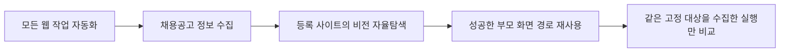

# L2C 개발 단계 기록

README에서 분리한 구현 단계와 검증 범위입니다. 현재 실행 구조는
[`ARCHITECTURE.md`](../ARCHITECTURE.md), 재현 가능한 최신 수치는
[`README.md`](../README.md)를 기준으로 합니다.

## Phase 1: Classic 기준선

- 원티드 URL 기반 상세 추출과 Gemini 구조화 출력 구현
- 원티드, 잡코리아, 로켓펀치 사이트별 Playwright 어댑터 구성
- SQLite 저장과 URL 중복 방지 구현
- 비전 경로와 비교할 DOM/selector 기반 실행시간 기준 확보

## Phase 2: 화면 인식과 물리 도구

- mss 화면 캡처와 PyAutoGUI 물리 입력 연결
- `click_marker`, `type_in_marker`, `scroll`, `press_key`, `finish_task` 도구 구현
- PaddleOCR 문자 검출과 OmniParser 아이콘 검출을 한 화면 마커로 합성
- 화면 좌표와 실제 클릭 좌표 매핑 검증
- structlog 기반 단계별 시간과 실패 로그 기록

## Phase 3: LangGraph 작업자

- `capture → OCR/추론 → execution` 순환 그래프 구성
- 멀티모달 화면과 마커 정보를 이용한 다음 행동 선택
- LangSmith trace와 모델 토큰 계측 연결
- 원티드 검색, 카드 선택, 상세 진입과 본문 수집 E2E 구현

## Phase 4: 사이트 확장

- 같은 화면 도구 계약으로 원티드 외 등록 사이트 탐색
- Realtime/Vision 경로에서 사이트별 DOM 파싱 제거
- 사이트 프로필에는 공식 주소와 참고 정보만 유지
- 상세 화면 OCR 원문과 Classic 추출 결과 비교

## Phase 5: 성능과 품질 측정

- Classic과 비전 경로의 실행시간, 성공 여부와 본문 누락 비교
- 실행별 추론, OCR, 토큰과 API 비용 집계
- 로컬 모델 메모리 한계를 확인하고 Gemini API 추론 경로로 정리
- 실패 화면과 단계별 로그를 트러블슈팅 근거로 보존

## Phase 6: 정제와 저장

- OCR 원문의 개행, 마커 잔영과 목록 필드 전처리
- 회사명, 직무, 기술, 업무, 자격요건, 우대사항과 경력 범위 구조화
- 수집, 후처리와 저장이 공유하는 Pydantic 공고 계약 도입
- URL 기반 UPSERT와 출처 근거 해시 저장
- 원문 캡처와 반복 탐색 레시피 저장 책임 분리

## Phase 7: DB 근거 조사

- 사용자 질문을 직무, 기술, 기간, 사이트와 목표 개수 계약으로 변환
- SQLite 근거가 충분하면 웹 수집을 건너뛰는 조사 그래프 구현
- 직무·기술 별칭을 검색 의미 사전의 정규 개념으로 연결
- 부족한 근거만 수집 계획으로 만들고 저장 후 다시 검사
- 최종 답변이 실제 DB 문서의 `job_id`만 인용하는지 검증
- 모호한 핵심 조건은 객관식 확인 질문으로 중단·재개

## Phase 8: 경험 기반 탐색

### 성공 기록

- 자율탐색의 전후 화면, 행동, 대상, 실행 결과를 같은 순번으로 기록
- 검색어처럼 실행마다 달라지는 값은 파라미터 슬롯으로 분리
- 수집에 성공한 실행만 레시피 후보로 저장

### Critic 가지치기

- 후보 전체의 승인·거절과 전이별 유지 여부만 판단
- 행동, 대상, 파라미터, 순서와 화면 조건 수정 권한 제거
- 가지치기 후 전후 화면이 실제로 이어지는 전이만 경로로 승격

### 경험 경로 재생

- 현재 ROI에서 저장 대상을 다시 찾고 연속 행동 실행
- OpenCV 프레임 변화로 렌더링 완료를 기다린 뒤 도착 화면 확인
- URL 또는 ROI pHash가 다르면 경로를 중단하고 자율탐색으로 복귀
- 가변 카드 선택과 상세 본문 판단은 LLM에 유지

### 품질 계약

- 기대 URL의 호스트, 경로와 쿼리 식별자를 저장 결과와 일대일 비교
- 누락, 중복 또는 예상하지 않은 URL 저장을 실패로 처리
- 기대 URL 계약으로 자율탐색과 경험 기반 탐색의 저장 품질을 각각 확인

### 현재 검증 상태

- 사람인 고정 공고 실행에서 경험 경로 1개와 전이 2개 재생
- 실행시간, 화면 추론, OCR, 토큰과 API 비용은 실행별 진단값으로 보존
- 경험 기반 탐색 성과는 원본 판단 대체 수에서 재생 해석기 호출을 뺀 값으로 집계
- 사이트별 반복 표본과 신규 사이트 적용 공수는 추가 검증 필요

## 범위가 좁아진 과정

자동 함수 합성, 범용 반복문 생성과 로그인·CAPTCHA 우회는 구현 범위에서 제외했습니다.
현재 실증 대상은 상세 본문을 DB 근거로 저장하는 채용공고 조사와 관찰된 화면 전이의
재사용입니다.
