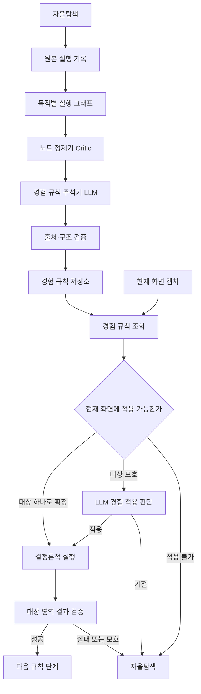

# 경험 규칙 리팩터링 완료 기록

> [!note] 보관 범위
> 이 문서는 2026-08-16에 완료한 리팩터링의 계획 변경과 검증 결과를 보존한다. 현재 구현 기준은 [Reflex Recipe 구현 기준](reflex_recipe_plan.md)과 [기술 및 설계 결정](design_decisions.md)을 우선한다.

## 문서 변경 규칙

- 계획을 취소하거나 대체할 때 기존 문장을 삭제하지 않고 `~~취소된 계획~~`으로 남긴다.
- 취소된 항목 바로 아래에 `변경 이유:`를 적고 관찰 로그, 테스트 또는 코드 근거를 연결한다.
- 구현 중 발견한 새 작업은 해당 단계에 체크박스로 추가한다.
- 단계가 끝나면 변경 파일, 삭제 파일, 테스트 결과를 `검증 기록`에 남긴다.
- 이 문서는 계획과 결정 이력을 보관한다. 상세 구현 기준은 [Reflex Recipe 구현 기준](reflex_recipe_plan.md)과 [기술 및 설계 결정](design_decisions.md)에 반영한다.

## 문제 정의

리팩터링 전 경험 기반 탐색은 자율탐색의 성공 경로를 기록하지만, 원본 관찰과 재사용 규칙이 같은 계약에 들어 있었다.

1. OCR 마커 ID와 텍스트는 캡처마다 달라질 수 있다.
2. 한 화면에서 유효했던 LLM 판단을 코드가 이후 화면에도 지속되는 사실로 취급한다.
3. 좌우 패널과 독립 스크롤 영역 같은 컴포넌트 관계가 마커 목록에 보존되지 않는다.
4. 전체 화면 변화는 감지하지만 행동 대상 영역이 의도대로 변했는지는 검증하지 못한다.

이 때문에 저장된 경험이 의미 규칙으로 변환되지 않고 OCR 문구와 좌표 경로로 재생된다.

## 시작 기준선

- 기준 커밋: `46d19fa`
- 작업 시작 시 변경 파일: 42개
- 핵심 단위 테스트: 32개 통과
- Ruff 대상 검사: 통과
- 실행 중 브라우저·Python 프로세스: 없음

| 실행 | 결과 | 저장 | 실행시간 | LLM 호출 | 토큰 | 종료 원인 |
|---|---:|---:|---:|---:|---:|---|
| 로켓펀치 `v25` | 성공 | 2/2 | 79.07초 | 13 | 94,449 | 정상 |
| 원티드 `v29` | 실패 | 1/2 | 106.21초 | 17 | 116,976 | 판단 호출 한도 |
| 원티드 `v30` | 실패 | 1/2 | 103.83초 | 11 | 73,152 | 그래프 재귀 한도 |

`v30`은 LLM 호출을 줄였지만 `page_end_unverified`를 유지한 결정론적 스크롤이 잘못된 대상을 반복해 재귀 한도에 도달했다.

## 유지할 경계

- Realtime/Vision은 DOM·Playwright selector를 사용하지 않는다.
- 화면 캡처, CV 준비 대기, PaddleOCR, OmniParser와 물리 입력 도구는 유지한다.
- 상위 조사 그래프, 수집 후 구조화·저장, DB 근거 답변 흐름은 유지한다.
- Critic은 실행 그래프의 의미 노드를 유지하거나 제거한다. 행동을 새로 만들거나 수정하지 않는다.
- 불확실한 현재 화면의 의미 판단은 LLM이 맡는다.
- 코드는 확정된 행동 실행, 입력 바인딩과 관찰 가능한 결과 검증을 맡는다.

## 목표 아키텍처



## 계약 경계

### 원본 실행 기록

`ObservedTransition`은 과거 실행 사실을 변경 없이 저장한다.

- 전후 관찰 ID와 스크린샷
- OCR·SoM 마커
- 실제 행동과 인자
- 당시 선택한 대상 스냅샷
- 전체 화면과 대상 영역의 변화 근거
- 도구 실행 결과

### 경험 규칙

`ExperienceRule`은 선택된 의미 노드와 그 노드에 속한 원본 물리 단계를 저장한다.

- 적용 페이지와 URL 범위
- 행동 목적
- 대상의 의미 역할과 공간 관계
- 입력 슬롯
- 원본 행동에만 연결되는 행동 묶음
- 기대하는 대상 영역 변화
- 적용 불가·폴백 조건
- 근거 `ObservedTransition` ID

그래프 노드가 의미 경계를 소유한다. 규칙 주석기는 노드와 원본 전이를 합치거나
나누지 않고 대상 설명, 적용 조건, 입력 슬롯과 기대 효과만 채운다. 다음 화면에 나타나는
대상은 이전 화면에서 미리 검증할 수 없으므로 노드 내부 전이는 별도 물리 단계로 실행한다.

### 실행 시 해석 단계

`ResolvedRuleStep`은 현재 화면에서 한 번만 유효하다.

- 현재 마커 ID 또는 물리 지점
- 현재 대상 영역
- 실행할 도구 인자
- 실행 후 검사할 대상 영역
- 출처 경험 규칙과 단계 ID

과거 마커 ID는 현재 실행 단계로 복사하지 않는다.

## 실행 계획

### 1. 기준선 복구

- [x] `job_detail_followup`을 지속 스크롤 명령으로 사용하는 변경 제거
- [x] OCR 텍스트·이전 x좌표로 상세 스크롤 대상을 확정하는 정책 제거
- [x] 상세 페이지는 대상이 모호하면 자율탐색으로 즉시 복귀
- [x] 기존 로켓펀치 성공에 필요했던 원본 OCR 보존과 실제 추출 검증은 유지
- [x] 관련 단위 테스트를 실제 책임에 맞게 수정

### 2. 원본 기록과 규칙 계약 분리

- [x] `ObservedTransition` 계약 추가
- [x] `ExperienceRule`, `ExperienceRuleStep`, `RuleTarget`, `ExpectedEffect` 계약 추가
- [x] `ResolvedRuleStep`과 대상 영역 실행 손잡이 계약 추가
- [x] 기록 시 행동 이름만 보고 `fixed` 또는 `parameterized`를 확정하는 로직 제거
- [x] `WorkerSubmission`과 후보 저장소는 원본 기록만 소유하도록 변경

### 3. 경로 정제와 규칙 생성 분리

- [x] Critic의 그래프 노드 keep/drop 출력과 권한 유지
- [x] Critic이 남긴 의미 노드를 입력으로 받는 경험 규칙 생성 서비스 추가
- [x] 규칙 생성 LLM은 원본 행동 ID, 적용 조건, 대상 역할, 기대 효과만 출력
- [x] 원본에 없는 행동·입력·순서를 생성하면 구조 검증에서 거절
- [x] 중간 관찰 없이 실행된 입력·제출 행동은 하나의 원본 전이와 규칙 단계로 보존
- [x] Gemini 3.6 Flash 구조화 출력을 사용하고 호출 지표 기록

### 4. 경험 적용과 실행

- [x] 현재 화면에서 규칙의 빠른 적용 가능 여부 검사
- [x] 저장 ROI가 일치하면 저장 좌표를 복원하고, 불일치하면 전체 OCR로 복귀
- [x] 적용 결과를 `ResolvedRuleStep`으로 변환
- [x] 경험 세션은 한 단계 실패 시 종료하고 같은 실행에서 자율탐색으로 복귀
- [x] 결정론적 무한 재시도와 상세 전용 반복 정책 제거

### 5. 대상 영역 결과 검증

- [x] URL 이동과 컴포넌트 내부 변화를 다른 효과 계약으로 분리
- [x] 컴포넌트 행동은 대상 ROI 전후 프레임을 비교
- [x] 전체 화면 변화는 보조 관측값으로 낮춤
- [x] 독립 스크롤 영역도 각 단계의 저장 ROI와 좌표로 검증
- [x] OCR은 내용 수집에 사용하고 스크롤 영역의 영속 식별자로 사용하지 않음

### 6. 레거시 삭제와 그래프 정리

- [x] 원본 실행 기록을 실행 규칙으로 직접 사용하는 경로 삭제
- [x] 이전 전이의 `after`에 다음 행동 타깃을 삽입하는 합성 제거
- [x] OCR 문구·좌표만으로 타깃을 확정하는 레거시 matcher 제거
- [x] 작업자 그래프를 `관찰 → 경험 적용 또는 자율 판단 → 실행 → 대상 효과 검증` 흐름으로 정리
- [x] 호환용 분기와 기존 계약 변환 코드를 남기지 않음
- [x] 기존 활성 경험 데이터는 새 계약과 혼합하지 않고 재생성

### 7. 검증

- [x] 삭제된 Python 3.13 기준 경로를 가리키는 앱·OCR 가상환경 실행기 복구
- [x] 저장 스크린샷: 같은 대상의 OCR ID·문구 변경
- [x] 저장 스크린샷: 같은 문구가 좌우 영역에 중복
- [x] 저장 스크린샷: 오른쪽 독립 상세 패널 스크롤
- [x] 저장 스크린샷: 다른 영역만 변한 경우 효과 검증 실패
- [x] 핵심 단위·통합 테스트
- [x] Ruff와 mypy
- [x] 첫 2개 사이트 자율탐색 실행에서 공통 상세 완료 계약 오류 확인
- [x] 필수 필드 충족과 페이지 끝 확인을 서로 독립된 완료 조건으로 수정
- [x] 상세 완료 계약 회귀 테스트와 정적 검사
- [x] 원티드 자율탐색 수집 결과 2/2 확인
- [ ] ~~원티드 입력·제출 묶음의 대상 출처 계약 수정과 후보 승격~~
  - 변경 이유: 코드 계약 수정은 단위 테스트로 확인할 수 있지만 실제 후보 승격은 새 자율탐색 결과가 있어야 검증된다. 구현과 E2E 판정을 한 체크박스에 묶으면 진행 상태가 불명확해진다.
- [x] 원티드 입력·제출 묶음의 대상 출처 계약 수정
- [x] 원티드 새 후보의 활성 경험 규칙 승격
- [x] 로켓펀치 자율탐색 그래프 수집 결과 2/2 확인
- [ ] ~~로켓펀치 상세 완료 의미 판단 수정과 후처리 저장 2/2 확인~~
  - 변경 이유: 저장 스크린샷으로 모델 배치를 먼저 검증하고 실제 저장 결과는 E2E에서 별도로 확인해야 실패 원인을 구분할 수 있다.
- [x] 경량 모델의 상세 완료 제안을 Gemini 3.6 Flash가 재검토하도록 모델 배치 수정
- [x] 로켓펀치 실패 스크린샷에서 Gemini 3.6 Flash의 추가 스크롤 선택 확인
- [x] 로켓펀치 후처리 저장 2/2 확인
- [x] 로켓펀치 새 후보의 활성 경험 규칙 승격
- [x] 상세 완료 전 중복 품질 게이트 제거와 최종 후처리 단일화
- [x] 원티드 자율탐색 2/2 재검증
- [ ] ~~원티드 경험 기반 탐색~~
  - 변경 이유: 실제 경험 규칙은 적중해 경로 `1/1`을 완료하고 공고 `2/2`를 저장했지만, 벤치마크가 삭제된 `roi_recipes` 키를 검사해 실행을 비교 불가로 잘못 판정했다.
  - 대체 계획: 사전조건과 지표 이름을 새 `experience_rules` 저장 계약으로 교체한 뒤 같은 원티드 경험 기반 탐색을 재검증한다.
- [x] 경험 기반 탐색 사전조건의 레거시 ROI 키 제거
- [x] 원티드 경험 기반 탐색 재검증
- [x] 로켓펀치 경험 기반 탐색
- [x] 성공률, 실행시간, LLM 호출, 토큰, 경험 적용·폴백 결과 기록

### 8. 사용자 요청 최종 E2E 재검증

- [x] 원티드 활성 경험 규칙 사전조건 확인
- [ ] ~~첫 실행 결과만으로 경험 기반 탐색의 성공 여부 판정~~
  - 변경 이유: 첫 실행은 `open_browser`가 새 Chrome 창을 바인딩하지 못해 캡처·OCR·LLM 호출 전에 `5.922초` 만에 종료됐다. 경험 규칙과 수집 경로는 실행되지 않았다.
  - 대체 계획: 제품 코드를 수정하지 않고 같은 시나리오를 한 번 재실행한다. 재현되면 브라우저 기동·창 발견 계약을 수정하고, 재현되지 않으면 일시적 시작 실패로 분리해 기록한다.
- [x] 원티드 `iOS 개발자 2건` 경험 기반 탐색 실행
- [x] 공고 `2/2` 해결과 DB 저장 품질 확인
- [x] 경험 경로 완료·폴백과 실행시간·LLM·OCR 지표 기록

## 완료 상태

- 완료: `1. 기준선 복구`부터 `6. 레거시 삭제와 그래프 정리`까지
- 완료: `7. 검증`과 최종 전체 회귀·정적 검사
- 완료: `8. 사용자 요청 최종 E2E 재검증`
- 다음 단계: 없음
- 차단 요소: 없음

## 계획 변경 기록

변경이 발생하면 아래 형식으로 누적한다.

```markdown
- ~~기존 계획 문장~~
  - 변경 이유: 실제 로그 또는 테스트에서 확인한 근거
  - 대체 계획: 새로 실행할 내용
```

- ~~경험 규칙 단계마다 단일 `source_transition_seq`를 저장한다.~~
  - 변경 이유: 입력만으로 화면 변화가 보장되지 않고, 이어지는 Enter 또는 검색 버튼까지 실행해야 효과를 검증할 수 있다. 단일 ID 계약은 같은 성공 묶음 사이에 불필요한 캡처와 판단을 삽입한다.
  - 대체 계획: `source_transition_seqs`에 인접 원본 전이 ID를 순서대로 보존하고, 원본 행동 전체가 허용된 입력·제출 묶음일 때만 하나의 규칙 단계 생성을 허용한다.

- ~~규칙 생성기가 인접한 여러 원본 전이를 한 단계로 다시 묶는다.~~
  - 변경 이유: 실행 그래프가 이미 의미 경계를 만들었는데 생성기가 별도 기준으로 다시 묶어 두 표현이 어긋났다. 필터 열기 뒤에 나타나는 선택 항목처럼 다음 화면을 봐야 찾을 수 있는 대상은 한 요청으로 미리 바인딩할 수도 없다.
  - 대체 계획: 그래프 노드를 `ExperienceRuleNode`로 보존하고 노드 안의 각 원본 전이를 별도 `ExperienceRuleStep`으로 만든다. 입력과 제출처럼 중간 관찰이 없는 행동은 자율탐색부터 같은 전이에 기록한다.

- ~~원티드·로켓펀치의 자율탐색과 경험 기반 탐색을 한 번에 연속 실행한다.~~
  - 변경 이유: 두 자율탐색이 모두 상세 완료 단계에서 같은 계약 오류로 실패해 경험 후보가 생성되지 않았다. 이 상태에서 경험 기반 탐색은 실행 근거가 없어 자동으로 건너뛴다.
  - 대체 계획: 공통 상세 완료 계약을 수정한 뒤 두 사이트의 자율탐색만 먼저 통과시키고, 후보 승격을 확인한 다음 경험 기반 탐색을 실행한다.

- ~~상세 완료 계약을 수정한 뒤 두 사이트의 자율탐색을 통과시키고 곧바로 경험 기반 탐색을 실행한다.~~
  - 변경 이유: 원티드는 2건 수집에 성공했지만 검색 입력과 Enter를 묶은 규칙에서 대상 없는 Enter 전이를 대상 출처로 참조해 컴파일이 거절됐다. 로켓펀치는 그래프에서 2건을 수집했지만 경량 모델이 `복지 및 근무환경` 제목만 보이는 화면을 필드 확인 완료로 판단해 첫 공고가 후처리에서 거절됐다.
  - 대체 계획: 규칙 대상은 행동 묶음 안에서 실제 대상 스냅샷을 가진 원본 행동으로 결정한다. 상세 완료처럼 화면 의미와 누락 여부를 판정하는 추론은 Gemini 3.6 Flash에 배정한다. 두 변경을 단위·저장 스크린샷으로 검증한 뒤 자율탐색과 후보 승격을 다시 확인하고, 그다음 경험 기반 탐색을 실행한다.

- ~~상세 종료는 필수 필드 화면 근거가 모두 누적되었거나 CV 무변화 스크롤로 페이지 끝이 확인된 경우에만 원문 캡처를 허용한다.~~
  - 변경 이유: 상세 종료 제안은 이미 Gemini 3.6 Flash가 재검토한다. 원티드 두 번째 공고에서 모델은 추천 공고 영역을 근거로 본문 끝을 세 번 정확히 판단했지만, 코드의 별도 무변화 스크롤 조건 때문에 같은 화면에서 종료만 반복했다. 최종 구조화 단계도 누적 OCR의 필수 필드를 다시 검사하므로 같은 품질 계약을 두 단계가 소유하고 있었다.
  - 대체 계획: Gemini 3.6 Flash가 확정한 `finish_detail_reading`은 누적 OCR을 `JobCapture`로 넘긴다. `observed_fields`는 다음 판단을 위한 작업 메모리와 근거 메타데이터로만 사용한다. 필수 필드 충족과 저장 가능 여부는 수집 후 구조화·저장 품질 게이트가 한 번 판정한다.

## 검증 기록

### 2026-08-15 계획 수립

- 계획 수립 당시 코드와 `v25`, `v29`, `v30` 실행 결과를 기준선으로 기록했다.
- 모델 상향보다 역할별 호출 분리와 대상 영역 검증을 먼저 적용하기로 결정했다.
- Gemini 3.6 Flash는 자율탐색, 규칙 생성, 모호한 경험 적용 판단에 사용한다.

### 2026-08-15 기준선 복구

- `detail_scroll_target_marker_id`와 OCR·x축 기반 상세 타깃 선택 보조 함수를 삭제했다.
- `detail_reading_policy`가 `page_end_unverified` 이후 자동 스크롤을 반복하던 선택 경로를 삭제했다.
- LLM이 선택한 상세 페이지 하향 스크롤이 실제로 화면을 바꾸지 않았을 때만 페이지 끝 근거로 인정한다.
- 상세 계약·작업자 경계 테스트 27개와 Ruff 검사를 통과했다.

### 2026-08-15 원본 기록과 경험 규칙 계약 분리

- `execution_record_schema.py`에 실제 화면·행동·전이만 담는 `ObservedTransition` 계약을 추가했다.
- `experience_rule_schema.py`에 `ExperienceRule`, 의미 대상, 기대 효과와 현재 캡처 전용 `ResolvedRuleStep` 계약을 추가했다.
- 기록 시 행동 이름으로 `fixed`, `parameterized`, `reasoning`을 추측하던 `_replay_mode`를 삭제했다.
- 검색어 슬롯은 현재 도구 호출에 `slot_name`이 실제로 명시된 경우에만 원본 기록에 남긴다.
- 작업자 제출물과 후보는 `ObservedTransition`만 노출한다.
- 기록 계약 회귀 테스트 6개와 변경 파일 Ruff 검사를 통과했다.

### 2026-08-15 경험 규칙 생성·적용·효과 검증

- 당시 Critic은 실행 그래프 노드의 keep/drop을 결정하고, `experience_rule_compiler.py`가 별도 Gemini 3.6 Flash 구조화 호출로 의미 주석을 생성했다. 이 호출은 2026-08-22에 제거했다.
- 생성기는 그래프 노드, 원본 전이와 행동 ID를 빠짐없이 순서대로 참조해야 하며, 노드·전이 재그룹화, 새 행동, 잘못된 입력 슬롯이나 근거 없는 효과를 출력하면 저장하지 않는다.
- 중간 관찰 없이 실행된 입력과 제출은 자율탐색 기록 시점부터 같은 원본 전이에 속한다. 서로 다른 전이는 규칙 생성 단계에서 합치지 않는다.
- 저장 ROI가 일치하면 OCR이나 의미 해석기를 호출하지 않고 저장 좌표를 복원해 실행한다.
- URL 이동, 페이지 역할 변화, 전체 화면 변화와 대상 영역 변화를 `ExpectedEffect`로 분리했다.
- 스크롤 대상도 각 단계에 저장된 ROI와 정규화 좌표를 사용한다.
- `ExperiencePath`, `SiteExperience`, `replay_mode`, 다음 타깃 합성과 기존 `recipes` 테이블 경로를 삭제했다.
- 제품 계층 의존성 검사를 통과했다: 153개 파일, 530개 의존성, 계약 6개 유지.
- 전체 테스트 243개, Ruff, mypy 73개 제품 파일 검사를 통과했다. pytest 캐시 디렉터리 권한 경고 1개는 남아 있다.

### 2026-08-15 저장 스크린샷 검증

- `regression_20260815_164335/regression.db`의 동일 로켓펀치 공고 기록에서 OCR 마커 ID가 `93`에서 `49`로 바뀌고, 제목도 `AI 엔지니어링 중심`과 `A엔지니어링중심`으로 다르게 인식된 사실을 확인했다. 저장 ID와 OCR 문자열을 영속 식별자로 사용할 수 없다.
- `marked_screen_20260815_172324_411221.png`에는 같은 `풀스택 개발자` 제목이 왼쪽 목록과 오른쪽 상세 패널에 함께 있다. 현재 OCR 문자열로 다시 고르는 방식은 위치가 다른 동명 대상을 혼동할 수 있어 재생 경로에서 제거했다.
- `screen_20260815_172458_902501.png`와 `screen_20260815_172504_248318.png`의 올바른 상세 패널 스크롤은 왼쪽 목록 변화율 `0%`, 오른쪽 상세 영역 변화율 `27.5342%`였다.
- `screen_20260815_172343_729316.png`와 `screen_20260815_172348_177514.png`의 잘못된 목록 스크롤은 왼쪽 목록 변화율 `18.4612%`, 오른쪽 상세 영역 변화율 `0%`였다. 대상 영역 효과 검증은 이 실행을 실패로 판정할 수 있다.

### 2026-08-15 로컬 실행 환경 복구

- `.venv-app`은 삭제된 `%LOCALAPPDATA%\Programs\Python\Python313`, `.venv-ocr`은 삭제된 임시 embed 경로를 가리키고 있었다.
- 두 `pyvenv.cfg`의 기준 실행 파일을 저장소에 보존된 `.venv-python313`으로 통일했다.
- 앱 환경은 Python `3.13.14`, OCR 환경은 Python `3.13.14`와 Paddle `3.3.1` 로드를 확인했다.

### 2026-08-15 첫 2개 사이트 E2E 실패 분석

- 원티드 자율탐색은 `0/2`, 실행시간 `93.326초`, reasoning `16회`로 종료했다.
- 로켓펀치 자율탐색은 `0/2`, 실행시간 `66.867초`, reasoning `16회`로 종료했다.
- 두 실행 모두 상세 화면에 진입했고 필수 OCR 필드도 확보했지만 `finish_detail_reading`이 `page_end_unverified`로 반복 거부됐다.
- 마지막 하향 스크롤의 전이는 두 사이트 모두 `screen_change_pixels_matched`였다. 따라서 무변화 스크롤 증거가 소실된 것이 아니라, 실제로 화면이 더 이동한 상태였다.
- 시스템 계약은 `필수 필드 충족 또는 페이지 끝 도달`을 완료 조건으로 설명한다. 구현은 필수 필드가 모두 충족된 경우에도 모델이 `page_exhausted=true`를 함께 보내면 무변화 스크롤을 강제해 두 조건을 잘못 결합했다.
- OCR 워커는 정상 재사용됐다. 첫 기동은 `6.33초`, 이후 요청은 대부분 `0.5~1.1초`여서 이번 실패 원인이 아니다.

### 2026-08-15 상세 완료 계약 수정

- 필수 필드가 모두 화면 근거로 확인된 경우에는 `page_exhausted` 주장과 관계없이 상세 원문 캡처를 완료한다.
- 필수 필드가 부족해 페이지 끝을 근거로 완료하려는 경우에만 무변화 하향 스크롤을 요구한다.
- 물리적으로 검증되지 않은 `page_exhausted=true`는 저장 근거에서 `false`로 정규화한다.
- 상세 계약 테스트 `10개`, 전체 테스트 `244개`, Ruff와 mypy `73개` 파일 검사를 통과했다.
- pytest 캐시 디렉터리의 기존 Windows 권한 경고 1개는 테스트 결과에 영향을 주지 않았다.

### 2026-08-15 두 번째 자율탐색 검증

- 원티드는 `2/2`를 DB에 저장했고 실행시간은 `60.246초`, OCR `8회`·`4.484초`, 그래프 reasoning `8회`였다.
- 원티드 본 실행은 LLM `10회`, `57,445토큰`, `$0.0349025`를 사용했다. 후보 검토·승격은 별도로 `21.687초`, `12,742토큰`, `$0.036975`를 사용했다.
- 원티드 후보의 Critic은 검색 입력·제출 전이를 유지했지만 규칙 생성 결과가 대상 없는 Enter 전이를 대상 출처로 참조했다. 구조 검증이 `target annotation has no source target 2`로 거절해 활성 경험 규칙은 생성되지 않았다.
- 로켓펀치는 그래프에서 `2/2`를 수집했지만 후처리에서 첫 공고의 `benefits` 근거가 없어 `1/2`만 저장했다. 실행시간은 `56.994초`, OCR `8회`, 그래프 reasoning `7회`, LLM `9회`, `57,336토큰`, `$0.0251164`였다.
- 로켓펀치 첫 상세 화면의 마지막 캡처에는 `복지 및 근무환경` 제목만 보이고 본문은 화면 아래에 있었다. Gemini 3.5 Flash Lite가 해당 필드를 확인했다고 반환해 조기 완료했고 후처리가 누락을 올바르게 거절했다.
- 두 실행 모두 OCR 워커 hang이나 로딩 대기 실패는 없었다. 남은 실패는 규칙 생성의 구조적 대상 출처와 상세 의미 판단 모델 배치로 분리된다.

### 2026-08-15 규칙 대상 출처와 상세 완료 모델 배치 수정

- 실제 원티드 제출물은 전이 하나에 `type_in_marker`와 대상 없는 `press_key Enter`가 함께 기록되어 있었다. 생성 모델이 Enter에 덧붙인 대상 설명은 원본 실행 구조에 없으므로 저장하지 않도록 변경했다.
- 원본 대상이 있는 입력 행동의 의미·ROI는 그대로 보존하고, 대상 없는 Enter는 키 입력만 보존한다. 원본에 없는 클릭 대상이나 좌표를 새로 만드는 경로는 추가하지 않았다.
- Gemini 3.5 Flash Lite가 `finish_detail_reading`을 제안한 경우에만 같은 화면을 Gemini 3.6 Flash가 재검토한다. 추가 본문이 보이면 스크롤을 선택하고, 완료 근거가 충분할 때만 종료 행동을 실행한다.
- 로켓펀치 실패 캡처 `screen_20260815_233801_958417.png`를 Gemini 3.6 Flash에 전달한 결과 `복지 및 근무환경` 본문이 아래에 남았다는 이유로 `scroll`을 선택했다. 호출은 `6.944초`, 입력 `3,912토큰`, 출력 `848토큰`이었다.
- 관련 회귀 테스트 `25개`, 전체 테스트 `245개`, Ruff, mypy `73개` 파일 검사를 통과했다. pytest 캐시 디렉터리의 Windows 권한 경고 1개는 계속 남아 있다.

### 2026-08-15 세 번째 자율탐색 검증

- 로켓펀치는 `2/2`를 저장했고 실행시간 `83.426초`, LLM `14회`, `99,879토큰`, `$0.0773171`, OCR `10회`였다.
- 로켓펀치 첫 공고에서 Lite의 조기 종료 제안을 Gemini 3.6 Flash가 추가 스크롤로 교정했다. 두 공고 모두 최종 구조화와 저장을 통과했다.
- 로켓펀치 후보 검토는 검색 목록 진입 행동 하나를 유지했고, 경험 규칙 생성기는 활성 규칙 `1개`를 저장했다. 대상 없는 행동 설명으로 인한 컴파일 오류는 재발하지 않았다.
- 원티드는 `1/2`만 저장했고 실행시간 `85.478초`, LLM `17회`, `111,933토큰`, `$0.0817493`, OCR `11회`였다.
- 원티드 두 번째 공고에서 누적 OCR은 `151줄`까지 확보됐고 Gemini 3.6 Flash는 추천 공고 영역을 근거로 본문 끝을 판단했다. 코드가 무변화 스크롤 근거를 별도로 요구해 `page_end_unverified`를 세 번 반환했고 reasoning 호출 한도에서 종료했다.
- 이 결과로 상세 종료 전 품질 검사와 최종 구조화 품질 검사가 중복 소유권을 가진다는 점을 확인했다. 다음 수정은 페이지별 예외가 아니라 품질 판정 위치를 최종 후처리로 단일화한다.

### 2026-08-16 상세 완료 소유권 단일화 구현

- Gemini 3.6 Flash가 확정한 `finish_detail_reading`은 누적 OCR이 비어 있지 않으면 `JobCapture`를 생성한다.
- 화면에서 확인한 필드, 미제공 필드와 페이지 끝 판단은 캡처 근거로 보존하고 저장 가능 여부를 미리 판정하지 않는다.
- `job_detail_followup`, `page_end_unverified`, CV 무변화 스크롤 기반 상세 종료 검사를 제품 상태·라우팅·프롬프트에서 삭제했다.
- 필수 필드 충족 여부는 `JobReview`에서 한 번 판정하고, 검토 결과인 `CollectionBatch`를 저장 단계에 그대로 전달한다.
- 집중 테스트 `36개`, 전체 테스트 `242개`, Ruff와 mypy `73개` 제품 파일 검사를 통과했다.
- pytest 캐시 디렉터리의 기존 Windows 권한 경고 1개는 테스트 결과에 영향을 주지 않았다.

### 2026-08-16 원티드 네 번째 자율탐색 검증

- 원티드는 `2/2`를 저장했고 실행시간은 `85.770초`였다.
- 본 실행은 LLM `14회`, `89,741토큰`, `$0.0834125`, OCR `9회`·`4.966초`, 그래프 reasoning `10회`·`44.315초`를 사용했다.
- 두 번째 공고에서 Gemini 3.6 Flash가 확정한 `finish_detail_reading`이 즉시 성공했으며 `page_end_unverified` 반복은 재발하지 않았다.
- 최종 구조화는 `포디 - iOS 개발자`, `피에프씨테크놀로지스 - iOS Engineer(iOS 엔지니어)` 두 건을 모두 저장했다.
- 후보 검토와 규칙 생성은 `22.269초`, `12,947토큰`, `$0.0373185`를 사용했고 행동 `2개`를 포함한 경험 규칙 단계 `1개`를 활성 규칙으로 저장했다.

### 2026-08-16 원티드 첫 경험 기반 탐색 검증

- 경험 규칙은 홈 화면에서 정확 매칭되어 검색 입력과 Enter를 `0.030초`에 연속 실행했고 경로 `1/1`을 완료했다.
- 공고 `2/2`를 저장했으며 실행시간은 `75.846초`, 저장된 행동 사용 `1회`, LLM `14회`, `89,434토큰`, `$0.0655058`, OCR `11회`였다.
- 자율탐색 기록과 비교하면 실행시간은 `9.924초`, 비용은 `$0.0179067` 낮았지만 OCR은 `2회` 많았다. 재현 가능한 짝 실험이 아니므로 절감량으로 판정하지 않는다.
- 행렬 종료 코드는 실패였다. `ExperienceRuleStore.active_counts()`는 `experience_rules=1`을 반환하지만 벤치마크가 삭제된 `roi_recipes`를 검사해 `active_roi_recipe_missing`을 잘못 기록했다.
- 실제 경로 성공과 벤치마크 판정 오류를 분리하기 위해 사전조건 계약을 먼저 수정한 뒤 재실행한다.

### 2026-08-16 경험 기반 탐색 사전조건 수정

- 실행 전 활성 규칙 확인을 `roi_recipes`에서 `experience_rules`로 교체했다.
- 요약 지표 이름도 `active_experience_rule_count`로 통일했다.
- 새 저장 계약으로 활성 규칙을 인정하는 평가 테스트를 추가했고 관련 테스트 `15개`와 Ruff를 통과했다.

### 2026-08-16 원티드 경험 기반 탐색 재검증

- 사전조건은 활성 경험 규칙 `1개`를 확인했다. 당시 필드명은 `performance_comparable=true`였으며 현재는 비교 의미를 제거한 `replay_ready=true`를 사용한다.
- 경험 규칙은 검색 입력과 Enter를 한 단계로 재생했고 경로 `1/1`을 완료했다.
- 공고 `2/2`를 저장했으며 행렬의 품질·경험 경로 계약이 모두 통과했다.
- 실행시간은 자율탐색 기록 `85.770초`, 경험 기반 기록 `67.083초`로 관찰됐다.
- reasoning은 각각 `10회`·`44.315초`와 `8회`·`28.595초`, LLM 호출은 `14회`와 `12회`였다.
- 토큰은 각각 `89,741`과 `75,535`, 비용은 `$0.0834125`와 `$0.0646611`이었다. 이 차이는 재현 가능한 절감량으로 사용하지 않는다.
- OCR은 두 실행 모두 `9회`였으며 경험 규칙이 상세 페이지의 가변 판독을 대체하지 않았음을 확인했다.

### 2026-08-16 로켓펀치 경험 기반 탐색 검증

- 사전조건은 활성 경험 규칙 `1개`를 확인했다. 정리된 계약에서는 이를 `replay_ready=true`로 기록한다.
- 검색 목록 진입 규칙은 정확 매칭되어 경로 `1/1`을 폴백 없이 완료했고 공고 `2/2`를 저장했다.
- 행렬의 품질·경험 경로 계약과 URL 무결성 검사를 모두 통과했다.
- 실행시간은 자율탐색 기록 `83.426초`, 경험 기반 기록 `73.109초`로 관찰됐다.
- reasoning은 각각 `9회`·`42.531초`와 `7회`·`35.706초`, LLM 호출은 `14회`와 `13회`였다.
- OCR은 각각 `10회`·`8.245초`와 `9회`·`6.866초`, 토큰은 `99,879`와 `93,649`였다. 실행 간 차이는 경험 규칙의 절감량으로 사용하지 않는다.
- 실행 비용은 `$0.0773171`에서 `$0.0855965`로 증가했다. 호출 수와 총토큰만으로 비용 절감을 보장할 수 없으며 모델별 입력·출력 토큰 구성을 함께 비교해야 한다.
- 경험 경로 실패·중간 실패·폴백은 모두 `0회`였다.

### 2026-08-16 최종 회귀 검사

- 전체 테스트 `243개`를 통과했다.
- Ruff는 `agent`, `shared`, `benchmark` 전 범위를 통과했다.
- mypy는 지정된 제품 코드 `73개` 파일을 통과했다.
- `git diff --check`는 공백 오류 없이 통과했다. 테스트 파일 `2개`의 CRLF가 다음 Git 처리 시 LF로 바뀐다는 경고만 있었다.
- 제품 코드와 문서에서 삭제된 `roi_recipes`, `active_roi_recipe`, `job_detail_followup`, `page_end_unverified` 참조가 남지 않았음을 확인했다.
- 변경 범위는 `61개` 파일, `2,567줄` 추가와 `3,454줄` 삭제로 순감소 `887줄`이다.
- `.pytest_cache`의 기존 Windows 접근 권한 경고는 남아 있지만 테스트 실행과 결과에는 영향을 주지 않았다.

### 2026-08-16 사용자 요청 최종 원티드 E2E 재검증

- 제한된 실행 환경에서 실행한 첫 두 시도는 각각 `5.922초`, `5.661초` 만에 `open_browser` 창 바인딩 실패로 종료됐다. 캡처·OCR·LLM 호출은 모두 `0회`였다.
- 새 Chrome 프로필과 최소 실행 인자로도 같은 제한 환경에서는 Crashpad 덤프가 생성됐다. 제품 코드나 기존 로그인 프로필 문제로 판정하지 않았다.
- Windows 데스크톱 접근 권한으로 같은 코드와 DB를 실행하자 Chrome 창을 `1.088초`에 바인딩했고 정상 수집을 완료했다.
- 활성 경험 규칙 `1개`를 확인했고 검색 입력과 Enter 묶음은 exact 모드로 `0.031초`에 적중했다.
- 경험 경로 `1/1`을 완료했으며 경로 실패·중간 실패·폴백은 모두 `0회`였다.
- `포디(FODI) - iOS 개발자`, `피에프씨테크놀로지스 - iOS Engineer(iOS 엔지니어)`를 DB에 `2/2` 저장했다.
- 실행시간은 `82.723초`, reasoning은 `9회`·`40.619초`, LLM 호출은 `13회`, OCR은 `10회`·`5.683초`였다.
- 총토큰은 `81,582`, 추정 비용은 `$0.0649606`이었다. OCR timeout과 낭비 토큰은 `0`이었다.
- 직전 원티드 경험 기반 실행보다 실행시간은 `15.640초` 길었다. reasoning이 `1회`·`12.024초`, OCR이 `1회`·`1.072초` 많았고 첫 상세 페이지의 추가 탐색이 차이의 대부분을 차지했다. 두 실행의 경로가 달라 직접 비교하지 않는다.
- DB 직접 조회에서 두 행의 `main_tasks`, `requirements`, `preferred`, `benefits`, `raw_ocr_text`가 모두 비어 있지 않음을 확인했다.
- 행렬 품질 계약, 경험 기반 모드 계약, 출처 URL 무결성은 모두 통과했다.

### 2026-08-16 경험 기반 탐색 평가 계약 정정

- 자율탐색은 해당 공고와 당시 화면 상태에서 한 번만 수행되므로 같은 환경을 다시 재현할 수 없다.
- 자율탐색과 경험 기반 탐색의 실행시간·토큰·비용 차이와 중앙값은 경험 규칙의 절감량으로 집계하지 않는다.
- 성공한 경험 규칙 단계가 대체한 원본 자율탐색 판단 수에서 재생 해석기 호출을 뺀 값을 `reflex_reasoning_call_reduction`으로 기록한다.
- 최종 수집 품질, 추론 호출 순감소량, 경험 경로 완료율과 폴백을 경험 기반 탐색의 평가 기준으로 사용한다.
