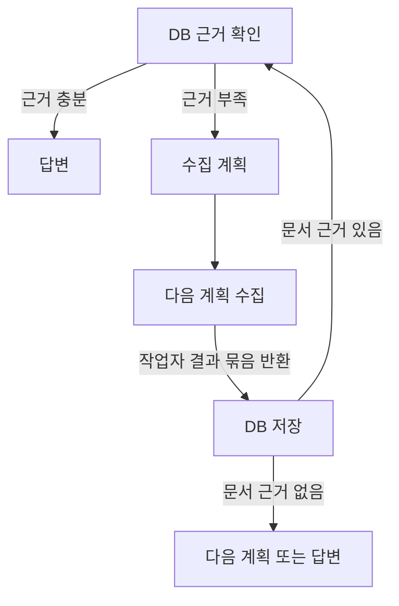
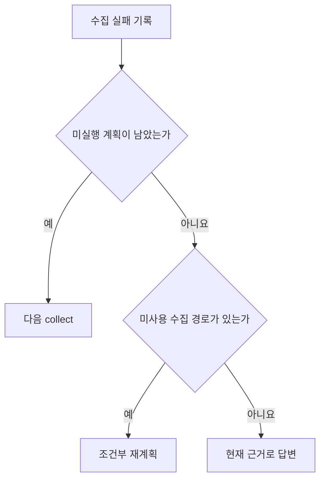
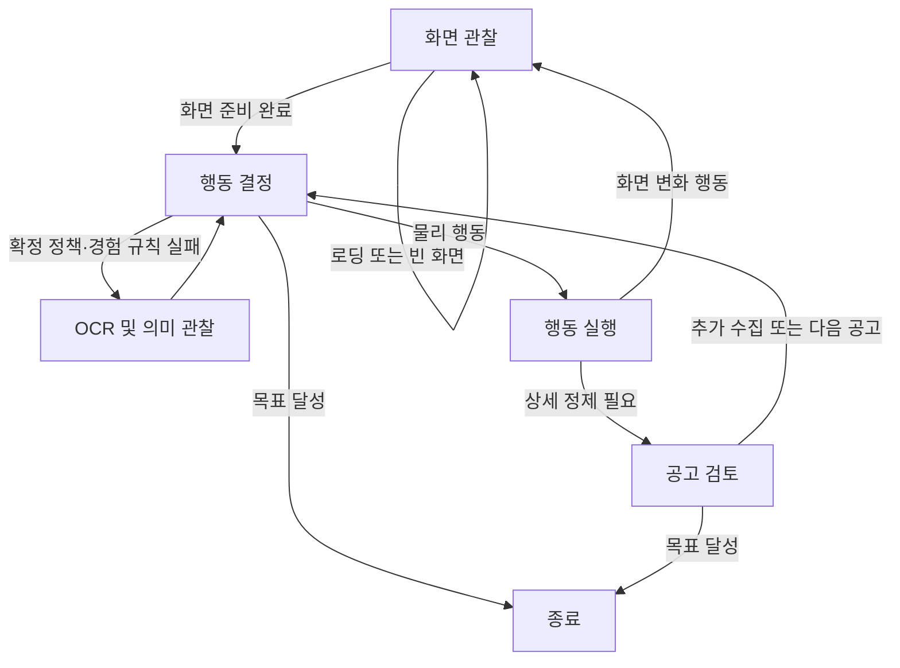
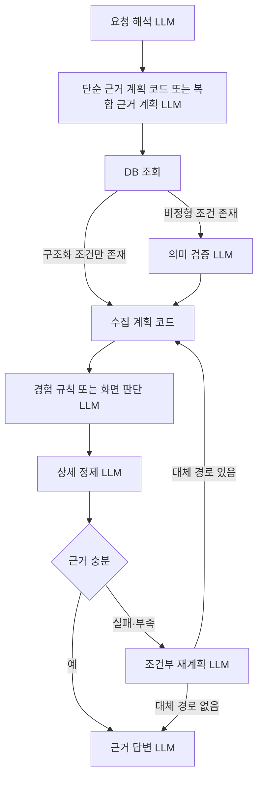

# 조사 및 경험 탐색 리팩터링 완료 기록

> [!note] 완료 상태
> 아래 0~7단계는 2026-08-22에 모두 완료했다. 현재 구조는 [`ARCHITECTURE.md`](../ARCHITECTURE.md), 이후 작업은 저장소의 열린 이슈와 최신 계획 문서를 기준으로 한다.

## 전체 실행 계획표

| 단계 | 작업 | 핵심 변경 | 검증 | 커밋 기준 | 상태 |
|---:|---|---|---|---|---|
| 0 | 현재 계약 고정 | `InvestigationState`, `WorkerState`, `CollectionBatch`, `ActionRequest`, `JobReview`, `ObservedTransition`을 유지할 경계로 확정하고 기존 로그에서 호출 기준값을 기록한다. | 기존 핵심 테스트와 2026-08-21 실행 기록 확인 | 문서만 변경하며 별도 코드 커밋은 만들지 않는다. | [x] |
| 1 | 상위 수집 실패 경로 단순화 | 작업자 예외는 DB 재조회 없이 남은 계획 또는 답변으로 보낸다. 반환된 `CollectionBatch`는 0건이어도 저장하고, 저장 결과에 문서 근거가 있을 때만 DB를 재확인한다. | 조사 그래프 회귀 테스트 | `refactor: 조사 그래프 수집 실패 경로 단순화` | [x] |
| 2 | 비전 작업자 그래프 4개 책임으로 통합 | `화면 관찰 → 행동 결정 → 행동 실행 → 공고 검토`로 정리한다. 저비용 캡처 뒤 확정 정책·경험 규칙이 실패할 때만 행동 결정 내부에서 OCR과 LLM을 호출한다. | 작업자 경계 테스트 후 자율탐색 E2E 1회 | `refactor: 비전 작업자 그래프 책임 단순화` | [x] |
| 3 | 화면 역할과 도구 선택 소유권 정리 | 사이트별 화면 역할은 참고 근거로 유지한다. 도구 노출은 역할 문자열이 아니라 OCR·상세 버퍼·카드 큐 같은 실제 실행 전제조건으로 제한한다. | 저장 화면 도구 계약 테스트와 실패 화면 재검증 | `refactor: 화면 역할과 행동 선택 경계 정리` | [x] |
| 4 | 일반 수집 행동 계획의 LLM 호출 제거 | `EvidenceRequirement`는 유지하고, 단일 사이트의 확정된 근거 요구사항을 `InvestigationPlanStep`으로 옮기는 작업만 코드로 바꾼다. | DB 전용·단일 수집·복합 비교 계획 테스트와 호출 계측 | `refactor: 단순 수집 행동 계획을 결정론적으로 생성` | [x] |
| 5 | 경험 규칙 후처리 2단계화 | 실행 그래프 LLM과 Critic LLM만 유지한다. 원본 행동의 역할·ROI·전후 화면으로 `ExperienceRule`을 코드에서 만들고 런타임이 사용하지 않는 설명 필드는 제거한다. | 실제 후보 JSON 기반 테스트 후 경험 탐색 E2E 1회 | `refactor: 경험 규칙 컴파일 LLM 제거` | [x] |
| 6 | 조건부 재계획 경로 추가 | 남은 계획이 없고 사용하지 않은 수집 경로가 있을 때만 재계획 LLM을 요청당 한 번 호출한다. 동일 계획 재생성을 금지하고 최종 답변 LLM은 유지한다. | 실패 후 대체 사이트, 중복 계획 거부, 대체 경로 없음 테스트 | `feat: 수집 실패 조건부 재계획 추가` | [x] |
| 7 | 통합 검증과 잔여 참조 정리 | 각 단계에서 레거시를 함께 삭제하고, 마지막에는 orphan import·상태·테스트 참조만 검사한다. 저장 화면 기반 5개 사이트와 실환경 2개 사이트를 검증한다. | 전체 `pytest`, Ruff, mypy, E2E 지표와 DB 품질 확인 | `docs: 조사 및 경험 탐색 검증 결과 반영` | [x] |

### 실행 원칙

- 각 단계의 테스트가 통과한 뒤 다음 단계로 이동한다.
- 제거한 함수, 상태 값과 노드의 호환 래퍼를 남기지 않는다.
- 삭제한 동작을 유지하기 위한 테스트 전용 분기나 임시 상태를 추가하지 않는다.
- 새로운 사이트별 문자열 휴리스틱으로 공통 흐름의 실패를 덮지 않는다.
- 상태 계약에 새 필드가 필요하면 해당 단계에서 소유자와 삭제 조건을 먼저 기록한다.
- 기존 테스트를 수정하거나 합치며 같은 계약을 확인하는 테스트 파일을 새로 늘리지 않는다.
- E2E 실행시간은 성공 여부 판단 기준으로 사용하지 않는다. LLM 판단 대체 횟수,
  목표 충족, 저장 품질과 경험 경로 완료 여부를 확인한다.

### 단계별 중단 조건

- 상위 그래프에서 같은 DB 조회 또는 같은 수집 계획이 반복되면 1단계에서 중단한다.
- 작업자 그래프 통합 후 행동 결정 소유자가 둘 이상 남거나 경험 적중 전 전체 OCR이 실행되면 2단계에서 중단한다.
- 화면 역할 오분류가 필요한 도구를 숨기면 3단계에서 중단한다.
- 결정론적 행동 계획이 `EvidenceRequirement`의 사이트·검색어·필터·목표 수를 누락하면 LLM 호출 제거 범위를 더 넓히지 않는다.
- 경험 규칙 컴파일 결과가 원본 행동 ID, 순서 또는 ROI 근거를 바꾸면 5단계에서 중단한다.
- 자율탐색 실패를 경험 경로 성공으로 집계하거나 DB 필수 필드가 누락되면 최종 검증을 통과시키지 않는다.

## 상위 조사 그래프의 수집 실패 경로 단순화

### 현재 문제

`collect` 노드가 예외로 종료되어 DB가 바뀌지 않았는데도 `inspect_evidence`로
돌아간다. 같은 DB 근거를 다시 조회하고 경우에 따라 의미 검증 모델도 다시
호출하므로 실패 처리에 필요하지 않은 비용이 발생한다.

`CollectionBatch`의 존재는 수집 성공을 뜻하지 않는다. 비전 작업자가 예외 없이
반환한 저장 대기 결과 묶음을 뜻한다. 공고가 0건이어도 실행 기록, 제외 결과와
후처리 근거가 들어 있을 수 있으므로 항상 저장 경계를 통과한다.

### 유지할 흐름

- 저장 결과에 신규·갱신·기존 확인 문서 ID가 있으면 DB를 다시 확인한다.
- 문서 ID가 없는 빈 결과는 같은 DB를 다시 조회하지 않는다.
- DB 재확인 결과가 충분하면 남은 수집 계획을 실행하지 않는다.
- `CollectionBatch`는 작업자와 저장 계층 사이의 타입 경계로 유지한다.
- 미실행 계획은 `execution.plan`과 `executed_step_ids`의 차이로 판단한다.

### 변경할 흐름

- [x] `collect` 예외 후 `inspect_evidence`로 돌아가는 간선을 제거한다.
- [x] 미실행 계획이 있으면 다음 `collect`로 바로 이동한다.
- [x] 미실행 계획이 없으면 6단계 전까지 현재 DB 근거와 실패 결과로 `answer`에 이동한다.
- [x] `pending_collection`이 있으면 공고 수와 관계없이 `persist`로 이동한다.
- [x] 새로운 상태 값이나 성공 여부 플래그를 추가하지 않고 기존
      `pending_collection`, `plan`, `executed_step_ids`만 사용한다.
- [ ] 문서와 로그에서 `CollectionBatch 있음`을 `저장 대기 작업자 결과 있음`으로
      표현한다.

### 변경 대상

- `agent/graph/investigation_collection_nodes.py`
  - `route_after_collect`를 `persist`, `collect`, `answer` 세 경로로 정리한다.
- `agent/graph/investigation_workflow.py`
  - `collect` 뒤 조건부 간선에서 `inspect_evidence` 직접 이동을 제거한다.
- `agent/tests/regression/test_investigation_collection_flow.py`
  - 첫 계획 실패 후 다음 계획 실행
  - 유일한 계획 실패 후 답변 이동
  - 빈 `CollectionBatch`도 저장 단계 이동
- `ARCHITECTURE.md`
  - 수정된 조사 그래프와 `CollectionBatch` 의미를 반영한다.

### 완료 기준

- [x] 수집 실패만으로 DB 근거 조회가 반복되지 않는다.
- [x] 여러 계획 중 하나가 실패해도 다음 미실행 계획을 수행한다.
- [x] 작업자가 반환한 결과 묶음은 비어 있어도 저장·후처리 경계를 통과한다.
- [x] 저장 결과에 문서 ID가 있을 때만 DB를 재확인한다.
- [x] 저장된 새 근거가 충분하면 남은 계획을 중단하고 답변한다.
- [x] 조사 그래프 핵심 테스트가 통과한다.

## 하위 비전 작업자 그래프 단순화

### 유지할 노드

- [x] `화면 관찰`: 화면 안정화 대기, 저비용 캡처와 직전 행동 결과 확인
- [x] `행동 결정`: 코드 정책, 경험 규칙, 필요 시 OCR, LLM 순서 적용과 `ActionRequest` 생성
- [x] `행동 실행`: 클릭, 입력, 스크롤 같은 물리 도구 실행
- [x] `공고 검토`: 채용공고 구조화와 추가 수집 여부 판단

### 제거하거나 대체할 그래프 복잡성

- [x] ~~OCR 전후로 `transition`을 두 번 통과하는 흐름을 제거한다.~~
      행동 직후의 CV 판정과 OCR 뒤의 의미 확인을 각각 명시적인 내부 함수로
      분리한다. 두 판단은 필요하지만 별도 LangGraph 노드 왕복은 필요하지 않다.
- [x] `selection`과 라우팅 함수가 다음 행동을 중복 판단하는 구조를 제거한다.
- [x] Reflex 적중 여부만 처리하는 별도 그래프 왕복을 제거한다.
- [x] ~~`pending`, `needs_ocr`, `unknown`, `ready` 문자열 상태를 모두 제거한다.~~
      `ready/unknown`은 저장된 행동 결과와 경험 경로 성공 판정에 사용하므로
      유지한다. `pending/needs_ocr`를 그래프 라우팅 값으로 사용하지 않고,
      관찰·결정 내부의 명시적인 함수 반환으로만 처리한다.
- [x] 하나의 행동 결정을 `selection`, `reflex`, `reasoning`, 라우터가 나눠 소유하는 구조를 제거한다.

### 목표 흐름

### 책임 배치

- `화면 관찰` 내부에서 CV 대기, 캡처와 URL·pHash 계산을 수행한다.
- `행동 결정` 내부에서 확정 정책, 경험 규칙을 먼저 적용하고 둘 다 실패할 때 현재 캡처를 OCR한 뒤 LLM을 호출한다.
- 목표 달성은 물리 도구가 아니므로 `행동 결정` 또는 `공고 검토`에서 바로 종료한다.
- 세부 단계 성능은 LangGraph 노드를 늘리지 않고 기존 관측 이벤트로 기록한다.
- 작업자 그래프의 `WorkerState` 계약과 수집 결과 계약은 유지한다.

> [!note] 계획 변경 이유
> 구현을 대조한 결과 `ready/unknown`은 실행 위치를 나타내는 임시 상태가 아니라
> `ObservedTransition`에 저장되는 행동 결과이며 경험 경로의 성공·실패 집계 기준이다.
> 이를 삭제하면 기존 실행 근거와 승격 결과를 해석할 수 없으므로 저장 의미는
> 유지하고 LangGraph 간선에서만 분리한다.

### 2단계 검증 결과

- 작업자 경계·전환·기록 테스트: `39 passed`
- 컴파일된 업무 노드: `observation`, `decision`, `execution`, `review`
- 원티드 `iOS 개발자` 자율탐색: 보이저엑스 공고 `1/1` 저장,
  실행시간 `36.807초`, 재귀 한도 미도달
- 원티드 `QA 엔지니어` 첫 실행은 통합검색 포지션에 목표와 무관한 카드가
  노출되고 페이지 스크롤이 움직이지 않아 판단 한도에서 `0/1` 종료했다.
  그래프 예외나 상태 유실은 없었으며 검색 결과 품질·스크롤 포커스 문제로 분리한다.

### 3단계 검증 결과

- 도구 노출 기준에서 `current_page_role` 분기를 제거했다.
- 클릭·입력·카드 큐는 OCR 완료와 실제 마커 존재 여부로 제한한다.
- 상세 검토는 현재 URL과 누적 상세 근거로 실제 검토 요청을 만들 수 있을 때만
  허용한다. 미처리 카드 큐가 있으면 큐 교체와 조기 종료를 허용하지 않는다.
- 사이트별 화면 역할은 프롬프트의 참고값으로만 전달하며 현재 캡처와 마커를
  우선하도록 명시했다.
- `home`으로 오분류된 검색 화면에서도 마커가 준비되면 카드 큐 도구가 노출되고,
  `job_detail`로 분류된 화면도 상세 근거가 없으면 검토 도구가 노출되지 않는 계약을
  확인했다.
- 관련 계약 테스트: `49 passed`

## LLM 사용 경계 정리

### 판단 기준

- 문맥, 의미 또는 행동 사이의 인과관계를 해석해야 하면 LLM을 사용한다.
- 이미 확정된 구조를 복사, 검증, 변환 또는 실행하는 단계는 코드가 담당한다.
- LLM 출력은 후보와 허용 범위를 코드가 제한할 수 있는 계약으로 받는다.

### 현재 호출 평가

| 호출 | 결정 | 적용 기준 |
|---|---|---|
| 사용자 요청 해석 | 유지 | 자연어, 대화 문맥, 모호성과 확인 질문을 판단한다. |
| 근거 계획 | 유지 | 답변 목적을 `JobField`와 근거 집단으로 바꾸는 의미 판단을 담당한다. 이미 구조화된 DB 전용 조회만 코드로 만든다. |
| DB 후보 의미 검증 | 유지 | 실제 업무, 자격요건과 비정형 사용자 조건을 함께 판정한다. |
| 수집 행동 계획 | 일반 경로에서 제거 | 확정된 사이트, 검색어, 필터와 목표 수를 `realtime_scraping` 입력으로 변환한다. |
| 최종 답변 | 유지 | DB 근거를 사용자의 자연어 요청과 출력 형식에 맞춰 설명한다. 별도 코드 렌더러는 추가하지 않는다. |
| 화면 행동 판단 | 유지 | 처음 보는 화면에서 컴포넌트 의미와 다음 물리 행동을 결정한다. |
| 상세 공고 정제 | 유지 | 누적 OCR을 `JobPosting`과 필드별 근거로 구조화한다. |
| 실행 그래프 구성 | 유지 | 전체 행동 로그를 하위 목적, 오판, 복구와 피드백 관계로 묶는다. |
| Critic 가지치기 | 유지 | 전체 실행 경로를 보고 재사용할 의미 노드를 선택한다. |
| 경험 규칙 컴파일 | LLM 제거 | 선택된 원본 행동과 순서를 결정론적으로 경험 규칙 스키마에 옮긴다. |
| Classic 본문 정제 | 유지 | 사이트마다 다른 DOM 본문을 공통 공고 스키마로 변환한다. |

OCR, OmniParser, CV 로딩 대기, ROI pHash, 경험 규칙 조회, 물리 입력,
카드 큐, DB 조회·저장과 인용 검증에는 LLM을 사용하지 않는다.

### 구조상 변경할 부분

#### 수집 행동 계획

`investigation_action_plan`은 이미 확정된 근거 요구사항과 수집 조건을 다시
LLM에 전달한 뒤 `select_collection_steps`에서 결과를 다시 검사한다. 단일 사이트의
확정된 `EvidenceRequirement`는 코드가 바로 `InvestigationPlanStep`으로 옮긴다.
필요한 `JobField`와 비교 집단을 정하는 근거 계획 LLM은 유지하고, 여러 사이트나
비교 집단 사이에서 실행 순서를 선택해야 할 때만 행동 계획 모델을 호출한다.

#### 4단계 검증 결과

- 근거 집단이 하나이고 사이트와 검색어가 각각 하나로 확정된 경우에만
  `InvestigationPlanStep`을 코드로 생성한다.
- 기간, 경력, 지역, 고용 형태, 목표 수와 필수 필드는 `EvidenceRequirement.scope`에서
  `CollectionIntent`로 그대로 옮긴다.
- 사이트가 여러 개이거나 검색어가 비어 있거나 근거 집단이 여러 개면 기존 행동계획
  모델을 호출한다.
- 단일 사이트 통합 테스트의 행동계획 모델 호출은 `0회`, 두 기간 비교 테스트는
  `1회`였으며 관련 조사 그래프 테스트는 `40 passed`였다.

#### 경험 규칙 컴파일

Critic은 노드 유지·제거만 판단한다. 선택된 노드의 `ObservedAction`에 이미 저장된
`intent`, `target_role`, `component`, `semantic_label`, ROI와 `expected_after`를 사용해
`ExperienceRule`을 코드에서 조립한다. 재생 코드가 읽지 않는 `applicable_when`,
`decline_when` 같은 설명 필드는 제거한다. 이 변경으로 후보 하나의 후처리 호출을
3회에서 2회로 줄인다.

#### 5단계 검증 결과

- 규칙 생성 모델과 `ExperienceRuleDraft` 계층을 삭제했다.
- 비평가가 유지한 노드의 원본 전이, 행동 순서, 입력 슬롯, 좌표와 ROI를 코드가
  `ExperienceRule`로 직접 옮긴다.
- 효과 종류는 저장된 전후 관찰에서 URL 변경, 화면 역할 변경, 일반 화면 변경 순으로
  선택한다. 코드는 대상 영역 변화 위치를 추측하지 않는다.
- 재생 코드가 읽지 않던 적용 조건, 거절 조건과 대상 공간 설명을 활성 규칙 계약에서
  제거했다.
- 실제 2026-08-21 후보에서 유지된 3개 노드는 원본 전이 `[1, 2, 4, 5, 6]`의
  5단계·6행동으로 변환됐고 `search_keyword` 입력 슬롯도 보존됐다.
- 규칙 관련 테스트: `35 passed`

#### 화면 역할 판단

현재 사이트별 URL 패턴과 OCR 문구로 계산한 화면 역할이 LLM에 노출할 도구까지
제한한다. 화면 역할은 참고값으로 유지하고, 도구 노출은 OCR 준비 여부, 상세 버퍼,
카드 큐와 목표 달성 상태처럼 실제 실행 전제조건으로 제한한다. 화면 구조 판단은
기존 행동 판단 호출이 함께 수행하며 별도 LLM 호출은 추가하지 않는다.

### 추가할 가치가 있는 LLM 판단

수집 단계가 실패하거나 모든 계획을 실행해도 근거가 부족하고 아직 사용하지 않은
수집 경로가 있을 때만 재계획 모델을 요청당 한 번 호출한다. 다음 정보만 전달한다.

- 실패한 수집 단계와 실패 원인 요약
- 현재 확보한 DB 근거
- 남은 근거 요구사항
- 아직 사용하지 않은 사이트와 수집 능력
- 이전에 실행한 `site + search_keyword + filters` 계획 서명

재계획 결과는 다른 수집 경로 실행 또는 현재 근거로 답변 중 하나로 제한한다.

#### 6단계 검증 결과

- `replan_attempted` 하나만 실행 상태에 추가했다. 기존 계획과 실행 ID에서 나머지
  조건을 계산한다.
- 모든 기존 단계가 끝났고 DB 근거가 부족하며 미사용 사이트가 있을 때만
  `replan_actions`로 이동한다.
- 보완 모델에는 부족 근거, 기존 단계와 미사용 사이트만 전달한다.
- 기존 단계와 입력·기대 근거가 같거나 단계 ID가 겹치는 제안은 실행하지 않는다.
- 통합 테스트에서 원티드 0건 뒤 사람인을 한 번 실행했고, 사람인도 0건인 뒤에는
  세 번째 계획 호출 없이 `partial` 답변으로 종료했다.
- 조사 그래프 관련 테스트: `41 passed`
정상 실행마다 계획 모델을 호출하지 않으며 이전 계획과 같은 서명은 거부한다.

## 7단계 통합 검증 결과

### 첫 실행에서 발견한 문제

- 원티드 자율탐색은 상세 정제 모델이 빈 구조화 응답을 반환해
  `OutputParserException`으로 종료됐다. 경량 정제 모델의 구조화 출력 파싱만 실패한
  경우 지휘자 모델로 한 번 다시 정제하도록 경계를 추가했다.
- 사람인 자율탐색은 공고 1건을 저장했지만 Critic이 가변 공고 카드 노드를 제거한 뒤
  재사용 가능한 검색 접두 경로까지 함께 거절했다. Critic 입력에 원본 행동 묶음의
  `replay_supported` 값을 전달하고, 마지막 가변 선택을 제외한 연속 접두 경로도 승격
  대상으로 명시했다.
- 사람인 저장값 한 건은 현재 공고 `예진(주)` 대신 오른쪽 추천 카드의
  `이에이트(주)`를 회사명으로 선택했다. 누적 OCR 줄은 좌우 열을 섞을 수 있으므로
  대표 상세 스크린샷 한 장을 정제 모델에 함께 전달해 공간 배치로 본문과 사이드바를
  구분하도록 변경했다.

### 실환경 2개 사이트

빈 DB에서 원티드 `데이터 엔지니어`와 사람인 `프론트엔드 개발자`를 각각
자율탐색 후 경험 기반 탐색으로 실행했다.

| 실행 | 수집/저장 | 실행시간 | 화면 추론 | OCR | 경험 적중/완료 | 대체한 추론 | 수집 토큰 | 수집 비용 |
|---|---:|---:|---:|---:|---:|---:|---:|---:|
| 원티드 자율탐색 | 1/1 | 39.383초 | 7회 | 6회 | 0/0 | 0회 | 46,167 | $0.018316 |
| 원티드 경험 기반 탐색 | 1/1 | 43.363초 | 7회 | 7회 | 1/1 | 1회 | 45,299 | $0.017528 |
| 사람인 자율탐색 | 1/1 | 35.649초 | 6회 | 6회 | 0/0 | 0회 | 40,843 | $0.015782 |
| 사람인 경험 기반 탐색 | 1/1 | 40.901초 | 7회 | 6회 | 1/1 | 1회 | 51,665 | $0.021090 |

두 경험 경로는 검색어 입력과 제출을 OCR·화면 추론 없이 실행했고 저장 화면 변화
검증까지 완료했다. 전체 화면 추론 횟수와 실행시간은 줄지 않았다. 경험 경로 뒤의
가변 카드 선택과 상세 읽기 횟수가 실행마다 달랐기 때문에, 이 결과는 고정 행동의
추론 대체 1회만 증명한다. 자율탐색 후보 승격에는 원티드 18,098토큰·$0.055287,
사람인 17,307토큰·$0.048179가 별도로 사용됐다.

사람인 오판 화면과 동일한 누적 OCR을 대표 스크린샷과 함께 다시 정제한 결과
회사명 `예진(주)`, 직무명 `프론트엔드 개발자 (React / Next.js / Python)`과 필수
업무·자격요건이 일치했다. 이 확인은 저장 화면을 사용한 실제 외부 모델 호출이며,
브라우저 매트릭스를 다시 실행한 결과는 아니다.

### 저장 화면 5개 사이트와 정적 검사

과거 성공 실행의 원티드·사람인·잡코리아·고용24·로켓펀치 캡처를 현재
PaddleOCR·OmniParser 워커 한 개로 연속 처리했다. 텍스트 마커는 각각
31·39·47·46·139개였고 다섯 화면 모두 인식 결과를 반환했다.

- 전체 테스트: `285 passed`
- Ruff: 통과
- mypy: `72 source files`, 오류 없음
- import-linter: `158 files`, `518 dependencies`, 계약 `6 kept / 0 broken`

### 목표 흐름

### 최근 비용 근거

2026-08-21 로켓펀치 `백엔드` 1건 작업자 실행에서 자율탐색은 LLM 15회,
87,280토큰, `$0.0396972`, 60.73초를 사용했다. 경험 기반 탐색은 LLM 8회,
44,129토큰, `$0.0461867`, 44.62초를 사용했다. 호출과 토큰은 감소했지만
`gemini-3.6-flash` 호출이 1회에서 4회로 늘어 비용은 증가했다. 호출 수와 함께
고성능 화면 판단으로 전환된 횟수를 비용 지표로 관리한다.

### LLM 경계 세부 작업

- [x] 단일 사이트·단일 근거 수집 계획을 코드로 생성한다.
- [x] 화면 역할을 도구 제한의 확정값에서 LLM 판단의 참고값으로 변경한다.
- [x] 경험 규칙 컴파일 LLM을 결정론적 컴파일러로 대체한다.
- [x] 수집 실패·근거 부족에만 실행되는 재계획 경로를 추가한다.
