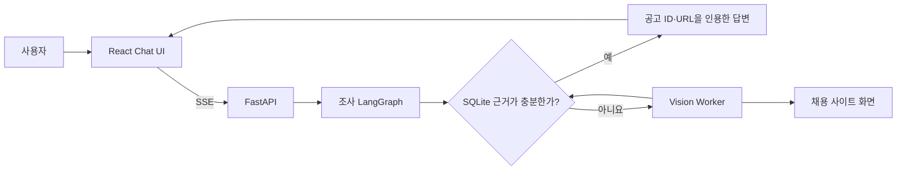

# 제품 데모 가이드

> [!info] 문서 범위
> 이 문서는 현재 코드로 UI와 조사 흐름을 시연하는 절차만 설명합니다. 성능 수치는
> [현재 버전 검증 기록](evidence/l2c_metrics_20260822.md), 날짜별 과거 실행값은
> [제품 회귀 실행 기록](history/product_regression_runs.md)에서 확인합니다.

> [!warning] 실제 사이트 실행
> 실제 사이트의 화면과 공고는 계속 바뀌므로 라이브 실행시간과 성공 여부는 고정되지
> 않습니다. 로그인·CAPTCHA가 필요한 범위는 자동화 대상이 아니며, 실행 전 해당
> 사이트의 이용약관과 계정 권한을 확인합니다.

## 데모에서 보여주는 흐름



UI에서는 질문 보완 선택지, 조사 진행 단계, 취소 상태, 공고 출처, 실행시간과 토큰
사용량을 확인할 수 있습니다. 실제 수집은 화면 캡처·OCR·물리 입력을 사용하며,
성공한 고정 GUI 구간은 화면 조건이 맞을 때만 재생합니다.

## 준비와 실행

최초 한 번 환경을 구성하고 `.env`에 `GEMINI_API_KEY`를 입력합니다.

```powershell
setup.cmd
notepad .env
```

합성 공고 3건으로 DB 근거 답변을 재현하려면 다음 명령을 사용합니다.

```powershell
demo.cmd
```

`demo.cmd`는 `data/samples/demo_jobs.json`으로 `data/demo_jobs.db`를 다시
만든 뒤 React UI와 FastAPI를 `http://127.0.0.1:8000`에서 실행합니다. 실제
사이트 수집은 `run.cmd`를 사용합니다.

## 시나리오 1: DB 근거만 사용하는 비교

```text
샘플 DB에 있는 AI 엔지니어 공고를 비교해줘
```

확인할 내용:

- 진행 단계에 `웹 수집`이 나타나지 않습니다.
- 서로 다른 회사의 공고를 비교하고 사실 옆에 `출처` 버튼을 표시합니다.
- 출처 패널에서 회사명, 공고명, 원본 URL과 저장 원문을 확인할 수 있습니다.
- 실행 전후 `data/demo_jobs.db`의 공고 수는 3건으로 유지됩니다.

이 시나리오는 Chat UI, FastAPI, 조사 LangGraph, SQLite 근거 검사와 인용 답변이
실제로 연결됐는지 확인합니다. 실제 웹 수집 성능을 검증하는 시나리오는 아닙니다.

## 시나리오 2: 모호한 요청 보완

```text
채용공고 찾아줘
```

확인할 내용:

- 중요한 검색 조건이 없으면 웹 수집 전에 `waiting_input`으로 중단합니다.
- UI가 업무 영역과 직무 후보를 선택지로 제시합니다.
- 선택한 조건은 같은 조사 문맥에 누적되고, 필요한 범위가 확정된 뒤에만 근거를
  조회하거나 웹 수집을 계획합니다.

## 시나리오 3: 실제 사이트 수집

```text
원티드에서 iOS 개발자 공고 1개를 직접 확인하고 주요 업무와 요구 기술을 DB 근거와 함께 알려줘
```

확인할 내용:

- 진행 단계가 계획·DB 검사·웹 수집·저장·답변 순서로 바뀝니다.
- Vision Worker가 실제 브라우저 화면을 읽고 상세 공고를 구조화합니다.
- 자동 품질 검사를 통과한 공고만 SQLite에 저장됩니다.
- 최종 답변의 공고 ID와 URL이 이번 조사에서 확인한 DB 문서로 연결됩니다.
- 요청이 끝나면 브라우저 창을 닫고 OCR 작업자는 애플리케이션 수명 동안 재사용합니다.

실제 수집 중에는 같은 데스크톱의 마우스와 키보드를 함께 사용하지 않습니다. 라이브
실행 하나의 시간이나 성공 여부를 저장소 전체의 성능값으로 해석하지 않습니다.

## 시나리오 4: 안전 취소

실제 사이트 수집을 시작하고 `웹 수집` 단계에서 취소합니다.

확인할 내용:

- 실행 상태가 `cancelled`로 끝납니다.
- Vision Worker와 브라우저가 정리됩니다.
- UI가 다시 질문을 입력할 수 있는 상태로 돌아옵니다.

## 면접 데모 순서

1. `demo.cmd`의 DB 전용 비교로 UI·SSE·출처 연결을 먼저 보여줍니다.
2. `채용공고 찾아줘`로 실행 전 질문 보완과 조사 재개를 보여줍니다.
3. 실행 현황에서 단계별 시간, 토큰과 실패 단계를 확인합니다.
4. 실제 수집은 저장된 검증 기록을 먼저 설명하고, 라이브에서는 수집 진입과 안전
   취소를 우선 시연합니다.
5. README의 핵심 구현 링크에서 조사 그래프, 행동 기록, 조건부 재생 코드로 이동합니다.

## 이 데모가 입증하는 것

- React UI가 FastAPI, 조사 LangGraph와 SQLite에 연결됩니다.
- DB로 충분한 요청과 실제 웹 확인이 필요한 요청이 다른 경로를 사용합니다.
- 답변에 사용한 공고 사실을 DB 문서 ID와 원본 URL로 추적할 수 있습니다.
- 사용자가 실행 상태를 확인하고 수집을 취소할 수 있습니다.
- 저장 행동은 전체 Agent를 대체하지 않고 화면 조건이 맞는 고정 구간에만 적용됩니다.

## 이 데모가 입증하지 않는 것

- 모든 채용 사이트와 검색어에서의 성공
- 로그인·CAPTCHA·장시간 네트워크 장애 복구
- 단일 라이브 실행을 근거로 한 평균 실행시간이나 비용
- 독립 사용자를 대상으로 한 답변 만족도

현재 수치와 실패는 [검증 기록](evidence/l2c_metrics_20260822.md), 필드별 사람 판정은
[14건 전수 감사](evidence/manual_field_audit_20260822.json), 실행 계측 방법은
[E2E 관측 환경](e2e_observability.md), 시스템 경계는
[`ARCHITECTURE.md`](../ARCHITECTURE.md)를 참고합니다.
