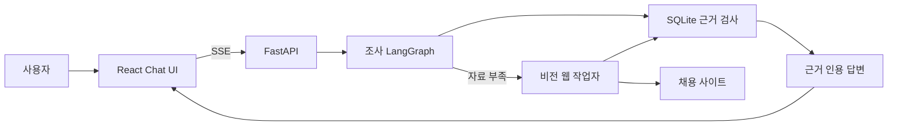

# 제품 데모 및 검증

> [!info] 검증 범위
> 이 문서는 로컬 Chat UI부터 조사 LangGraph, 비전 작업자, SQLite 근거 답변까지 실제 연결된 제품 경로를 설명합니다. 특정 실행의 성공을 모든 사이트의 성공률로 확대 해석하지 않습니다.

## 사용자가 보는 흐름



UI는 조사 진행 단계, 질문 보완 선택지, 취소 상태, 답변의 공고 인용, 실행시간과 토큰 사용량을 한 화면에 표시합니다. 같은 조사의 질문 보완 실행은 최근 목록에서 한 건으로 묶고, 실행 현황에서는 진단을 위해 개별 실행을 유지합니다.

## 실행

최초 환경 구성:

```powershell
setup.cmd -DryRun
setup.cmd
```

앱 실행:

```powershell
run.cmd
```

기본 주소는 `http://127.0.0.1:8000`입니다. `run.cmd`는 React 빌드가 없거나 소스보다 오래됐을 때만 다시 빌드하고, FastAPI와 같은 로컬 주소에서 제공합니다. 런타임 조합은 [런타임 호환 기준](runtime_compatibility.md)을 따릅니다.

## 데모 시나리오

### DB 근거만 사용하는 비교

질문:

```text
웹 수집은 하지 말고 현재 DB에 저장된 iOS 개발자 공고 2개를 비교해서 주요 업무와 요구 기술을 근거와 함께 알려줘
```

확인할 내용:

- 진행 단계에 `웹 수집`이 나타나지 않습니다.
- 서로 다른 회사 2곳을 비교하고 각 사실에 `출처` 버튼을 표시합니다.
- 출처를 누르면 오른쪽 패널에 회사명, 직무명, 원본 URL과 수집 원문이 표시됩니다.

2026-07-28 실제 Chat API 검증에서는 25.63초에 완료됐고, DB 91건은
변경되지 않았습니다. 답변은 비모소프트 `job_id:6`과 스토어링크
`job_id:9`만 인용했으며 두 ID 모두 테스트 DB에 존재했습니다.

### 모호한 요청의 단계적 보완

질문:

```text
채용공고 찾아줘
```

2026-07-28 첫 요청 검증에서는 5.11초에 수집 없이 `waiting_input`으로
중단하고 다음 6개 업무 영역을 제시했습니다.

- IT·데이터
- 경영·사무·금융
- 생산·제조·정비
- 연구·공학
- 영업·서비스·물류
- 의료·교육·공공

2026-07-24 전체 대화 검증에서는 다음 순서로 범위를 확정했습니다.

1. 업무 영역: `IT·데이터`
2. 상위 직무군: `AI·머신러닝 엔지니어`
3. 세부 직무: `머신러닝 엔지니어`
4. DB에서 연결된 공고 7건을 근거와 함께 답변

네 번의 HTTP 실행은 모두 같은 `investigation_id`를 사용했습니다. 첫 질문 보완은 지휘자 판단을 포함해 3.9초, 사전 카디널리티로 만든 다음 두 질문은 각각 25ms와 16ms, 최종 DB 답변은 18.0초였습니다.

### 실제 사이트 수집

질문:

```text
원티드에서 iOS 개발자 공고 1개를 직접 확인하고 주요 업무와 요구 기술을 DB 근거와 함께 알려줘
```

2026-07-28 실행 결과:

| 지표 | 결과 |
|---|---:|
| 실행시간 | 89.72초 |
| 비전 작업자 | 60.87초 |
| OCR 요청 | 8회, 합계 4.57초 |
| 화면 추론 | 8회, 합계 25.82초 |
| 수집 행동계획 | 10.05초 |
| 최종 답변 | 5.97초 |
| 전체 LLM 토큰 | 63,078 |
| 추정 비용 | $0.1092 |
| 브라우저 정리 | 성공 |

테스트 DB는 91건에서 92건으로 증가했습니다. 현재 수집 실행에서 확인한 문서
ID는 `10`, `11`, `94`였고, 수집 후 의미 검증은 이 범위 안에서 백패커의
`[텀블벅] iOS 개발자 (1-3년)` 공고 `job_id:10`을 최종 근거로 선택했습니다.
따라서 새 행뿐 아니라 기존 중복 공고를 다시 관찰한 경우에도 현재 실행에서
검증한 문서만 답변에 사용할 수 있음을 확인했습니다.

### 경량 화면 추론 비용 검증

2026-08-11에는 사람인 `AI 엔지니어` 공고 1건 자율 탐색을 동일한 요청의
2026-08-08 실행과 비교했습니다. 일반 화면 판단은 Gemini 3.5 Flash Lite,
복구 판단은 Gemini 3.6 Flash를 사용했습니다.

| 실행 | 실행시간 | 토큰 | 추정 비용 | 저장 품질 |
|---|---:|---:|---:|---:|
| 기존 자율 탐색 | 58.99초 | 86,024 | $0.1298 | 1/1 통과 |
| 경량 우선 자율 탐색 | 50.97초 | 74,679 | $0.0492 | 1/1 통과 |

실행시간은 13.6%, 토큰은 13.2%, 추정 비용은 62.1% 줄었습니다. 경량 모델의
출력 계약을 확인하기 위해 저장된 사람인 상세 화면 한 장을 별도로 입력한 호출은
3,735토큰과 약 $0.0013을 사용했습니다. 이 호출은 `scroll_distance=page`와
`direction=down`을 분리해 반환했고 내부 실행 계약의 `amount=page`로 변환됐습니다.

이어 실행한 사람인 경험 기반 탐색은 공고 1건 저장에는 성공했지만 활성 ROI
레시피가 0개였습니다. 사전조건은 `performance_comparable=false`, 원인은
`active_roi_recipe_missing`이었고 Reflex와 작업 목록 재생은 모두 0회였습니다.
이 실행은 69.79초, 84,563토큰, $0.0766을 사용한 자율 탐색 폴백 기록으로
분류하며 경험 기반 탐색 성능 비교에서는 제외합니다. 두 실행에서 저장된 후보는
`pending_review` 상태이며 후처리 승격 전에는 경험 기반 탐색 표본을 만들 수
없습니다.

### 다중 사이트 자율·경험 기반 회귀

2026-07-24에는 격리 DB에서 원티드, 사람인, 고용24의 자율 탐색과 경험 기반 탐색 6회를 순차 실행했습니다.

| 모드 | 품질 통과 | 저장 공고 | 실행시간 | 추론 | OCR | Reflex | 토큰 | 추정 비용 |
|---|---:|---:|---:|---:|---:|---:|---:|---:|
| 자율 탐색 3회 | 3/3 | 4건 | 160.70초 | 25회 | 23회 | 0회 | 233,870 | $0.3499 |
| 경험 기반 탐색 3회 | 3/3 | 4건 | 139.87초 | 24회 | 22회 | 1회 | 219,660 | $0.3312 |

모든 실행이 요청한 공고 수와 저장 품질을 충족했습니다. 다만 원티드와 사람인의 후처리 Critic 호출이 `504 DEADLINE_EXCEEDED`로 끝나 후보가 승격되지 않았고, 두 경험 기반 탐색은 카드 큐만 재사용했습니다. 고용24만 후보 승격과 Reflex 1회를 모두 통과했습니다. 따라서 합계 실행시간 감소를 Reflex 효과로 일반화할 수 없으며, 이 회귀의 Reflex 모드 계약은 2/6만 통과했습니다.

자율 탐색의 API 비용은 유효 공고 한 건당 약 130원, 경험 기반 탐색은 약 123원이었습니다. 원화 환산은 비교를 위한 `$1=1,488원` 가정이며 실제 청구액에는 환율과 세금 차이가 생길 수 있습니다.

### Critic 승격 경로 재검증

위 회귀에서는 실제 서비스의 재시도 작업자를 거치지 않고 Critic을 한 번만 직접 호출했으며, Critic 비용도 합계에서 빠졌습니다. 중복 설명과 들여쓰기가 포함된 입력을 정리해 기존 후보 기준 문자 수를 36~38% 줄이고, 회귀 매트릭스도 실제 `RecipePromotionWorker` 경로를 사용하도록 고쳤습니다. Critic 제한시간은 30초로 유지했습니다.

기존에 504로 실패했던 원티드와 사람인 후보는 각각 23.45초와 17.27초에 승격됐습니다. 같은 DB의 경험 기반 탐색을 다시 실행한 결과는 다음과 같습니다.

| 사이트 | 실행시간 | 추론 | Reflex | 작업 목록 | 토큰 | 추정 비용 |
|---|---:|---:|---:|---:|---:|---:|
| 원티드 | 49.70초 | 6회 | 3회 | 2회 | 59,700 | $0.0850 |
| 사람인 | 31.94초 | 4회 | 1회 | 1회 | 35,368 | $0.0498 |

새 격리 DB에서 원티드 `자율 탐색 → Critic 승격 → 경험 기반 탐색` 전체 흐름도 통과했습니다. 자율 탐색 수집은 62.18초, 86,169토큰, $0.1274였고 Critic은 별도로 24.45초, 14,715토큰, $0.0518을 사용했습니다. 따라서 자율 탐색과 승격을 합친 실제 비용은 100,884토큰, $0.1791입니다. 이어진 경험 기반 탐색은 52.45초, 추론 7회, Reflex 2회, 69,786토큰, $0.1001이었으며 공고 2건의 저장 품질도 통과했습니다.

### 현재 코드의 사이트별 경험 기반 회귀

2026-07-28에는 단계 전체가 아니라 Critic이 안전하다고 판정한 개별 단계만
승격하도록 바꾸고, 입력 대상의 1픽셀 반올림 오차도 자율 탐색과 경험 기반 탐색에서
같은 기준으로 검증했습니다.

| 사이트·모드 | 실행시간 | 추론 | OCR | Reflex | 작업 목록 | 저장 |
|---|---:|---:|---:|---:|---:|---:|
| 원티드 자율 탐색 | 81.78초 | 11회 | 10회 | 0회 | 2회 | 2건 |
| 원티드 경험 기반 탐색 | 72.27초 | 7회 | 10회 | 4회 | 2회 | 2건 |
| 사람인 자율 탐색 | 63.20초 | 8회 | 8회 | 0회 | 1회 | 1건 |
| 사람인 경험 기반 탐색 | 47.51초 | 4회 | 6회 | 2회 | 1회 | 1건 |
| 잡코리아 자율 탐색 | 76.12초 | 12회 | 10회 | 0회 | 1회 | 1건 |
| 잡코리아 경험 기반 탐색 | 34.52초 | 3회 | 4회 | 1회 | 1건 |
| 고용24 자율 탐색 | 59.43초 | 8회 | 7회 | 0회 | 1회 | 1건 |
| 고용24 경험 기반 탐색 | 64.04초 | 8회 | 8회 | 1회 | 1건 |

모든 행은 목표 수와 DB 저장 품질을 통과했습니다. 원티드·사람인·잡코리아는
경험 기반 탐색이 빨라졌지만 고용24는 검색 입력만 재사용해 오히려 4.61초
느려졌습니다. 이 결과는 Reflex hit 수가 아니라 **얼마나 비싼 추론 경로를
대체했는지**를 성과 기준으로 봐야 한다는 점을 보여 줍니다.

### 리팩터링 완료 기준 회귀

2026-07-29에는 격리 DB에서 원티드·사람인·고용24의 자율 탐색을 실행하고,
각 성공 후보를 실제 승격 작업자로 검토한 뒤 같은 작업을 경험 기반 탐색으로
재실행했습니다.

| 사이트·모드 | 실행시간 | 추론 | OCR | Reflex | 저장 |
|---|---:|---:|---:|---:|---:|
| 원티드 자율 탐색 | 70.46초 | 11회 | 11회 | 0회 | 2건 |
| 원티드 경험 기반 탐색 | 63.38초 | 8회 | 11회 | 2회 | 2건 |
| 사람인 자율 탐색 | 44.81초 | 5회 | 6회 | 0회 | 1건 |
| 사람인 경험 기반 탐색 | 48.16초 | 3회 | 6회 | 2회 | 1건 |
| 고용24 자율 탐색 | 38.94초 | 5회 | 6회 | 0회 | 1건 |
| 고용24 경험 기반 탐색 | 35.89초 | 4회 | 6회 | 1회 | 1건 |

여섯 실행 모두 목표 수와 저장 품질을 통과했습니다. 원티드와 고용24는 실행시간도
줄었지만 사람인은 추론 감소보다 다른 구간 변동이 커서 3.35초 늘었습니다. 따라서
Reflex의 직접 성과는 먼저 생략한 추론 횟수로 보고, 실행시간은 반복 표본의 분포로
평가해야 합니다.

같은 원티드 활성 레시피로 검색어와 목표 수를 `iOS 개발자 2개`에서
`백엔드 개발자 1개`로 바꾼 실행은 39.31초, 추론 3회, Reflex 2회로 1건을
저장했습니다. 이어 같은 DB의 기존 iOS 공고 2개를 재요청한 실행은 검색 결과
카드에서 DB ID 2개를 확인하고 상세 화면을 열지 않았습니다. 이 실행은 20.33초,
카드 선택 LLM 1회, 화면 추론 0회, 신규 저장 0건으로 완료됐습니다.

### 기준 커밋 최소 회귀

기존 실행을 전부 버리고 같은 시나리오를 여러 번 다시 돌리지 않았습니다.
`benchmark.audit_e2e_history`로 기존 summary 150개를 먼저 분류했고, 그중
수집 E2E 97개는 깨끗한 작업 트리 19개와 개발 중 작업 트리 78개로 나뉘었습니다.
최종 기준값에는 `git_dirty=false` 실행만 사용했습니다.

| 사이트·모드 | 커밋 | 품질 | 실행시간 | 추론 | OCR | Reflex | 토큰 | 추정 비용 |
|---|---|---:|---:|---:|---:|---:|---:|---:|
| 원티드 자율 탐색 | `6ae20a6` | 통과 | 74.82초 | 10회 | 9회 | 0회 | 88,196 | $0.1330 |
| 원티드 경험 기반 탐색 | `6ae20a6` | 통과 | 61.73초 | 7회 | 9회 | 3회 | 63,700 | $0.0945 |
| 잡코리아 자율 탐색 | `98c1b93` | 통과 | 37.59초 | 5회 | 4회 | 0회 | 41,423 | $0.0605 |
| 잡코리아 경험 기반 탐색 | `98c1b93` | 통과 | 83.93초 | 10회 | 16회 | 2회 | 84,221 | $0.1278 |

원티드는 경험 기반 탐색에서 실행시간 17.5%, 추론 30.0%, 토큰 27.8%가 줄었습니다.
자율 탐색 뒤 Critic 승격에는 별도로 17.99초와 13,185토큰이 들었으므로 첫
반복 한 번만으로는 승격 비용까지 회수하지 못합니다.

잡코리아의 첫 기준 실행에서는 pHash가 행동 전후 화면을 같다고 판정해 OCR을
생략했지만, 새 캡처가 직전 마커를 이미 비운 뒤라 `Marker ID not found`로
실패했습니다. `98c1b93`에서는 행동 전 OCR 상태를 캡처 ID와 함께 보존하고,
같은 URL·같은 전환 전 캡처·pHash 무변화가 모두 확인될 때만 새 캡처에
재결합합니다. 재검증에서는 같은 무변화 경로 뒤 다른 검색 버튼을 정상
클릭했고 자율·반복 모두 공고 1건을 저장했습니다.

정확성은 복구됐지만 잡코리아 경험 기반 탐색은 승격된 검색창 클릭을 두 번 재생한 뒤
커뮤니티 화면으로 이동했고, 자율 복구 때문에 자율 탐색보다 46.35초 느렸습니다.
따라서 잡코리아 결과는 Reflex 성능 향상 사례가 아니라 **잘못 승격된 원자
단계가 전체 경로 비용을 늘릴 수 있다는 현재 한계**로 해석합니다. 전체 원시
그룹은 [`benchmark/e2e_history_audit.md`](../benchmark/e2e_history_audit.md)에
남깁니다.

### 장기 실행 자원 재사용

같은 FastAPI 수명에서 원티드 iOS와 데이터 엔지니어 수집 요청을 연속
실행했습니다.

| 항목 | 첫 요청 | 두 번째 요청 |
|---|---:|---:|
| 실행시간 | 88.95초 | 55.71초 |
| OCR 시작 횟수 | 1회 | 0회 |
| OCR 작업자 PID | 20100 | 20100 |
| OCR 요청 | 8회 | 5회 |

두 요청 모두 새 공고 저장과 인용 무결성을 통과했습니다. 각 요청이 끝난 뒤
브라우저 창은 닫혔고, OCR 작업자와 reasoning 모델 캐시는 같은 백엔드
프로세스에서 재사용됐습니다.

### 자연어 계획과 제품 API 회귀

- 실제 지휘자 모델의 12개 요청 이해 시나리오: `12/12` 통과
- 실제 Chat API DB 전용 비교: 통과
- 실제 Chat API 객관식 질문 보완: 통과
- 실제 Chat API 웹 수집 후 DB 인용 답변: 통과

자동 평가는 목적·근거 정책·수집 이벤트·DB 변화·인용 무결성만 검사합니다.
답변의 표현과 직무 조언 품질은 별도 사용자 평가 대상으로 남깁니다.

### 실행 취소

`웹 수집` 단계에서 취소 버튼을 누른 검증은 18.08초에 `cancelled`로 끝났습니다. 시작 화면 준비 중 취소 요청을 확인했고, 비전 작업자와 브라우저 정리 후 입력 가능한 상태로 돌아왔습니다. 취소 전까지 사용한 토큰은 8,415개였습니다.

## 면접 데모 순서

1. `run.cmd`로 앱을 실행합니다.
2. DB 전용 비교 질문으로 SSE 단계와 출처 패널을 보여줍니다.
3. `채용공고 찾아줘`로 사전 카디널리티 기반 질문 보완을 보여줍니다.
4. 실행 현황에서 실행시간, 단계별 병목, 토큰과 실패 단계를 확인합니다.
5. 실제 수집은 완료 로그를 먼저 설명하고, 라이브에서는 수집 단계 진입과 안전 취소까지만 보여줍니다.

## 이 데모가 입증하는 것

- React UI가 목업이 아니라 실제 FastAPI, 조사 LangGraph, SQLite와 연결됩니다.
- 지휘자가 모호한 요청을 바로 도구 실행으로 보내지 않고 질문으로 보완합니다.
- DB로 충분한 요청과 실제 웹 확인이 필요한 요청이 다른 경로를 사용합니다.
- 답변의 공고 사실은 검증된 DB 문서 ID로 추적할 수 있습니다.
- 사용자는 실행 중 상태를 보고 취소할 수 있으며, 런타임 자원이 정리됩니다.
- 등록된 여러 채용사이트에서 DOM selector 없이 같은 화면 관찰·물리 입력
  런타임을 재사용할 수 있습니다.
- Reflex는 전체 자율 탐색을 대체하지 않고, 화면 증거로 검증된 안정 경로를
  단계별로 재생해 해당 구간의 추론만 선택적으로 생략합니다.

## 아직 별도로 검증할 것

- 깨끗한 Windows PC에서 `setup.cmd` 한 번으로 설치되는지
- 인증, 차단, 네트워크 지연을 포함한 장시간 복구
- 사이트별 자율 탐색/경험 기반 탐색 성공률과 잘못된 클릭률
- 신규 사이트 프로필 작성 시간과 사이트별 코드 감소량
- Critic 비용을 포함한 반복 횟수별 누적 손익분기점
- 실제 사용자 과업의 답변 만족도

실행 관측 방식은 [E2E 관측 환경](e2e_observability.md), 현재 시스템 경계는 [`ARCHITECTURE.md`](../ARCHITECTURE.md), 구조 변경 이력은 [아키텍처 리팩터링 계획](architecture_refactor_plan.md)을 참고합니다.
