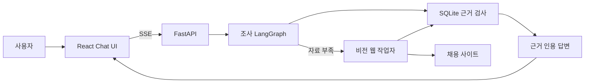

# 제품 데모 및 검증

> [!info] 검증 범위
> 이 문서는 로컬 Chat UI부터 조사 LangGraph, 비전 작업자, SQLite 근거 답변까지 실제 연결된 제품 경로를 설명합니다. 특정 실행의 성공을 모든 사이트의 성공률로 확대 해석하지 않습니다.

## 사용자가 보는 흐름



UI는 조사 진행 단계, 질문 보완 선택지, 취소 상태, 답변의 공고 인용, 실행시간과 토큰 사용량을 한 화면에 표시합니다. 같은 조사의 질문 보완 실행은 최근 목록에서 한 건으로 묶고, 실행 현황에서는 진단을 위해 개별 실행을 유지합니다.

## 실행

최초 환경 구성:

```powershell
setup.cmd -DryRun
setup.cmd
```

앱 실행:

```powershell
run.cmd
```

기본 주소는 `http://127.0.0.1:8000`입니다. `run.cmd`는 React 빌드가 없거나 소스보다 오래됐을 때만 다시 빌드하고, FastAPI와 같은 로컬 주소에서 제공합니다. 런타임 조합은 [런타임 호환 기준](runtime_compatibility.md)을 따릅니다.

## 데모 시나리오

### DB 근거만 사용하는 비교

질문:

```text
웹 수집은 하지 말고 현재 DB에 저장된 머신러닝 엔지니어 공고 3개를 비교해줘
```

확인할 내용:

- 진행 단계에 `웹 수집`이 나타나지 않습니다.
- 서로 다른 회사 3곳을 비교하고 각 사실에 `출처` 버튼을 표시합니다.
- 출처를 누르면 오른쪽 패널에 회사명, 직무명, 원본 URL과 수집 원문이 표시됩니다.

### 모호한 요청의 단계적 보완

질문:

```text
채용공고 찾아줘
```

2026-07-24 검증에서는 다음 순서로 범위를 확정했습니다.

1. 업무 영역: `IT·데이터`
2. 상위 직무군: `AI·머신러닝 엔지니어`
3. 세부 직무: `머신러닝 엔지니어`
4. DB에서 연결된 공고 7건을 근거와 함께 답변

네 번의 HTTP 실행은 모두 같은 `investigation_id`를 사용했습니다. 첫 질문 보완은 지휘자 판단을 포함해 3.9초, 사전 카디널리티로 만든 다음 두 질문은 각각 25ms와 16ms, 최종 DB 답변은 18.0초였습니다.

### 실제 사이트 수집

질문:

```text
원티드에서 프론트엔드 개발자 공고 1개를 실제 사이트에서 수집해줘
```

2026-07-24 실행 결과:

| 지표 | 결과 |
|---|---:|
| 실행시간 | 47.87초 |
| 비전 작업자 | 22.67초 |
| 시작 화면 준비 | 8.88초 |
| OCR 시작 | 4.66초 |
| OCR 요청 | 4회, 합계 1.80초 |
| 화면 추론 | 4회, 합계 8.26초 |
| 전체 LLM 토큰 | 38,608 |
| 브라우저 정리 | 성공 |

공고가 DB에 이미 있으면 새 행을 만들지 않고 같은 근거를 갱신하거나 재사용합니다. 최종 답변은 실제로 채택된 DB 문서 ID만 인용합니다.

### 다중 사이트 자율·반복 회귀

2026-07-24에는 격리 DB에서 원티드, 사람인, 고용24의 자율탐색과 반복탐색 6회를 순차 실행했습니다.

| 모드 | 품질 통과 | 저장 공고 | 실행시간 | 추론 | OCR | Reflex | 토큰 | 추정 비용 |
|---|---:|---:|---:|---:|---:|---:|---:|---:|
| 자율탐색 3회 | 3/3 | 4건 | 160.70초 | 25회 | 23회 | 0회 | 233,870 | $0.3499 |
| 반복탐색 3회 | 3/3 | 4건 | 139.87초 | 24회 | 22회 | 1회 | 219,660 | $0.3312 |

모든 실행이 요청한 공고 수와 저장 품질을 충족했습니다. 다만 원티드와 사람인의 후처리 Critic 호출이 `504 DEADLINE_EXCEEDED`로 끝나 후보가 승격되지 않았고, 두 반복탐색은 카드 큐만 재사용했습니다. 고용24만 후보 승격과 Reflex 1회를 모두 통과했습니다. 따라서 합계 실행시간 감소를 Reflex 효과로 일반화할 수 없으며, 이 회귀의 Reflex 모드 계약은 2/6만 통과했습니다.

자율탐색의 API 비용은 유효 공고 한 건당 약 130원, 반복탐색은 약 123원이었습니다. 원화 환산은 비교를 위한 `$1=1,488원` 가정이며 실제 청구액에는 환율과 세금 차이가 생길 수 있습니다.

### Critic 승격 경로 재검증

위 회귀에서는 실제 서비스의 재시도 작업자를 거치지 않고 Critic을 한 번만 직접 호출했으며, Critic 비용도 합계에서 빠졌습니다. 중복 설명과 들여쓰기가 포함된 입력을 정리해 기존 후보 기준 문자 수를 36~38% 줄이고, 회귀 매트릭스도 실제 `RecipePromotionWorker` 경로를 사용하도록 고쳤습니다. Critic 제한시간은 30초로 유지했습니다.

기존에 504로 실패했던 원티드와 사람인 후보는 각각 23.45초와 17.27초에 승격됐습니다. 같은 DB의 반복탐색을 다시 실행한 결과는 다음과 같습니다.

| 사이트 | 실행시간 | 추론 | Reflex | 작업 목록 | 토큰 | 추정 비용 |
|---|---:|---:|---:|---:|---:|---:|
| 원티드 | 49.70초 | 6회 | 3회 | 2회 | 59,700 | $0.0850 |
| 사람인 | 31.94초 | 4회 | 1회 | 1회 | 35,368 | $0.0498 |

새 격리 DB에서 원티드 `cold → Critic 승격 → warm` 전체 흐름도 통과했습니다. 자율탐색 수집은 62.18초, 86,169토큰, $0.1274였고 Critic은 별도로 24.45초, 14,715토큰, $0.0518을 사용했습니다. 따라서 자율탐색과 승격을 합친 실제 비용은 100,884토큰, $0.1791입니다. 이어진 반복탐색은 52.45초, 추론 7회, Reflex 2회, 69,786토큰, $0.1001이었으며 공고 2건의 저장 품질도 통과했습니다.

### 실행 취소

`웹 수집` 단계에서 취소 버튼을 누른 검증은 18.08초에 `cancelled`로 끝났습니다. 시작 화면 준비 중 취소 요청을 확인했고, 비전 작업자와 브라우저 정리 후 입력 가능한 상태로 돌아왔습니다. 취소 전까지 사용한 토큰은 8,415개였습니다.

## 면접 데모 순서

1. `run.cmd`로 앱을 실행합니다.
2. DB 전용 비교 질문으로 SSE 단계와 출처 패널을 보여줍니다.
3. `채용공고 찾아줘`로 사전 카디널리티 기반 질문 보완을 보여줍니다.
4. 실행 현황에서 실행시간, 단계별 병목, 토큰과 실패 단계를 확인합니다.
5. 실제 수집은 완료 로그를 먼저 설명하고, 라이브에서는 수집 단계 진입과 안전 취소까지만 보여줍니다.

## 이 데모가 입증하는 것

- React UI가 목업이 아니라 실제 FastAPI, 조사 LangGraph, SQLite와 연결됩니다.
- 지휘자가 모호한 요청을 바로 도구 실행으로 보내지 않고 질문으로 보완합니다.
- DB로 충분한 요청과 실제 웹 확인이 필요한 요청이 다른 경로를 사용합니다.
- 답변의 공고 사실은 검증된 DB 문서 ID로 추적할 수 있습니다.
- 사용자는 실행 중 상태를 보고 취소할 수 있으며, 런타임 자원이 정리됩니다.

## 아직 별도로 검증할 것

- 깨끗한 Windows PC에서 `setup.cmd` 한 번으로 설치되는지
- 인증, 차단, 네트워크 지연을 포함한 장시간 복구
- 사이트별 cold/warm 반복 성공률과 잘못된 클릭률
- 실제 사용자 과업의 답변 만족도

실행 관측 방식은 [E2E 관측 환경](e2e_observability.md), 현재 시스템 경계는 [`ARCHITECTURE.md`](../ARCHITECTURE.md), 구조 변경 이력은 [아키텍처 리팩터링 계획](architecture_refactor_plan.md)을 참고합니다.
